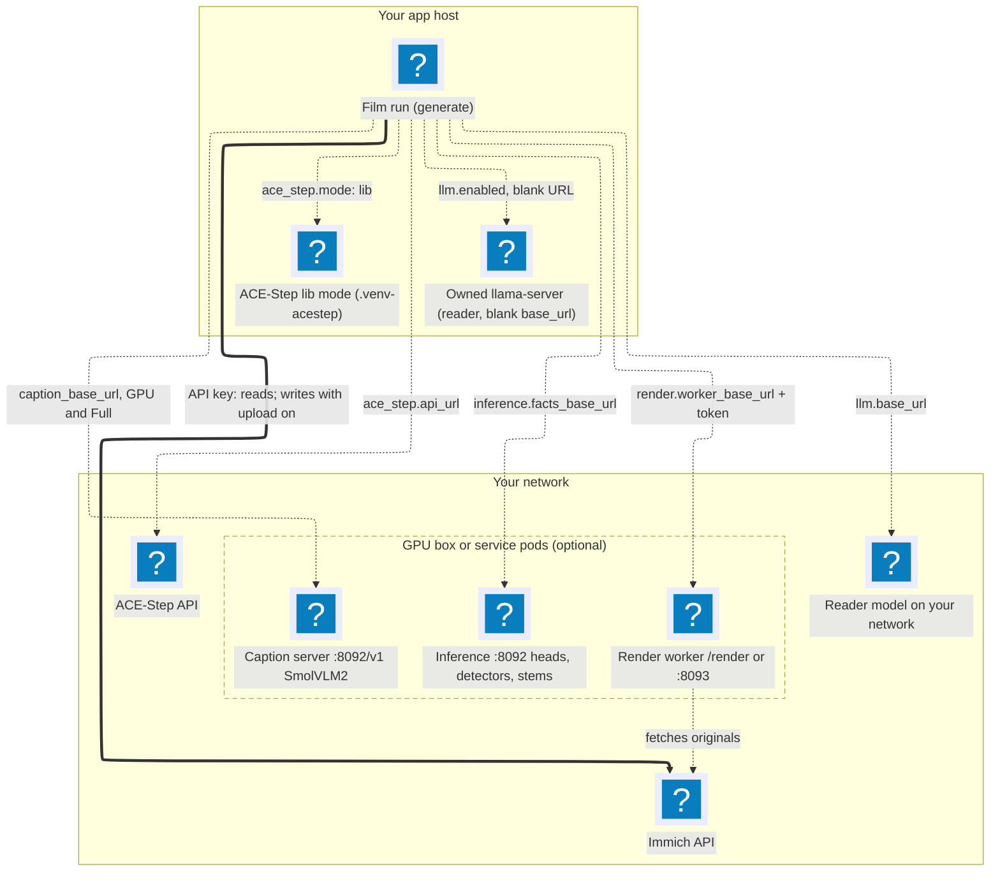

{/* What a film run calls on your network, for contribute/architecture (2 of 2). Drawn from immich/, inference client, render/, llm/, audio/. Style: contribute/diagram-style.md. */}

```mermaid
%%{init: {"layout": "elk"}}%%
flowchart TB
    subgraph host["Your app host"]
        gen@{ icon: "mdi:console", form: "square", label: "Film run (generate)", pos: "b", h: 48 }
        llama@{ icon: "mdi:robot-outline", form: "square", label: "Owned llama-server (reader, blank base_url)", pos: "b", h: 48 }
        acelib@{ icon: "mdi:music-note", form: "square", label: "ACE-Step lib mode (.venv-acestep)", pos: "b", h: 48 }
    end
    subgraph lan["Your network"]
        immich@{ icon: "simple-icons:immich", form: "square", label: "Immich API", pos: "b", h: 48 }
        subgraph gpubox["GPU box or service pods (optional)"]
            infer@{ icon: "mdi:chip", form: "square", label: "Inference :8092 heads, detectors, stems", pos: "b", h: 48 }
            capt@{ icon: "mdi:image-text", form: "square", label: "Caption server :8092/v1 SmolVLM2", pos: "b", h: 48 }
            worker@{ icon: "mdi:movie-open-cog-outline", form: "square", label: "Render worker /render or :8093", pos: "b", h: 48 }
        end
        reader@{ icon: "mdi:robot-outline", form: "square", label: "Reader model on your network", pos: "b", h: 48 }
        aceapi@{ icon: "mdi:music-note", form: "square", label: "ACE-Step API", pos: "b", h: 48 }
    end
    gen ==>|"API key: reads; writes with upload on"| immich
    gen -.->|"inference.facts_base_url"| infer
    gen -.->|"caption_base_url, GPU and Full"| capt
    gen -.->|"render.worker_base_url + token"| worker
    worker -.->|"fetches originals"| immich
    gen -.->|"llm.base_url"| reader
    gen -.->|"llm.enabled, blank URL"| llama
    gen -.->|"ace_step.mode: lib"| acelib
    gen -.->|"ace_step.api_url"| aceapi
    class gpubox optional
    classDef optional stroke-dasharray: 6 4
```
