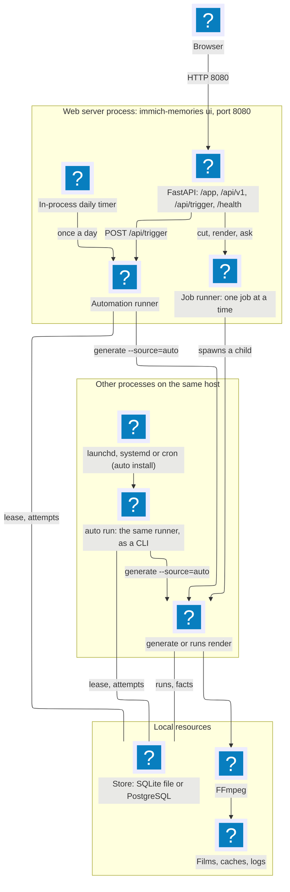

{/* The app host in detail, for contribute/architecture (1 of 2). Drawn from web/server.py, automation/, cli/. Style: contribute/diagram-style.md. */}

```mermaid
%%{init: {"layout": "elk"}}%%
flowchart TB
    browser@{ icon: "mdi:web", form: "square", label: "Browser", pos: "b", h: 48 }
    subgraph server["Web server process: immich-memories ui, port 8080"]
        api@{ icon: "logos:fastapi-icon", form: "square", label: "FastAPI: /app, /api/v1, /api/trigger, /health", pos: "b", h: 48 }
        timer@{ icon: "mdi:timer-outline", form: "square", label: "In-process daily timer", pos: "b", h: 48 }
        runner@{ icon: "mdi:robot-industrial-outline", form: "square", label: "Automation runner", pos: "b", h: 48 }
        jobs@{ icon: "mdi:format-list-checks", form: "square", label: "Job runner: one job at a time", pos: "b", h: 48 }
    end
    subgraph procs["Other processes on the same host"]
        ostimer@{ icon: "mdi:timer-outline", form: "square", label: "launchd, systemd or cron (auto install)", pos: "b", h: 48 }
        autocli@{ icon: "mdi:console", form: "square", label: "auto run: the same runner, as a CLI", pos: "b", h: 48 }
        gen@{ icon: "mdi:console", form: "square", label: "generate or runs render", pos: "b", h: 48 }
    end
    subgraph local["Local resources"]
        ffmpeg@{ icon: "logos:ffmpeg-icon", form: "square", label: "FFmpeg", pos: "b", h: 48 }
        store@{ icon: "mdi:database", form: "square", label: "Store: SQLite file or PostgreSQL", pos: "b", h: 48 }
        files@{ icon: "mdi:harddisk", form: "square", label: "Films, caches, logs", pos: "b", h: 48 }
    end
    browser -->|"HTTP 8080"| api
    api -->|"cut, render, ask"| jobs
    api -->|"POST /api/trigger"| runner
    timer -->|"once a day"| runner
    ostimer --> autocli
    jobs -->|"spawns a child"| gen
    runner -->|"generate --source=auto"| gen
    autocli -->|"generate --source=auto"| gen
    gen --> ffmpeg
    ffmpeg --> files
    gen ---|"runs, facts"| store
    runner ---|"lease, attempts"| store
    autocli ---|"lease, attempts"| store
```
