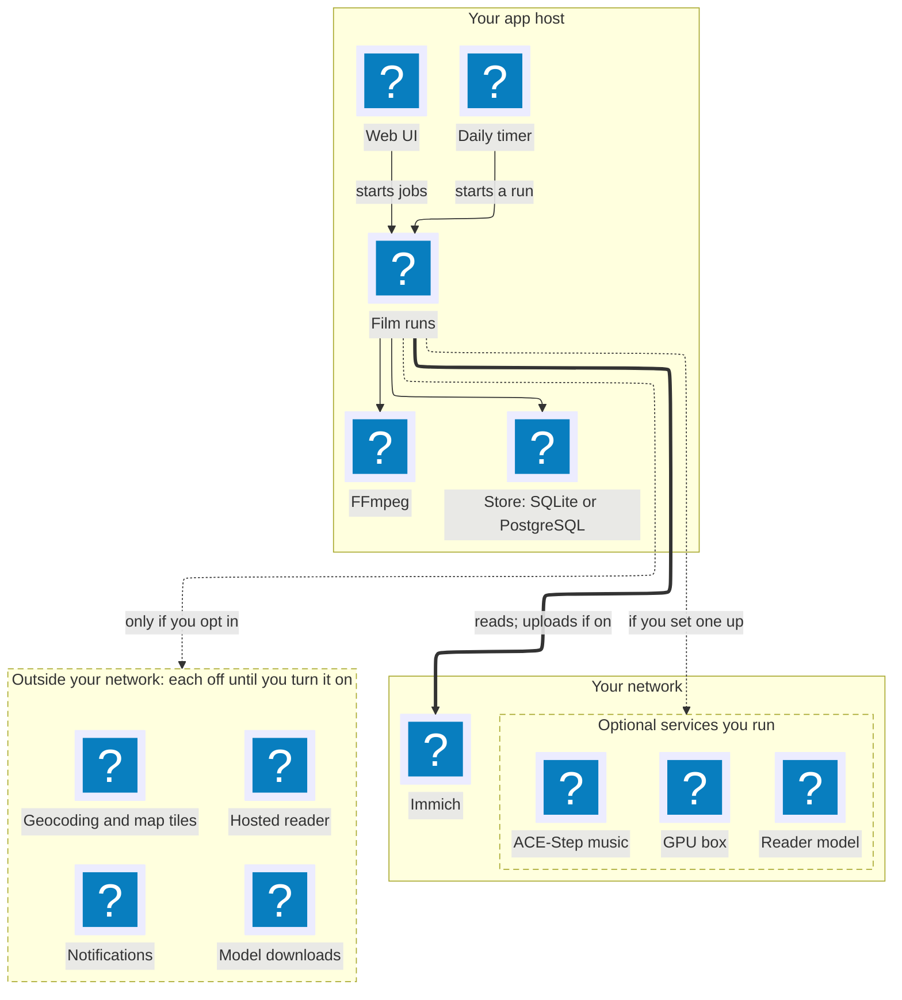

{/* What runs where, for run/overview and the README. Style: contribute/diagram-style.md. */}

```mermaid
%%{init: {"layout": "elk"}}%%
flowchart TB
    subgraph host["Your app host"]
        direction TB
        timer@{ icon: "mdi:timer-outline", form: "square", label: "Daily timer", pos: "b", h: 56 }
        web@{ icon: "logos:svelte-icon", form: "square", label: "Web UI", pos: "b", h: 56 }
        cli@{ icon: "mdi:console", form: "square", label: "Film runs", pos: "b", h: 56 }
        ffmpeg@{ icon: "logos:ffmpeg-icon", form: "square", label: "FFmpeg", pos: "b", h: 56 }
        store@{ icon: "mdi:database", form: "square", label: "Store: SQLite or PostgreSQL", pos: "b", h: 56 }
        timer -->|starts a run| cli
        web -->|starts jobs| cli
        cli --> ffmpeg
        cli --> store
    end
    subgraph lan["Your network"]
        direction TB
        immich@{ icon: "simple-icons:immich", form: "square", label: "Immich", pos: "b", h: 56 }
        subgraph extras["Optional services you run"]
            direction TB
            gpubox@{ icon: "mdi:expansion-card", form: "square", label: "GPU box", pos: "b", h: 56 }
            reader@{ icon: "mdi:robot-outline", form: "square", label: "Reader model", pos: "b", h: 56 }
            music@{ icon: "mdi:music-note", form: "square", label: "ACE-Step music", pos: "b", h: 56 }
        end
    end
    subgraph outside["Outside your network: each off until you turn it on"]
        direction TB
        maps@{ icon: "mdi:map-outline", form: "square", label: "Geocoding and map tiles", pos: "b", h: 56 }
        hosted@{ icon: "mdi:cloud-outline", form: "square", label: "Hosted reader", pos: "b", h: 56 }
        notify@{ icon: "mdi:bell-ring-outline", form: "square", label: "Notifications", pos: "b", h: 56 }
        models@{ icon: "mdi:download", form: "square", label: "Model downloads", pos: "b", h: 56 }
    end
    cli ==>|"reads; uploads if on"| immich
    cli -.->|"if you set one up"| extras
    cli -.->|"only if you opt in"| outside
    maps ~~~ notify
    hosted ~~~ models
    classDef optional stroke-dasharray: 6 4
    class extras,outside optional
```
