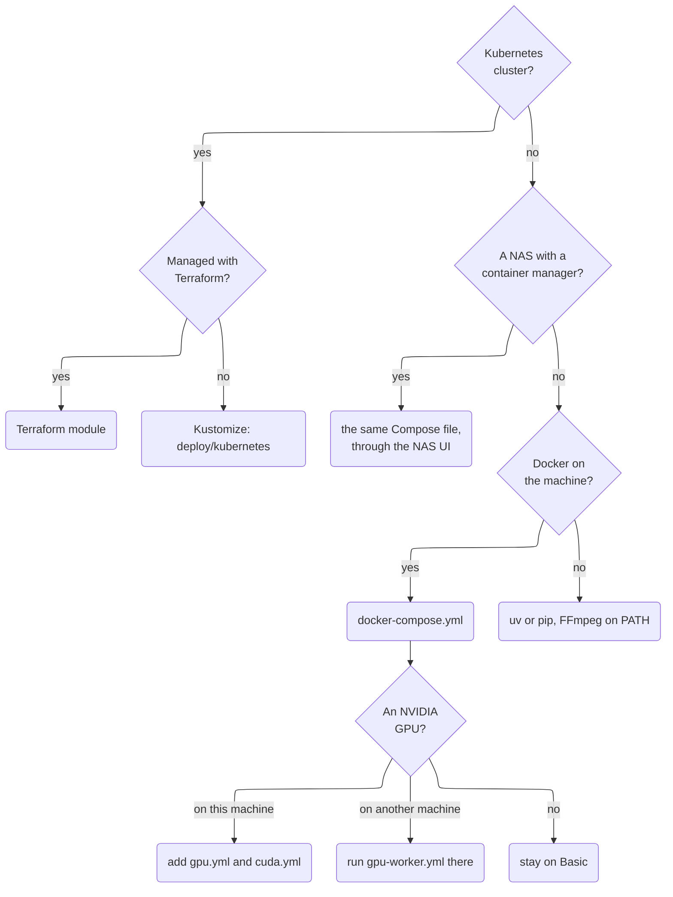

{/* Which install to pick, for get-started/choose-your-setup. Drawn from deploy/ and the docs install pages. Style: contribute/diagram-style.md. */}

```mermaid
%%{init: {"layout": "elk"}}%%
flowchart TD
    q1{"Kubernetes<br/>cluster?"}
    q1 -->|yes| q2{"Managed with<br/>Terraform?"}
    q2 -->|yes| tf("Terraform module")
    q2 -->|no| kus("Kustomize: deploy/kubernetes")
    q1 -->|no| q3{"A NAS with a<br/>container manager?"}
    q3 -->|yes| nas("the same Compose file,<br/>through the NAS UI")
    q3 -->|no| q4{"Docker on<br/>the machine?"}
    q4 -->|yes| comp("docker-compose.yml")
    q4 -->|no| uv("uv or pip, FFmpeg on PATH")
    comp --> q5{"An NVIDIA<br/>GPU?"}
    q5 -->|"on this machine"| ov("add gpu.yml and cuda.yml")
    q5 -->|"on another machine"| gw("run gpu-worker.yml there")
    q5 -->|no| basic("stay on Basic")
```
