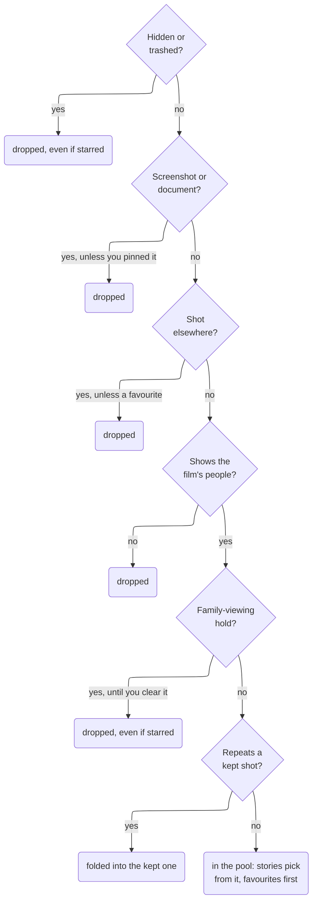

{/* Why a picture is kept or dropped, plain version, for how-it-chooses/family-audience-duplicates. Drawn from the source gate and the editorial passes. Style: contribute/diagram-style.md. */}

```mermaid
%%{init: {"layout": "elk"}}%%
flowchart TD
    q1{"Hidden or<br/>trashed?"}
    q1 -->|yes| x1("dropped, even if starred")
    q1 -->|no| q2{"Screenshot or<br/>document?"}
    q2 -->|"yes, unless you pinned it"| x2("dropped")
    q2 -->|no| q3{"Shot<br/>elsewhere?"}
    q3 -->|"yes, unless a favourite"| x3("dropped")
    q3 -->|no| q4{"Shows the<br/>film's people?"}
    q4 -->|no| x4("dropped")
    q4 -->|yes| q5{"Family-viewing<br/>hold?"}
    q5 -->|"yes, until you clear it"| x5("dropped, even if starred")
    q5 -->|no| q6{"Repeats a<br/>kept shot?"}
    q6 -->|yes| x6("folded into the kept one")
    q6 -->|no| pool("in the pool: stories pick<br/>from it, favourites first")
```
