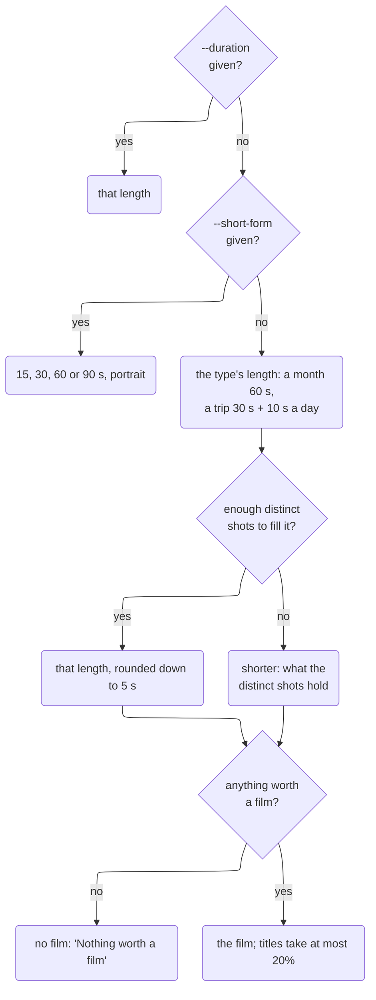

{/* How long the film is, for how-it-chooses/length-and-filler and reference/film-types. Drawn from planning/memory_length.py and the depth fill. Style: contribute/diagram-style.md. */}

```mermaid
%%{init: {"layout": "elk"}}%%
flowchart TD
    q1{"--duration<br/>given?"}
    q1 -->|yes| d("that length")
    q1 -->|no| q2{"--short-form<br/>given?"}
    q2 -->|yes| sf("15, 30, 60 or 90 s, portrait")
    q2 -->|no| preset("the type's length: a month 60 s,<br/>a trip 30 s + 10 s a day")
    preset --> q3{"enough distinct<br/>shots to fill it?"}
    q3 -->|yes| keep("that length, rounded down to 5 s")
    q3 -->|no| short("shorter: what the<br/>distinct shots hold")
    keep --> q4{"anything worth<br/>a film?"}
    short --> q4
    q4 -->|no| none("no film: 'Nothing worth a film'")
    q4 -->|yes| film("the film; titles take at most 20%")
```
