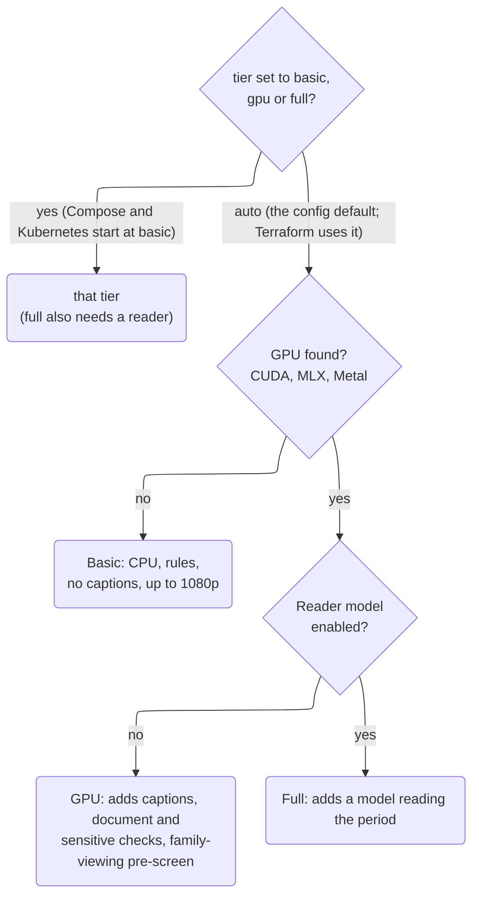

{/* Which tier you get, for run/requirements and better/. Drawn from config_tiers.py and deployment_config.py. Style: contribute/diagram-style.md. */}

```mermaid
%%{init: {"layout": "elk"}}%%
flowchart TD
    q1{"tier set to basic,<br/>gpu or full?"}
    q1 -->|"yes (Compose and Kubernetes start at basic)"| pinned("that tier<br/>(full also needs a reader)")
    q1 -->|"auto (the config default; Terraform uses it)"| q2{"GPU found?<br/>CUDA, MLX, Metal"}
    q2 -->|no| basic("Basic: CPU, rules,<br/>no captions, up to 1080p")
    q2 -->|yes| q3{"Reader model<br/>enabled?"}
    q3 -->|no| gpu("GPU: adds captions, document and<br/>sensitive checks, family-viewing pre-screen")
    q3 -->|yes| full("Full: adds a model reading the period")
```
