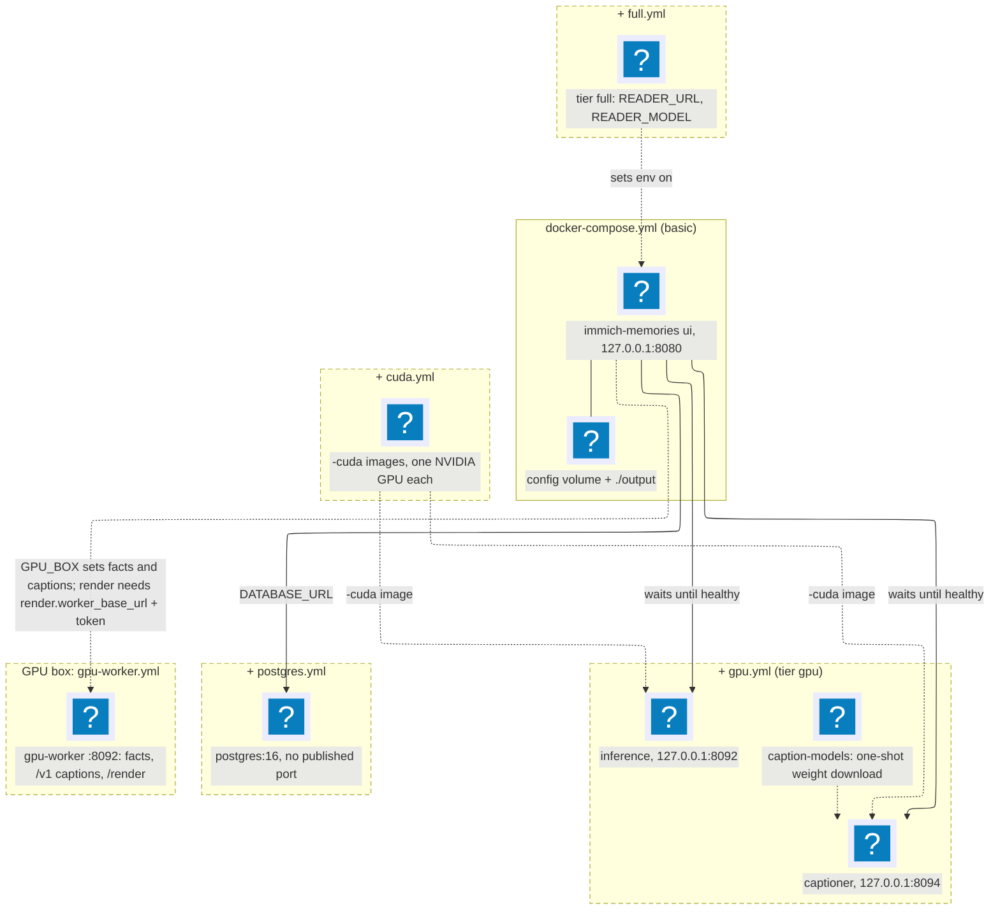

{/* Docker Compose: the base file and its -f overlays, for run/docker and reference/compose-files. Drawn from docker-compose*.yml. Style: contribute/diagram-style.md. */}

```mermaid
%%{init: {"layout": "elk"}}%%
flowchart TB
    subgraph base["docker-compose.yml (basic)"]
        app@{ icon: "logos:docker-icon", form: "square", label: "immich-memories ui, 127.0.0.1:8080", pos: "b", h: 48 }
        vols@{ icon: "mdi:harddisk", form: "square", label: "config volume + ./output", pos: "b", h: 48 }
        app --- vols
    end
    subgraph gpu["+ gpu.yml (tier gpu)"]
        infer@{ icon: "mdi:chip", form: "square", label: "inference, 127.0.0.1:8092", pos: "b", h: 48 }
        capt@{ icon: "mdi:image-text", form: "square", label: "captioner, 127.0.0.1:8094", pos: "b", h: 48 }
        models@{ icon: "mdi:download", form: "square", label: "caption-models: one-shot weight download", pos: "b", h: 48 }
        models -.-> capt
    end
    subgraph cuda["+ cuda.yml"]
        nv@{ icon: "simple-icons:nvidia", form: "square", label: "-cuda images, one NVIDIA GPU each", pos: "b", h: 48 }
    end
    subgraph full["+ full.yml"]
        tierfull@{ icon: "mdi:robot-outline", form: "square", label: "tier full: READER_URL, READER_MODEL", pos: "b", h: 48 }
    end
    subgraph pg["+ postgres.yml"]
        postgres@{ icon: "logos:postgresql", form: "square", label: "postgres:16, no published port", pos: "b", h: 48 }
    end
    subgraph box["GPU box: gpu-worker.yml"]
        gw@{ icon: "simple-icons:nvidia", form: "square", label: "gpu-worker :8092: facts, /v1 captions, /render", pos: "b", h: 48 }
    end
    app -->|"waits until healthy"| infer
    app -->|"waits until healthy"| capt
    nv -.->|"-cuda image"| infer
    nv -.->|"-cuda image"| capt
    tierfull -.->|"sets env on"| app
    app -->|"DATABASE_URL"| postgres
    app -.->|"GPU_BOX sets facts and captions; render needs render.worker_base_url + token"| gw
    class gpu,cuda,full,pg,box optional
    classDef optional stroke-dasharray: 6 4
```
