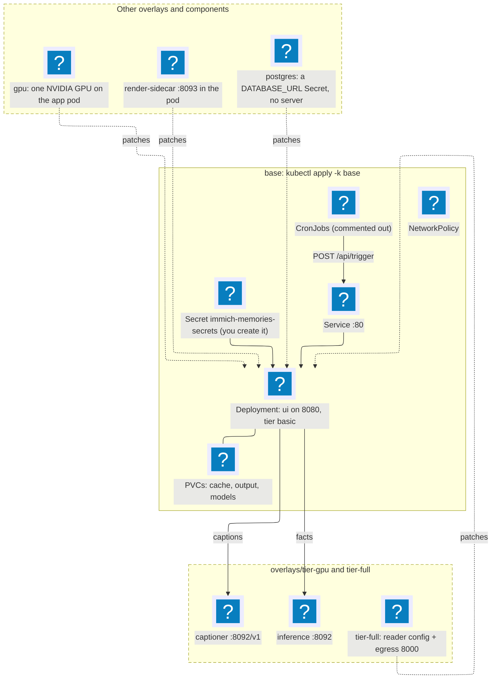

{/* Kubernetes with Kustomize: base, components and overlays, for run/kubernetes. Drawn from deploy/kubernetes. Style: contribute/diagram-style.md. */}

```mermaid
%%{init: {"layout": "elk"}}%%
flowchart TB
    subgraph base["base: kubectl apply -k base"]
        dep@{ icon: "logos:kubernetes", form: "square", label: "Deployment: ui on 8080, tier basic", pos: "b", h: 48 }
        svc@{ icon: "mdi:lan-connect", form: "square", label: "Service :80", pos: "b", h: 48 }
        pvc@{ icon: "mdi:harddisk", form: "square", label: "PVCs: cache, output, models", pos: "b", h: 48 }
        secret@{ icon: "mdi:key-variant", form: "square", label: "Secret immich-memories-secrets (you create it)", pos: "b", h: 48 }
        np@{ icon: "mdi:shield-lock-outline", form: "square", label: "NetworkPolicy", pos: "b", h: 48 }
        cron@{ icon: "mdi:timer-outline", form: "square", label: "CronJobs (commented out)", pos: "b", h: 48 }
        svc --> dep
        dep --- pvc
        secret --> dep
        cron -->|"POST /api/trigger"| svc
    end
    subgraph services["overlays/tier-gpu and tier-full"]
        infer@{ icon: "mdi:chip", form: "square", label: "inference :8092", pos: "b", h: 48 }
        capt@{ icon: "mdi:image-text", form: "square", label: "captioner :8092/v1", pos: "b", h: 48 }
        reader@{ icon: "mdi:robot-outline", form: "square", label: "tier-full: reader config + egress 8000", pos: "b", h: 48 }
    end
    subgraph comps["Other overlays and components"]
        gpu@{ icon: "simple-icons:nvidia", form: "square", label: "gpu: one NVIDIA GPU on the app pod", pos: "b", h: 48 }
        side@{ icon: "mdi:movie-open-cog-outline", form: "square", label: "render-sidecar :8093 in the pod", pos: "b", h: 48 }
        pgsec@{ icon: "logos:postgresql", form: "square", label: "postgres: a DATABASE_URL Secret, no server", pos: "b", h: 48 }
    end
    dep -->|"facts"| infer
    dep -->|"captions"| capt
    reader -.->|"patches"| dep
    gpu -.->|"patches"| dep
    side -.->|"patches"| dep
    pgsec -.->|"patches"| dep
    class services,comps optional
    classDef optional stroke-dasharray: 6 4
```
