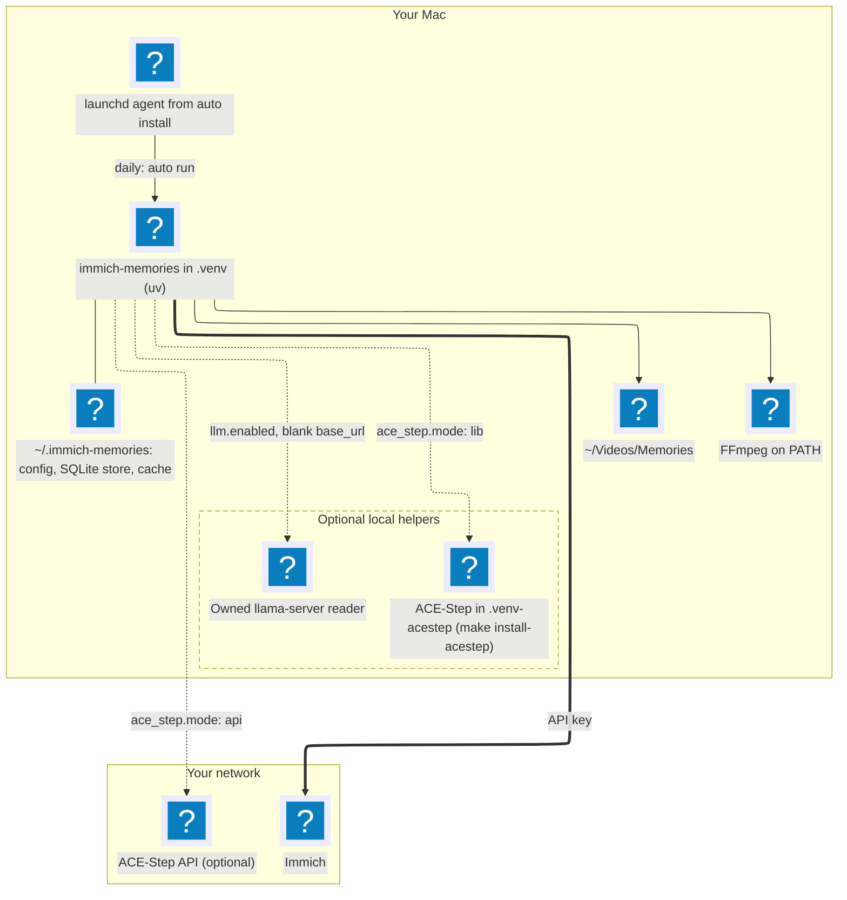

{/* A native install on a Mac, for run/reference/mac-example and run/uv-pip. Drawn from automation/system_scheduler.py and the Makefile. Style: contribute/diagram-style.md. */}

```mermaid
%%{init: {"layout": "elk"}}%%
flowchart TB
    subgraph mac["Your Mac"]
        launchd@{ icon: "logos:apple", form: "square", label: "launchd agent from auto install", pos: "b", h: 48 }
        app@{ icon: "logos:python", form: "square", label: "immich-memories in .venv (uv)", pos: "b", h: 48 }
        ffmpeg@{ icon: "logos:ffmpeg-icon", form: "square", label: "FFmpeg on PATH", pos: "b", h: 48 }
        cfg@{ icon: "mdi:database", form: "square", label: "~/.immich-memories: config, SQLite store, cache", pos: "b", h: 48 }
        out@{ icon: "mdi:folder-play-outline", form: "square", label: "~/Videos/Memories", pos: "b", h: 48 }
        subgraph helpers["Optional local helpers"]
            llama@{ icon: "mdi:robot-outline", form: "square", label: "Owned llama-server reader", pos: "b", h: 48 }
            ace@{ icon: "mdi:music-note", form: "square", label: "ACE-Step in .venv-acestep (make install-acestep)", pos: "b", h: 48 }
        end
    end
    subgraph lan["Your network"]
        immich@{ icon: "simple-icons:immich", form: "square", label: "Immich", pos: "b", h: 48 }
        aceapi@{ icon: "mdi:music-note", form: "square", label: "ACE-Step API (optional)", pos: "b", h: 48 }
    end
    launchd -->|"daily: auto run"| app
    app --> ffmpeg
    app --- cfg
    app --> out
    app -.->|"llm.enabled, blank base_url"| llama
    app -.->|"ace_step.mode: lib"| ace
    app -.->|"ace_step.mode: api"| aceapi
    app ==>|"API key"| immich
    class helpers optional
    classDef optional stroke-dasharray: 6 4
```
