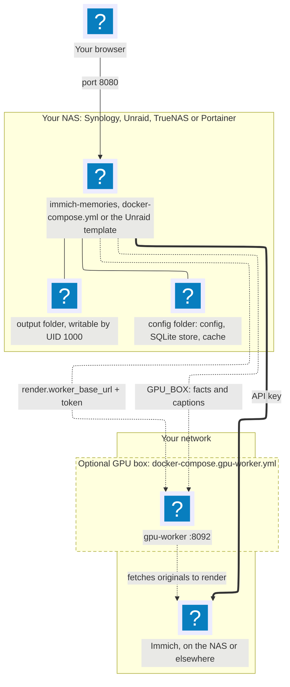

{/* A NAS install: one Compose stack through the NAS manager, plus an optional GPU box, for run/nas. Drawn from docker-compose.yml, docker-compose.gpu-worker.yml and deploy/unraid. Style: contribute/diagram-style.md. */}

