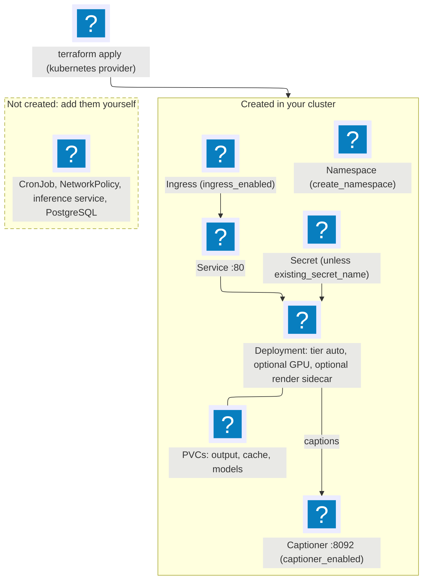

{/* What the Terraform module creates, and what it leaves out, for run/terraform. Drawn from deploy/terraform. Style: contribute/diagram-style.md. */}

```mermaid
%%{init: {"layout": "elk"}}%%
flowchart TB
    tf@{ icon: "logos:terraform-icon", form: "square", label: "terraform apply (kubernetes provider)", pos: "b", h: 48 }
    subgraph made["Created in your cluster"]
        ns@{ icon: "logos:kubernetes", form: "square", label: "Namespace (create_namespace)", pos: "b", h: 48 }
        secret@{ icon: "mdi:key-variant", form: "square", label: "Secret (unless existing_secret_name)", pos: "b", h: 48 }
        dep@{ icon: "logos:kubernetes", form: "square", label: "Deployment: tier auto, optional GPU, optional render sidecar", pos: "b", h: 48 }
        svc@{ icon: "mdi:lan-connect", form: "square", label: "Service :80", pos: "b", h: 48 }
        pvc@{ icon: "mdi:harddisk", form: "square", label: "PVCs: output, cache, models", pos: "b", h: 48 }
        ing@{ icon: "mdi:web", form: "square", label: "Ingress (ingress_enabled)", pos: "b", h: 48 }
        capt@{ icon: "mdi:image-text", form: "square", label: "Captioner :8092 (captioner_enabled)", pos: "b", h: 48 }
    end
    subgraph notmade["Not created: add them yourself"]
        none@{ icon: "mdi:close-circle-outline", form: "square", label: "CronJob, NetworkPolicy, inference service, PostgreSQL", pos: "b", h: 48 }
    end
    tf --> made
    secret --> dep
    svc --> dep
    ing --> svc
    dep --- pvc
    dep -->|"captions"| capt
    tf ~~~ notmade
    class notmade optional
    classDef optional stroke-dasharray: 6 4
```
