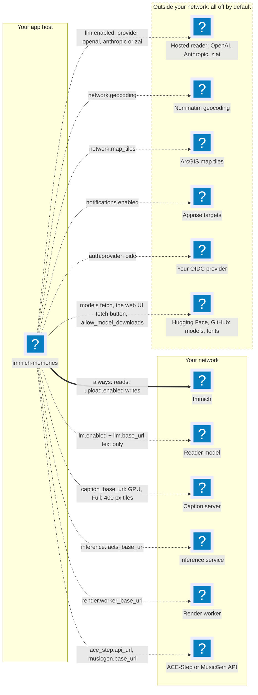

{/* Every outbound connection and the setting that turns it on, for run/privacy. Drawn from run/reference/privacy-egress and the config models. Style: contribute/diagram-style.md. */}

```mermaid
flowchart LR
    subgraph host["Your app host"]
        app@{ icon: "mdi:movie-open-outline", form: "square", label: "immich-memories", pos: "b", h: 48 }
    end
    subgraph lan["Your network"]
        immich@{ icon: "simple-icons:immich", form: "square", label: "Immich", pos: "b", h: 48 }
        lanreader@{ icon: "mdi:robot-outline", form: "square", label: "Reader model", pos: "b", h: 48 }
        capt@{ icon: "mdi:image-text", form: "square", label: "Caption server", pos: "b", h: 48 }
        infer@{ icon: "mdi:chip", form: "square", label: "Inference service", pos: "b", h: 48 }
        worker@{ icon: "mdi:movie-open-cog-outline", form: "square", label: "Render worker", pos: "b", h: 48 }
        music@{ icon: "mdi:music-note", form: "square", label: "ACE-Step or MusicGen API", pos: "b", h: 48 }
    end
    subgraph outside["Outside your network: all off by default"]
        hosted@{ icon: "mdi:cloud-outline", form: "square", label: "Hosted reader: OpenAI, Anthropic, z.ai", pos: "b", h: 48 }
        geo@{ icon: "simple-icons:openstreetmap", form: "square", label: "Nominatim geocoding", pos: "b", h: 48 }
        tiles@{ icon: "mdi:map-outline", form: "square", label: "ArcGIS map tiles", pos: "b", h: 48 }
        notify@{ icon: "mdi:bell-ring-outline", form: "square", label: "Apprise targets", pos: "b", h: 48 }
        oidc@{ icon: "simple-icons:openid", form: "square", label: "Your OIDC provider", pos: "b", h: 48 }
        dl@{ icon: "logos:hugging-face-icon", form: "square", label: "Hugging Face, GitHub: models, fonts", pos: "b", h: 48 }
    end
    app ==>|"always: reads; upload.enabled writes"| immich
    app -.->|"llm.enabled + llm.base_url, text only"| lanreader
    app -.->|"caption_base_url: GPU, Full; 400 px tiles"| capt
    app -.->|"inference.facts_base_url"| infer
    app -.->|"render.worker_base_url"| worker
    app -.->|"ace_step.api_url, musicgen.base_url"| music
    app -.->|"llm.enabled, provider openai, anthropic or zai"| hosted
    app -.->|"network.geocoding"| geo
    app -.->|"network.map_tiles"| tiles
    app -.->|"notifications.enabled"| notify
    app -.->|"auth.provider: oidc"| oidc
    app -.->|"models fetch, the web UI fetch button, allow_model_downloads"| dl
    class outside optional
    classDef optional stroke-dasharray: 6 4
```
