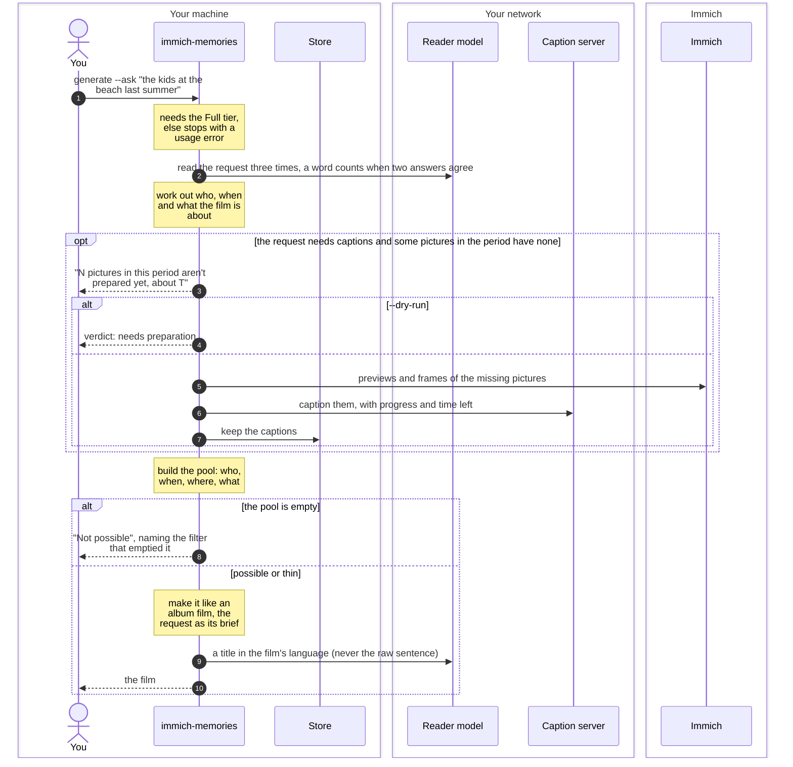

{/* A film from a sentence (generate --ask), for make/free-text and reference/sentence-parser. Traced from cli/_ask_generation.py and free_text/. Style: contribute/diagram-style.md. */}

```mermaid
%%{init: {"sequence": {"wrap": true, "noteMargin": 12, "messageMargin": 30}}}%%
sequenceDiagram
    autonumber
    box Your machine
        actor You
        participant App as immich-memories
        participant Store
    end
    box Your network
        participant Reader as Reader model
        participant Captions as Caption server
    end
    box Immich
        participant Immich
    end
    You->>App: generate --ask "the kids at the beach last summer"
    Note over App: needs the Full tier, else stops with a usage error
    App->>Reader: read the request three times, a word counts when two answers agree
    Note over App: work out who, when and what the film is about
    opt the request needs captions and some pictures in the period have none
        App-->>You: "N pictures in this period aren't prepared yet, about T"
        alt --dry-run
            App-->>You: verdict: needs preparation
        else
            App->>Immich: previews and frames of the missing pictures
            App->>Captions: caption them, with progress and time left
            App->>Store: keep the captions
        end
    end
    Note over App: build the pool: who, when, where, what
    alt the pool is empty
        App-->>You: "Not possible", naming the filter that emptied it
    else possible or thin
        Note over App: make it like an album film, the request as its brief
        App->>Reader: a title in the film's language (never the raw sentence)
        App-->>You: the film
    end
```
