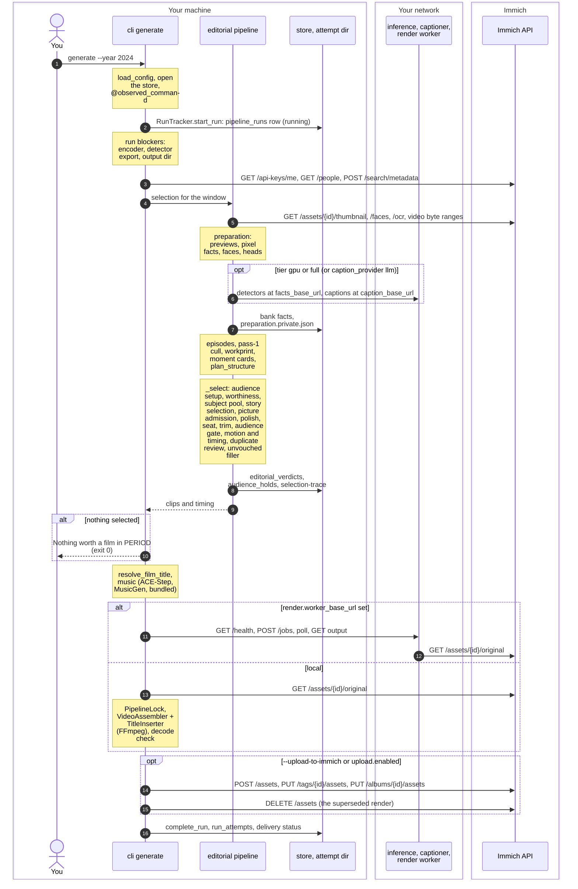

{/* generate with internal names, for reference/generation-contract. Traced from cli/generate.py, immich/, editorial/ and processing/. Style: contribute/diagram-style.md. */}

```mermaid
%%{init: {"sequence": {"wrap": true, "noteMargin": 12, "messageMargin": 30}}}%%
sequenceDiagram
    autonumber
    box Your machine
        actor You
        participant CLI as cli generate
        participant Ed as editorial pipeline
        participant Store as store, attempt dir
    end
    box Your network
        participant GPU as inference, captioner, render worker
    end
    box Immich
        participant Immich as Immich API
    end
    You->>CLI: generate --year 2024
    Note over CLI: load_config, open the store, @observed_command
    CLI->>Store: RunTracker.start_run: pipeline_runs row (running)
    Note over CLI: run blockers: encoder, detector export, output dir
    CLI->>Immich: GET /api-keys/me, GET /people, POST /search/metadata
    CLI->>Ed: selection for the window
    Ed->>Immich: GET /assets/{id}/thumbnail, /faces, /ocr, video byte ranges
    Note over Ed: preparation: previews, pixel facts, faces, heads
    opt tier gpu or full (or caption_provider llm)
        Ed->>GPU: detectors at facts_base_url, captions at caption_base_url
    end
    Ed->>Store: bank facts, preparation.private.json
    Note over Ed: episodes, pass-1 cull, workprint, moment cards, plan_structure
    Note over Ed: _select: audience setup, worthiness, subject pool, story selection, picture admission, polish, seat, trim, audience gate, motion and timing, duplicate review, unvouched filler
    Ed->>Store: editorial_verdicts, audience_holds, selection-trace
    Ed-->>CLI: clips and timing
    alt nothing selected
        CLI-->>You: Nothing worth a film in PERIOD (exit 0)
    end
    Note over CLI: resolve_film_title, music (ACE-Step, MusicGen, bundled)
    alt render.worker_base_url set
        CLI->>GPU: GET /health, POST /jobs, poll, GET output
        GPU->>Immich: GET /assets/{id}/original
    else local
        CLI->>Immich: GET /assets/{id}/original
        Note over CLI: PipelineLock, VideoAssembler + TitleInserter (FFmpeg), decode check
    end
    opt --upload-to-immich or upload.enabled
        CLI->>Immich: POST /assets, PUT /tags/{id}/assets, PUT /albums/{id}/assets
        CLI->>Immich: DELETE /assets (the superseded render)
    end
    CLI->>Store: complete_run, run_attempts, delivery status
```
