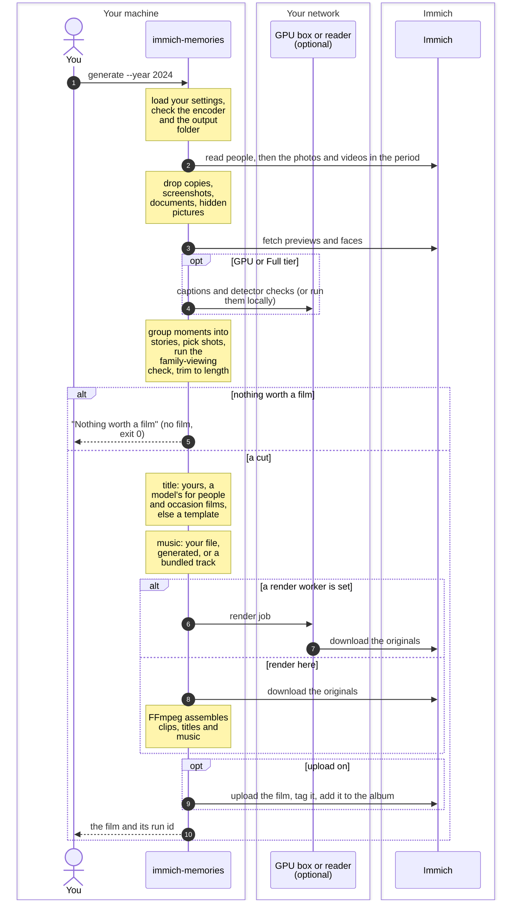

{/* What happens when you run generate, in plain steps, for how-it-chooses/overview and make/. Traced from cli/generate.py and the editorial pipeline. Style: contribute/diagram-style.md. */}

```mermaid
%%{init: {"sequence": {"wrap": true, "noteMargin": 12, "messageMargin": 30}}}%%
sequenceDiagram
    autonumber
    box Your machine
        actor You
        participant App as immich-memories
    end
    box Your network
        participant Helpers as GPU box or reader (optional)
    end
    box Immich
        participant Immich
    end
    You->>App: generate --year 2024
    Note over App: load your settings, check the encoder and the output folder
    App->>Immich: read people, then the photos and videos in the period
    Note over App: drop copies, screenshots, documents, hidden pictures
    App->>Immich: fetch previews and faces
    opt GPU or Full tier
        App->>Helpers: captions and detector checks (or run them locally)
    end
    Note over App: group moments into stories, pick shots, run the family-viewing check, trim to length
    alt nothing worth a film
        App-->>You: "Nothing worth a film" (no film, exit 0)
    else a cut
        Note over App: title: yours, a model's for people and occasion films, else a template
        Note over App: music: your file, generated, or a bundled track
        alt a render worker is set
            App->>Helpers: render job
            Helpers->>Immich: download the originals
        else render here
            App->>Immich: download the originals
            Note over App: FFmpeg assembles clips, titles and music
        end
        opt upload on
            App->>Immich: upload the film, tag it, add it to the album
        end
        App-->>You: the film and its run id
    end
```
