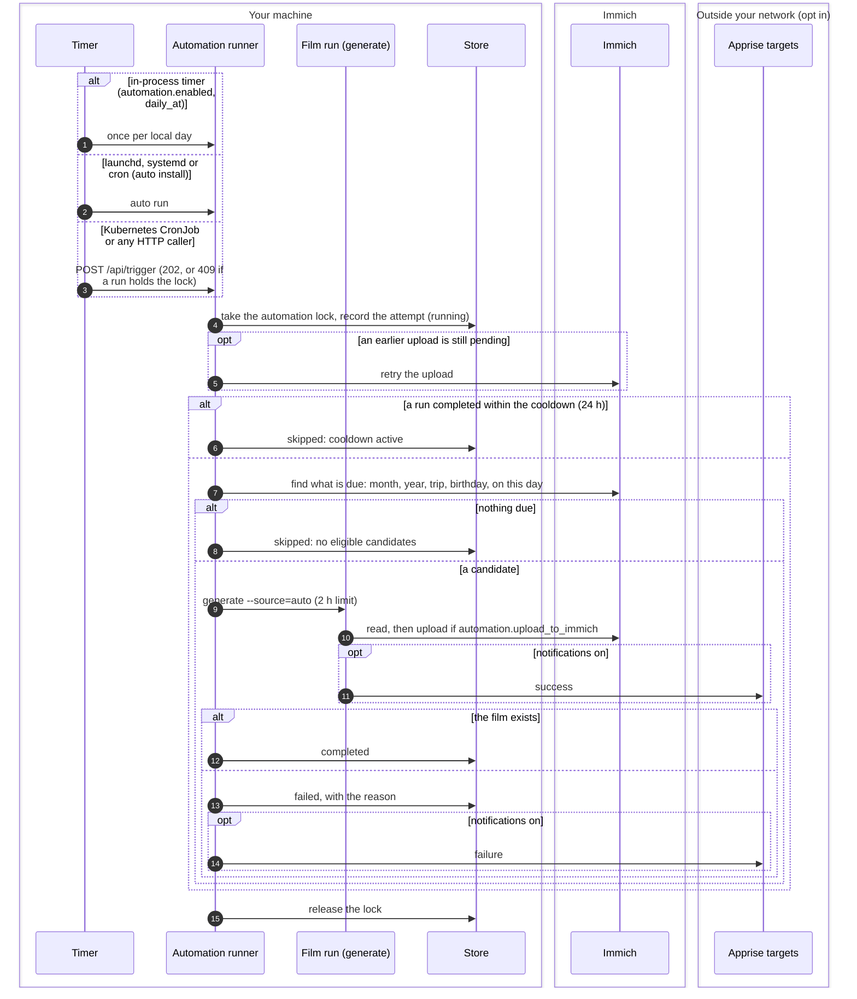

{/* One scheduled run, for make/automate and reference/automation-contract. Traced from automation/. Style: contribute/diagram-style.md. */}

```mermaid
%%{init: {"sequence": {"wrap": true, "noteMargin": 12, "messageMargin": 30}}}%%
sequenceDiagram
    autonumber
    box Your machine
        participant Timer as Timer
        participant Runner as Automation runner
        participant Run as Film run (generate)
        participant Store
    end
    box Immich
        participant Immich
    end
    box Outside your network (opt in)
        participant Notify as Apprise targets
    end
    alt in-process timer (automation.enabled, daily_at)
        Timer->>Runner: once per local day
    else launchd, systemd or cron (auto install)
        Timer->>Runner: auto run
    else Kubernetes CronJob or any HTTP caller
        Timer->>Runner: POST /api/trigger (202, or 409 if a run holds the lock)
    end
    Runner->>Store: take the automation lock, record the attempt (running)
    opt an earlier upload is still pending
        Runner->>Immich: retry the upload
    end
    alt a run completed within the cooldown (24 h)
        Runner->>Store: skipped: cooldown active
    else
        Runner->>Immich: find what is due: month, year, trip, birthday, on this day
        alt nothing due
            Runner->>Store: skipped: no eligible candidates
        else a candidate
            Runner->>Run: generate --source=auto (2 h limit)
            Run->>Immich: read, then upload if automation.upload_to_immich
            opt notifications on
                Run->>Notify: success
            end
            alt the film exists
                Runner->>Store: completed
            else
                Runner->>Store: failed, with the reason
                opt notifications on
                    Runner->>Notify: failure
                end
            end
        end
    end
    Runner->>Store: release the lock
```
