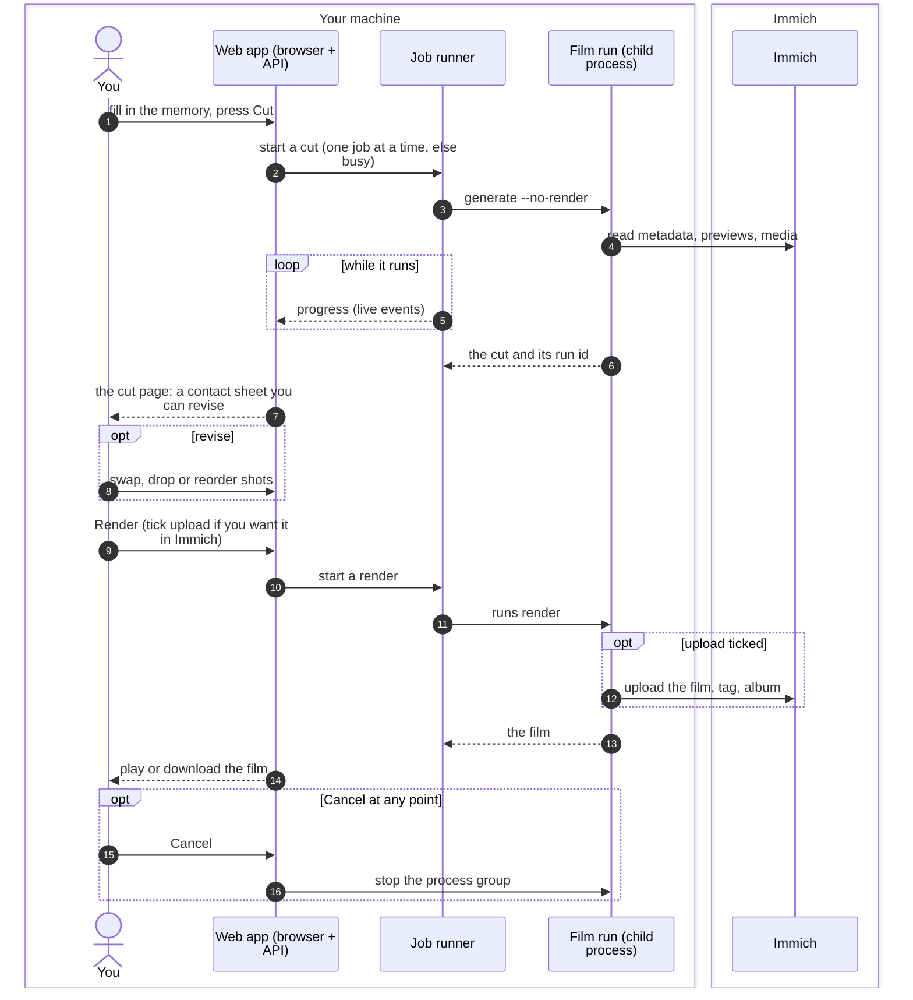

{/* A cut and a render from the web app, for make/web-ui and reference/web-ui-details. Traced from web/ and the job runner. Style: contribute/diagram-style.md. */}

```mermaid
%%{init: {"sequence": {"wrap": true, "noteMargin": 12, "messageMargin": 30}}}%%
sequenceDiagram
    autonumber
    box Your machine
        actor You
        participant Web as Web app (browser + API)
        participant Job as Job runner
        participant Run as Film run (child process)
    end
    box Immich
        participant Immich
    end
    You->>Web: fill in the memory, press Cut
    Web->>Job: start a cut (one job at a time, else busy)
    Job->>Run: generate --no-render
    Run->>Immich: read metadata, previews, media
    loop while it runs
        Job-->>Web: progress (live events)
    end
    Run-->>Job: the cut and its run id
    Web-->>You: the cut page: a contact sheet you can revise
    opt revise
        You->>Web: swap, drop or reorder shots
    end
    You->>Web: Render (tick upload if you want it in Immich)
    Web->>Job: start a render
    Job->>Run: runs render
    opt upload ticked
        Run->>Immich: upload the film, tag, album
    end
    Run-->>Job: the film
    Web-->>You: play or download the film
    opt Cancel at any point
        You->>Web: Cancel
        Web->>Run: stop the process group
    end
```
