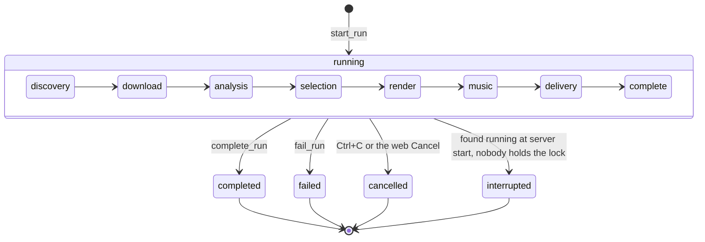

{/* The states of a film run, for reference/generation-contract. Real names from pipeline_runs.status and the phases. Style: contribute/diagram-style.md. */}

```mermaid
stateDiagram-v2
    [*] --> running: start_run
    state running {
        direction LR
        discovery --> download
        download --> analysis
        analysis --> selection
        selection --> render
        render --> music
        music --> delivery
        delivery --> complete
    }
    running --> completed: complete_run
    running --> failed: fail_run
    running --> cancelled: Ctrl+C or the web Cancel
    running --> interrupted: found running at server start, nobody holds the lock
    completed --> [*]
    failed --> [*]
    cancelled --> [*]
    interrupted --> [*]
```
