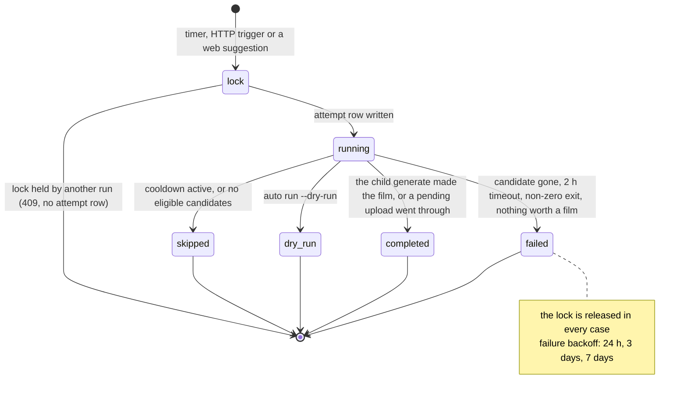

{/* The outcomes of one scheduled attempt, for reference/automation-contract. Real names from automation_attempts.outcome. Style: contribute/diagram-style.md. */}

```mermaid
stateDiagram-v2
    [*] --> lock: timer, HTTP trigger or a web suggestion
    lock --> [*]: lock held by another run (409, no attempt row)
    lock --> running: attempt row written
    running --> skipped: cooldown active, or no eligible candidates
    running --> dry_run: auto run --dry-run
    running --> completed: the child generate made the film, or a pending upload went through
    running --> failed: candidate gone, 2 h timeout, non-zero exit, nothing worth a film
    skipped --> [*]
    dry_run --> [*]
    completed --> [*]
    failed --> [*]
    note right of failed
        the lock is released in every case
        failure backoff: 24 h, 3 days, 7 days
    end note
```
