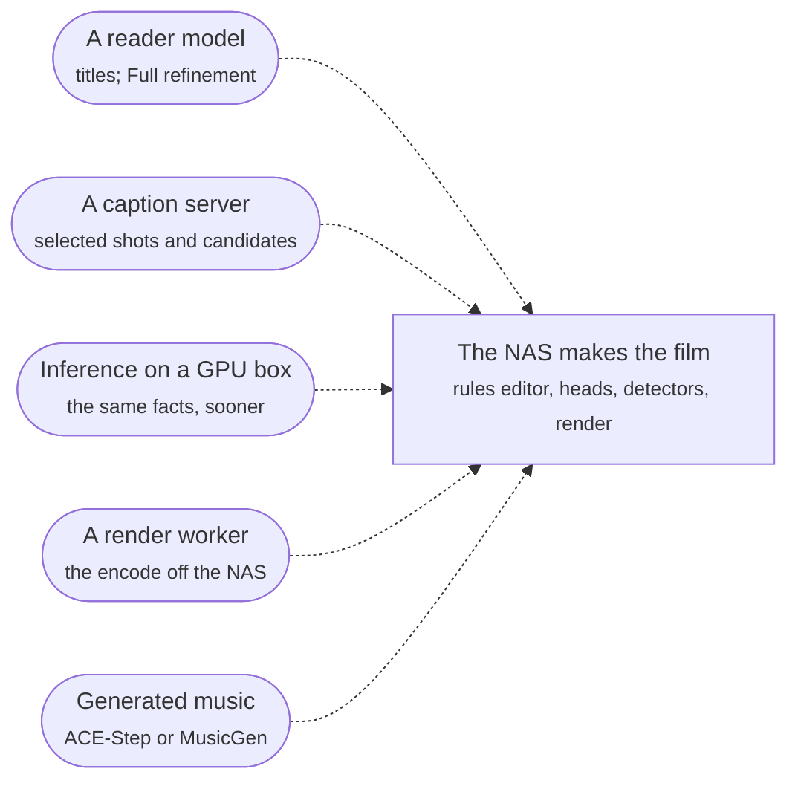

# What a model adds, what it costs

Reader: newcomer and power user.

Immich Memories works on a plain NAS: one container, one `models fetch`, and the whole film gets
made there. That is a good default. Optional models can add small refinements; compare the
pictures and decide whether the extra time, memory or API cost is worth it. They can also leave
the cut unchanged. Existing captions and other facts stay banked when you change the setup.

## The add-ons

| Add-on | What it buys | What it needs | What leaves the box |
|---|---|---|---|
| [A reader](./reader.md) | Titles and music mood on every tier; on Full, an account of the period and refinement of the NAS draft | A text model with a 32k context, such as local Gemma 4 E4B. Selection refinement also needs GPU capability, captions and Laya | The candidates' annotation lines, people and place names included, to the model. Never a picture |
| [Captions](./captions.md) | Descriptions for selected pictures and replacement candidates, used by the reader and Laya | The supported 500M vision model, or explicit opt-in to a vision-capable LLM | A 400 px tile of each requested picture, once per caption generation, to the chosen provider |
| [Inference on a GPU box](./inference.md) | The encoder, its eight heads and the two detectors on a card or a bigger CPU | A second machine, CPU or NVIDIA | A preview of each picture, once, to your service |
| [A render worker](./gpu-render.md) | The encode on a GPU box instead of the NAS | An NVIDIA box running the same app version | The chosen cut and your Immich key; the worker fetches the originals itself |
| [Generated music](./music.md) | An original track per film instead of a bundled one | ACE-Step on a Mac or an NVIDIA box (7 to 29 GB free for its weights), or a MusicGen server | A text prompt (mood, tempo, length) to your music server |

Every destination defaults to `localhost` or off. Pointing one at another host is the consent step,
and [Privacy](../run/privacy.md) lists every switch.

## What the model does, and what it doesn't

The rules editor builds the draft from dates, places, favourites, known people and inexpensive
CPU classifier results. `tier: auto` selects NAS without GPU inference, GPU with it, and Full
with GPU inference plus a configured LLM. Preparation follows the same tier. An LLM alone can
still write titles and music mood; it does not enable selection refinement.

On Full, the model does two things with the draft:

- **It writes the prose.** It reads the episodes the draft's shots sit in (only those, not the
  whole period), says what happened in each, then writes an account of the period, a title and a
  mood for the music. Banked readings are reused when their inputs and producer still match.
- **It polishes.** It reads the finished draft in blocks of 12 shots and names the ones that add
  nothing. A named shot stays until a replacement passes the shared checks and its final fit
  vote. An ordinary replacement still marked weak leaves the original in place. Favourites,
  a close relative's only shot and a record the catalogue holds
  stay put. So does a year's only shot in a film that gives every year a voice, and a year whose
  every shot is named keeps one. A refill that picks a picture takes its moment's favourite instead
  when the page has one. Sharing and unusable-picture checks can still remove a shot outright.
  Final duplicate review can also leave a shorter cut when no suitable replacement exists.

The prose reader gets text only and never decides sharing. Rules and picture classifiers make
those decisions on NAS; GPU and Full add Laya over the captions. Laya cannot lift a detector hold.
GPU and Full acquire missing captions and clip evidence for selected shots and actual replacement
candidates. Captioning the whole library is a separate, explicit `prepare` job.

The [LLM caption option](./captions.md#explicit-llm-captions) is separate from the prose reader.
It sends image inputs only with explicit config approval, is less efficient than SmolVLM, and
can cost much more on hosted infrastructure. It can supply captions on NAS without enabling
Full selection.

Separate date windows also use the NAS draft and bounded refinement. If the model cannot read
the period account after two attempts, the rules draft ships with the passes a no-model film gets,
and the log says: `The model polish did not run (<reason>); the film is the rules draft`.

`advanced.editorial.thin_model_layer: false` makes the model plan every film whole instead. How the
polish decides, with diagrams: [What a model adds](../how-it-chooses/what-a-model-adds.md).

## What it costs

Time, memory and euros per setup belong on [Measured](./measured.md), with the code revision,
hardware and cache state. Plan for these costs:

- The reader and caption server need memory alongside the app. Reader memory also depends on
  context length and concurrent requests, not just the model's weight size.
- NAS does not require a caption server. GPU and Full need a caption provider and reuse existing captions.
- A hosted reader bills tokens, and the prose is banked, so a week is paid for once, not once per
  film.
