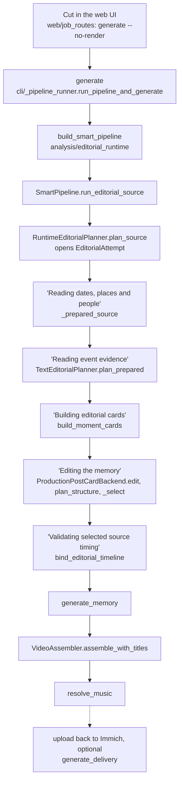
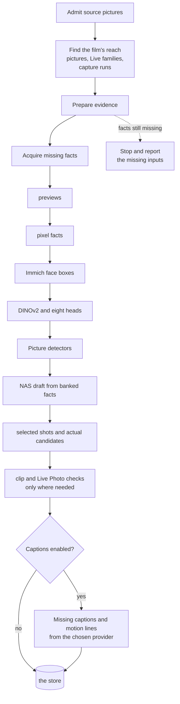

# From library to film

route through the code, for when you want to see every step.

## The short version

You pick a period: a month, a year, a trip, a person. The editor reads what Immich already knows
about every picture in it (when, where, who, whether you starred it, whether it moves), groups the
pictures into moments and the moments into stories, decides which stories earn a place in a film
of that length, picks the best frame of each moment it funds, and checks the finished cut against
a list of promises before anything renders.

On a plain NAS that is the whole editor: metadata, pixels and small CPU classifiers make the film.
A GPU adds a one-line description of every picture in the cut and a second family-viewing check. A
text model on top of that polishes the draft, swapping out the shots that add nothing
([What a model adds](./what-a-model-adds.md)). Facts already banked are reused, and the text model
only ever reads text and never decides what is shareable.

## The house rules

These hold on every tier.

- **Always chronological.** The film plays in the order things happened. The editor decides what
  goes in and how long it stays, never when.
- **Your star wins its moment.** A favourite beats every other frame of its moment and always stands
  on its own. It does not buy a place by itself: the family-viewing gate, the capture spacing and
  the duplicate review still apply.
- **Stories are weighed, days aren't counted.** A week with nothing marked gets no shot; a stretch
  away from home or an unusually busy day does. See [Moments, episodes and stories](./moments-and-stories.md).
- **Videos are first class.** A video always plays, and a Live Photo plays as motion when its clip
  moves and shows its subject. See [Picking each shot](./picking-shots.md).
- **Close family gets a shot.** A partner, child or parent who is all over the period and in none of
  its shots gets a seat. See [Family, audience and duplicates](./family-audience-duplicates.md).
- **Short beats a guess.** When the material runs out, the film runs shorter than its target rather
  than pad with a frame nothing vouches for. See [Length, quiet weeks and filler](./length-and-filler.md).
- **Your tick outranks the editor.** A picture you tick in the pool goes in, one you untick never
  does, even over a family-viewing hold: you looked at it. On a new cut, a picture you pass with
  `--include` still goes through the gate. See [Overrule it](./overrule-it.md).
- **The finished cut is checked.** Once every pass has run, the cut is read against these promises.
  A broken one is a warning in the log and a row in the run's records.

## The route through the code

The web UI's **Cut** runs `immich-memories generate --no-render` on the server, so both take the same
route. The quoted stage names are what the web UI and the terminal print.

`_select` in `analysis/editorial_structure_planner.py` is where the film gets decided. Everything the
other pages of this section describe happens inside it.

## Preparation: what gets read, and when

A film acquires cheap facts for its **reach**: the pictures it could select (for a person film, every
picture of an episode where Immich recognised that person at least once), the other stills of their Live Photo bursts, and every picture of the same
five-minute capture run, because the exposure rule reads the whole run. The rest of the window is
read as Immich metadata only, since moments and episodes are cut from all of it. A cut that selects
a picture it never prepared stops rather than ship it. Captions and clip checks wait until after
the NAS draft, for selected shots and actual candidates. A reader may use the selected shot's
whole episode for context without captioning every neighbour. `immich-memories prepare` reads a
whole scope ahead of time when explicitly requested.

Admission refuses a few things before anything is read: a video over five minutes
(`max_source_video_seconds`), the video half of a Live Photo (it plays inside its still), anything
tagged `immich-memories/generated` or listed in this install's upload receipts (a film this app made
is not footage), and pictures that look forwarded rather than shot on your camera. After the heads
run, screenshots and photos of screens go too: a phone-screen pixel size, the `screen` head, or the
document detector calling it a screenshot, a table or a QR code.

The eight heads are small classifiers over one pinned DINOv2 encoder: `location`, `people`,
`children`, `activity`, `venue`, `frame_kind`, `screen` and `uncovered_person`. The two detectors are
`nsfw_marqo` (exposure) and `doc_docling` (documents). Every fact is banked in the store
under its producer's version, so the next cut asks nothing twice.

Preparation follows the resolved product tier (`tier: auto` by default):

| Tier | What reads the pixels | When you get it |
|---|---|---|
| `nas` | previews, pixel facts, face boxes, the eight heads, the two detectors | no usable local GPU or GPU inference service |
| `gpu` | NAS facts, plus missing captions and clip evidence for selected shots and candidates; Laya reads their captions | GPU inference without a configured prose LLM |
| `full` | the same pixel producers as GPU; a prose LLM reads annotation text to refine selection | GPU inference and a configured prose LLM |

NAS needs `immich-memories models fetch` once. A configured LLM alone does not change selection
from NAS, but can still write titles and music mood. GPU and Full enable captions by default;
NAS can use a vision-capable LLM only with explicit caption-provider opt-in. Captions are an add-on:
[Add captions](../better/captions.md).

## What a run leaves behind

Every cut writes a durable attempt under `~/.immich-memories/cache/editorial-runs/`, with each pass's
decisions in `derived-decisions/*.private.json`. `immich-memories runs why <asset-id>` reads them for
one picture, `runs story` prints the storyboard, and `runs show` prints the run with its count of
broken promises. See [runs](../make/cli/runs.md).
