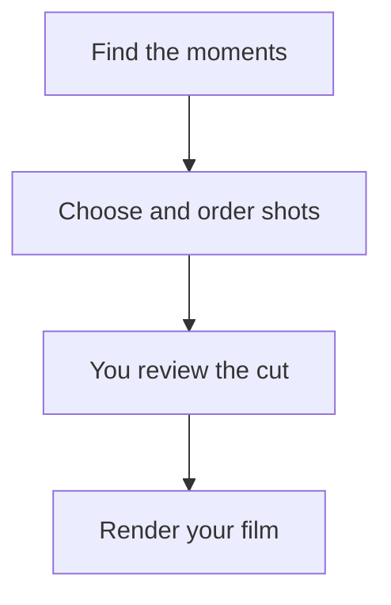

# How it chooses

You choose a month, a trip, a person or an album. Immich Memories turns that pool into a chronological film: a few moments worth keeping, rather than every photo you took.

Thirty pictures of the same jump are one moment. A holiday with several stops has several stories. The editor gives those stories room, picks a frame from each moment, and removes repeats. It uses dates, places, faces, favourites and small local picture classifiers.

- **Your favourites matter.** A star in Immich wins over other frames of that moment. It still needs a place in the film.
- **People and motion help.** A clear frame of someone you know usually beats another empty room. Videos and useful Live Photo motion can play alongside stills.
- **Family matters.** Confirm who your close family is so someone photographed all month gets more than zero appearances.
- **A quiet month makes a shorter film.** The target length is a budget. It does not need to be filled with the ceiling.
- **You have the final edit.** Review the pool, add what matters and remove what does not. The film follows those choices.

A plain NAS does this without a prose model. A GPU adds descriptions and an extra sharing check. With a text model too, the app can refine the draft. Those additions have costs and limitations: [Choose an upgrade](../better/overview.md).

Read [how moments become stories](./moments-and-stories.md), [how a shot wins](./picking-shots.md), and [what a model changes](./what-a-model-adds.md).

## Make it yours

[Review and adjust the cut](./overrule-it.md), [choose who may see it](./family-audience-duplicates.md), or [understand a shorter film](./length-and-filler.md).

For the exact grouping, scoring and timing rules, read [Selection internals](../reference/selection-internals/overview.md). You do not need those to make a film.
