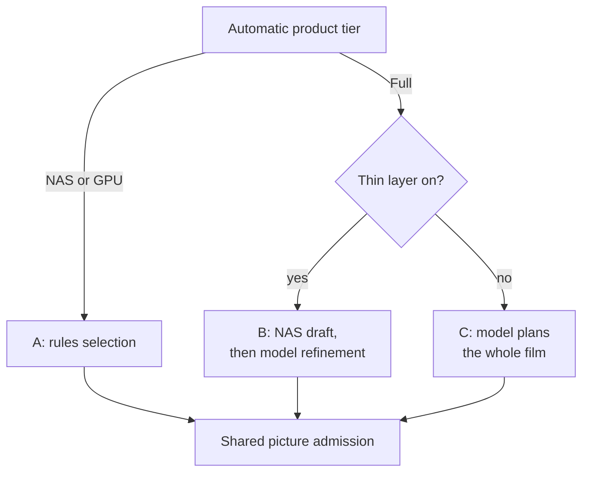
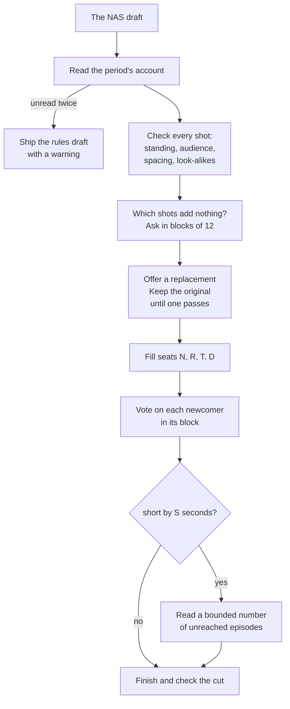
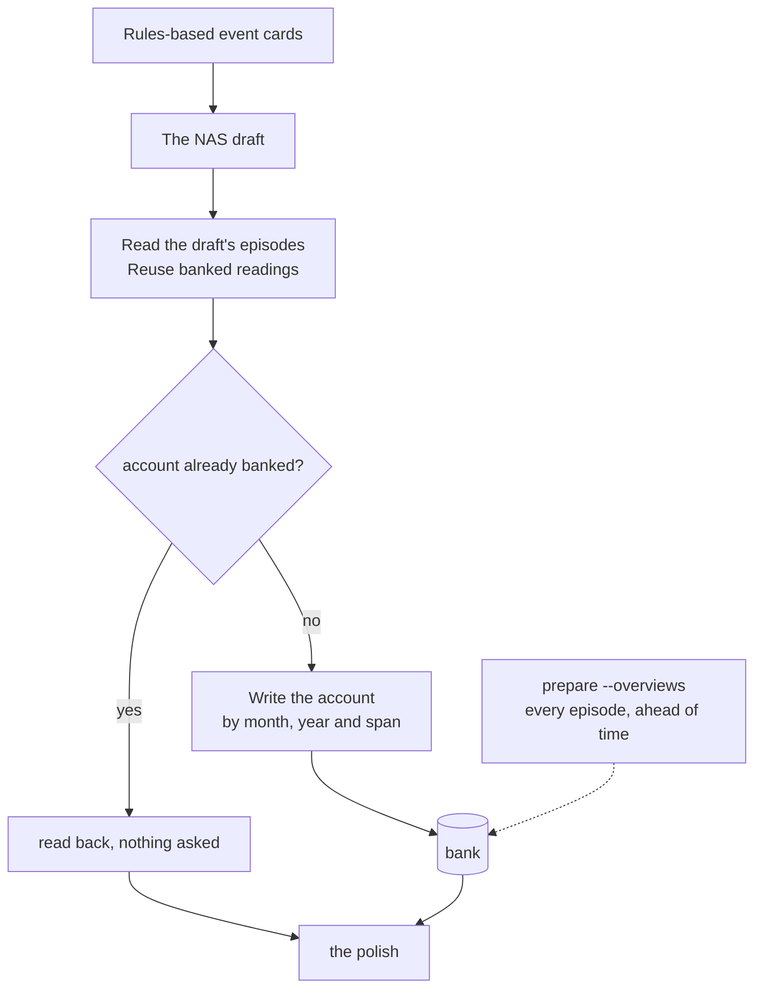

# What a model adds

The NAS tier makes the whole film from metadata, pixels and small CPU classifiers. The `gpu` tier
adds captions and Laya for the pictures in the cut and their candidates. The `full` tier adds a text
model that reads the draft, as annotation lines, and polishes it: this page is how. What each tier
adds, feature by feature: [What a GPU or a model adds](../get-started/what-a-gpu-or-a-model-adds.md).

The prose model gets text only and never decides sharing. Rules, picture classifiers and Laya
own that check. A configured LLM can also write titles and music mood on NAS or GPU without
changing the selection tier. Costs and setup are on [What a model adds, what it costs](../better/overview.md).

## Which route a cut takes

- `tier: auto` picks the tier: [The three tiers](../run/requirements.md#the-preparation-tier).
  Conflicting legacy switches are reported and ignored.
- The first draft uses metadata and CPU facts on every tier, even when captions are already banked,
  so it never depends on an earlier caption job. Captions arrive during the polish, for the
  selected shots and their candidates.
- **Route B** covers months, years, seasons, trips, special days and person films. It also covers
  separate date windows, such as the same day across years or a birthday with flashbacks.
- **Route C** is selected with `advanced.editorial.thin_model_layer: false`.
  There the model reads the period's stories, weighs
  them, folds trips and recurring activities, and picks the moments. Standing, spacing, the
  look-alike check and every pass after the draft stay the same facts.

## The polish (Route B)

**The vote.** The model gets the draft as text, in blocks of at most 12 shots, under the period's
account and whose film it is. It answers one question, reject-only: which of these shots add
nothing? Each block is asked in source order, and in a second, hashed order only when the first named
a shot it may move. A shot named in either order is offered a replacement and keeps its place
until one passes every check. If the bounded candidate search finds nothing suitable, the
original stays. Sharing and unusable-picture checks can still remove a shot outright.

**What the vote can't touch.** A favourite, a picture an episode reading recorded as worth a place of
its own, the only shot of a close family member, and a story's only shot that isn't a portrait
(a place outdoors, a crowd, a race, a party: the frame, people, activity and location heads
say which; an empty interior doesn't count). Left alone,
the vote reads a road race as filler and a posed selfie as the point. A block made only of those is
not asked. Only a
gate removes them. In a film that gives every year a shot, a year's last shot is kept from the vote
and from the standing gate too: only the sharing check, a source rule or a repeat takes it. Your
ticks are added back after the polish either way.

**Seats.** A refusal is a seat, not a hole. N seats take only the room the draft left unused, at
the 3.5 s minimum hold. R seats swap within the original shot's time; T seats can use the seconds
a gate-refused shot freed. Both work even when the draft already filled the film. If no replacement
passes, an R or D seat keeps the original. A T seat stays empty because its original failed a
gate. The record names the failed attempt and any original retained without a replacement.

| Seat | What it is for |
|---|---|
| N | a story the library records something about and the draft gave no shot |
| R | replaces a shot the vote named in both orders |
| T | replaces a shot a gate refused |
| D | swaps out a shot one order named; needs no room |

A seat's page is its own story's pictures. An R or T seat then reads on into the pictures of the
other stories the film already holds, nearest in time first, so it doesn't end empty while the film
has material. The refused moment comes first, then the
moments the cut lacks, moving ones first, the favourite first inside a moment. A refill's page puts
the kind of shot its story holds fewer of (portrait or texture) on top of all that, among the
pictures the library vouches for (a star, a video, someone Immich knows). A removed shot shorter than
2 s still frees a whole seat; finishing shaves the fraction the refill runs over. The model picks
from 12 rows at most; the facts then say whether the pick stands, and a failed pick gets one more
try, as does an R or T pick a gate refuses. A replacement for a shot the vote named comes from
another moment: the vote judged the moment, and a frame taken seconds apart adds nothing either. A
newcomer that repeats a scene the cut already holds (the same scene prints the final duplicate review
reads) is refused on the spot; the outgoing shot is excluded from this comparison. `thin-polish.private.json` records the shot-kind mix of
the draft and of the polished cut. Every newcomer is voted
on again inside the block it joined. An ordinary candidate named weak in either order is
revoked: trading one weak picture for another has not improved the draft. Its original comes
back; an R or T seat can try once more within the existing budget. Protected pictures keep
the protections described above.

### A short film gets one more look

On a cold library, a story the draft never reached has no reading, so it can never show it holds
something worth a place. When the polished film is short by S seconds, the polish reads at most
2 × ceil(S / 3.5) of those unread episodes (a week the film doesn't reach first, then a day, then by
worthiness, close family, motion and standing), and opens at most ceil(S / 3.5) N seats for the
stories whose reading records a moment. A story whose reading records nothing gets no seat, and the
film stays short.

**The budget.** Up to 4 questions per 12 draft shots, 4 per seat, and one per three episodes the
short-film look reads. Sharing uses no prose-LLM calls. `thin-polish.private.json`
records what it asked against that budget, and the run logs a warning when it goes over.

**When the account can't be read**, it is asked once more. A second failure ships the no-model film
exactly: the run logs *The model polish did not run (...); the film is the rules draft*, the record
says `ran: false` with the reason. The filler pass runs either way.

**When an episode can't be read**, the account can still use its factual card. The private
`plan.private.json` records each demanded episode's availability and exact evidence identity under
`episode_reading_health`. An unresolved reading marks that section `degraded` and adds a warning
to the selection trace. A later successful read is marked `recovered`; it clears the unresolved
warning and keeps the successful reading banked. A completed film can therefore still have an
incomplete model pass, which the run evidence now makes visible.

## Reading on demand

A model film starts with the NAS draft. Missing captions and clip evidence are acquired for
selected shots and actual candidates. The reader may expand a selected shot to its whole episode
for context, using existing annotations without captioning every neighbour. It asks what happened,
one representative and the moments worth a record. The period's account combines those readings
with rules-based cards for the other episodes. Existing matching readings and captions are reused.

Accounts are one per calendar month, one per year, and for a longer window one per calendar year it
touches plus one over the span, up to 8 per request. Each is keyed by exactly what it summarises and
the model that wrote it, so a second cut of the same period asks nothing again.
`immich-memories prepare --overviews` reads a whole window ahead of time instead; it needs a model reader.

`advanced.llm.reader_concurrency` sets how many independent requests overlap. Unset, it is 1 for a
server on your own machine or network and 4 for a public host.

## What else the model writes

- **The title**, for person, month, season, year, album, holiday, on-this-day and special-day films;
  trips only with `--llm-title`, and `--no-llm-title` keeps the template. With no model the template writes it.
- **The music's mood**, from the film's story titles and captions, in one text call
  (`audio/text_mood.mood_for_cut`). With no model the clips' own mood decides, or "calm".
- **The thesis**, the period's account in up to 150 words. It steers the vote, and the storyboard and
  `runs story` show it on every film the model polished or planned.

The captions under the pictures are dates and places from Immich metadata on every tier.

## The keys

| Key | Default | What it does |
|---|---|---|
| `tier` | `auto` | Resolves NAS, GPU or Full from inference capability and the configured LLM; controls preparation and selection together |
| `advanced.editorial.thin_model_layer` | `true` | `false` makes the model plan every film whole (Route C) |
| Laya | follows the tier | Enabled on GPU and Full, off on NAS; not a separate preparation choice ([details](./family-audience-duplicates.md#the-family-viewing-gate)) |
| `advanced.llm.reader_concurrency` | unset | requests in flight: 1 local, 4 hosted when unset |
