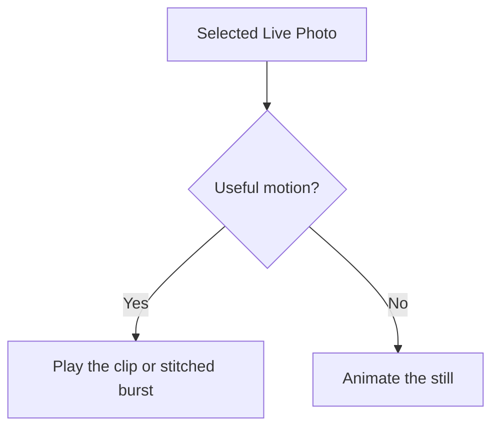

import Video from '@site/src/components/Video';

# Photos, Live Photos and HDR

Photos and videos share one cut. A selected still gets a gentle zoom and pan; a video plays the interval the cut chose. You can remove either or swap it during review.

## Ken Burns, and where the pan lands

The pan moves toward the largest face Immich recognised, or toward the centre when there is none. Rendering does not run another face detector.

If you crop, rotate or mirror a photo in Immich's own editor, the film uses that edited version, not the untouched original. An edited HDR photo comes out in SDR: Immich's editor does not carry the gain map over.

Clips keep their whole frame. For a landscape clip in a portrait film, choose **Blurred background** or **Fit with bars** under **Scaling Mode**. Neither crops your subject.

To make a video-only film, untick **Include photos** under **Length and pictures**, pass `--no-photos` on the CLI, or set `photos.enabled: false` in YAML.

## Live Photos

A Live Photo enters the cut as one photograph. If its video shows useful motion, it plays as motion; if not, the still stays. Nearby Live Photos can be stitched into a longer clip. The app verifies selected motion companions before sealing the cut: a malformed video keeps the photograph as a still, while unavailable sources or tools stop the check.

Three overlapping Live Photos can become this continuous 4.5-second shot:

<Video src="/demos/live-photos/italian_hilltop/merged.mp4" width={480} controls />

Six Live Photos at a bike race become 8.1 seconds:

<Video src="/demos/live-photos/bike_race/merged.mp4" width={480} controls />

These examples are the author's own footage, published with permission.

Untick **Include Live Photos**, pass `--no-live-photos`, or set `advanced.analysis.include_live_photos: false` to use the stills only. A person-filtered film does not add untagged pictures just to extend a burst.

## HDR, end to end

HDR preservation depends on the source and encoding hardware. On the Basic tier, Live Photo merges are limited to 1080p. On that tier, a device with hardware H.264 but no hardware HEVC tone-maps HDR photos and companions to SDR during preparation.

Use [hardware encoding](../run/hardware.md) to check what your machine supports. The [media processing reference](../reference/media-processing.md) covers frame verification, audio alignment, supported devices, HDR formats and gain maps.
