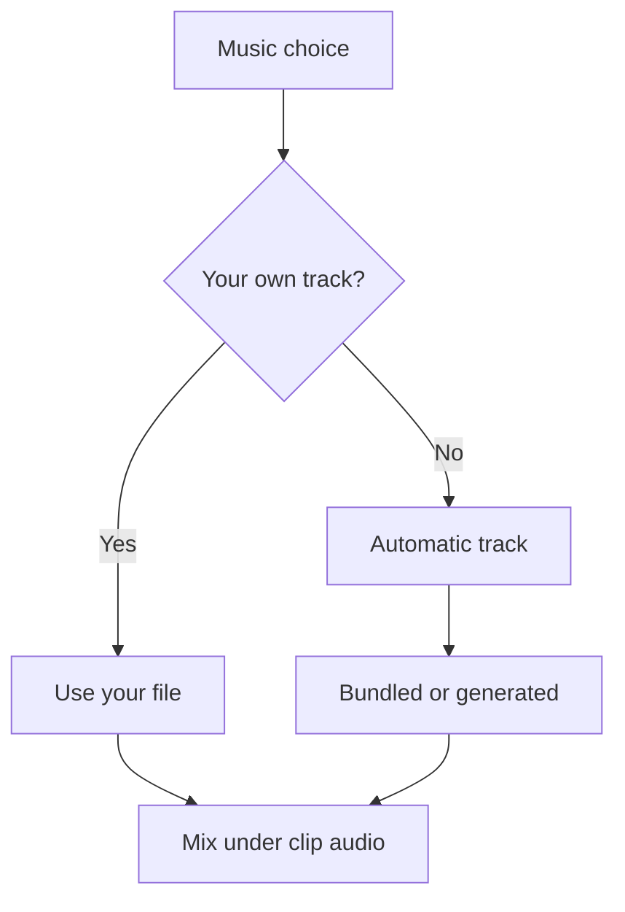

# Titles, maps and music

These are render choices. You can change them after reviewing the cut, without asking the app to choose the shots again.

## Titles and language

Under **Render**, type a **Title** and **Subtitle**, or leave them empty for the app's suggestion. Template titles use the dates, people and occasion. An optional [text reader](../better/reader.md) can write a title from the cut's facts.

The film's language is separate from the interface language. Save **Settings > Title screens > locale**
(including in Docker), or set it in your configuration:

```yaml
title_screens:
  locale: fr
```

## Opening and closing fades

Choose **Opening and closing fade** under **Render**: white, black, or **As configured**. This changes the fade at both ends of the title sequence for this film. Title screens must be enabled.

Set the default in **Settings → title screens → fade_color**, or in your configuration:

```yaml
title_screens:
  fade_color: black  # white is the default
```

For one CLI render, add `--fade-color black` to `generate` or `runs render`. The override leaves your saved default alone.

## Styles

Choose **Title style** under **Render** for one film. **As configured** keeps the saved default. The choices are **Auto (match the mood)**, **Random**, **Modern warm**, **Elegant minimal**, **Vintage charm**, **Playful bright** and **Soft romantic**. For a lasting default:

```yaml
title_screens:
  style_mode: elegant_minimal
```

`auto` and `random` are also valid defaults. For a saved CLI cut, use `runs render RUN_ID --title-style elegant_minimal`. Preview a card before rendering the whole film:

```bash
immich-memories titles test --year 2025 --style elegant_minimal
```

In Docker, write the preview to the mounted output folder:

```bash
docker compose exec immich-memories immich-memories titles test --year 2025 --style elegant_minimal -o /app/output/title-test.mp4
```

The host file is `./output/title-test.mp4`.

The [style and font reference](../reference/output-rendering.md#styles) lists the palettes and supported alphabets. Docker includes the fonts; native installs may need `immich-memories titles fonts --install`.

On a CPU or NAS, title cards keep the font, layout and palette. FFmpeg slides, scales and fades
the text over a still background; the text is drawn once. Moving backgrounds, bokeh, animated
deblur and separate title/subtitle timing still need a rendering GPU.

## Date and place captions

In **Render**, untick **Add date overlay** or **Caption clips with their place** if you want a cleaner frame. Frequently visited places are not labelled over and over. The lasting defaults are `defaults.add_date` and `defaults.add_place`.

Place captions show the city when it changes. The home country stays hidden. Abroad, the
country appears when you enter it, unless the opening title already named it; the next city
doesn't repeat it. Crossing another border shows the new country.

With `network.geocoding: true`, Nominatim resolves rounded coordinates at zoom 16 in your
chosen title/caption language. If a translation is missing, it tries the base language
(for example, Portuguese for Brazilian Portuguese), then English, then the available local
name. A town keeps its name even when no translation exists.

Near the configured home base (within 10 km), captions can name the district, such as Laeken.
Away from home, a district covering at least 85% of a stay's pictures keeps its name;
excursions keep their own labels. When all known districts agree, missing district data
does not erase those local labels. Visits spread across districts use their shared locality.
Different towns and visits separated by more than `trips.max_gap_days` do not rename one
another. The selected clips retain the names resolved from the full source window.
Streets and points of interest stay out of captions. A country disagreement keeps the source
label; failed lookups are retried on a later run.

A few distant excursions do not turn a local stay into a regional trip: the trip planner
checks whether at least 85% of its positioned pictures fit a 25 km group. A town supported
by those pictures is not replaced by a broader label from the trip's centre point.

## The map fly-over

Trip maps are off by default. Enable them when you want an animated route and are comfortable requesting satellite tiles from an outside provider:

In Docker, save **Settings > Network > map_tiles**, or use YAML:

```yaml
network:
  map_tiles: true
```

With maps off, a trip uses ordinary title and location cards. Smooth maps fly between stops; the fast preset uses three views joined by short fades. Maps add time to the finished film beyond the picture budget. [Map rendering](../reference/output-rendering.md#the-map-fly-over) covers providers, route grouping and timing.

## Music

In **Render**, choose **Automatic**, **No music**, or upload your own MP3, M4A or WAV. **Music volume** changes the mix; the music drops under the clips' own sound.

Automatic uses a bundled track by default. A configured [music generator](../better/music.md) can make an original one and enables **Preview a track** so you can listen first. A failed generator falls back to a bundled track and leaves a warning.



On the CLI:

```bash
immich-memories generate --year 2025 --music ~/Music/track.mp3 --music-volume 0.4
```

## When a model names the film

A text reader can write titles and choose the music mood on the Basic tier too. Those calls use text, not pictures. Your typed title wins; template titles remain the fallback. [Title provenance](../reference/output-rendering.md#where-the-title-came-from) explains the source shown on a run.

## Generated music

[Set up generated music](../better/music.md) when you want it. The [output reference](../reference/output-rendering.md) has language catalogues, typography, map timing and audio mixing details.
