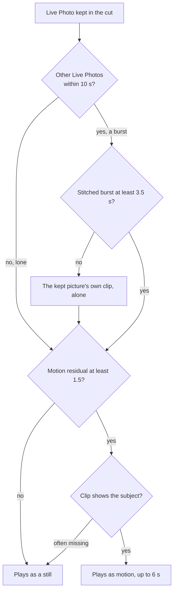

import Video from '@site/src/components/Video';

# Photos, Live Photos and HDR processing

Photos compete in the same pool as videos, on every tier. There is no separate photo pipeline: a
still that wins a slot is animated at render time and holds the screen for the seconds the editor
gave it. Every image in range comes back from Immich, Live Photo stills included.

`--no-photos` takes stills out for one run; `photos.enabled` is the lasting switch.

## Ken Burns, and where the pan lands

One renderer for every photo: a zoom of 5 to 12 %, seeded from the asset ID so a re-render moves the
same way, panning toward the largest face Immich found. With no face on the picture the pan ends at
the centre, which suits landscapes, food and the dog. The face boxes come from Immich; framing runs
no face detector of its own.

Photo preparation uses the hardware encoder the app has verified, including NVIDIA and VAAPI.
On Basic tier, a device with hardware H.264 but no hardware HEVC prepares photos as SDR H.264;
HDR photos are tone-mapped before encoding. Devices with hardware HEVC keep HDR photo
intermediates. Disabling hardware encoding keeps preparation in software.

Video clips are never cropped. A landscape clip in a portrait film keeps its whole frame and
[`scale_mode`](config-reference.md) fills the rest: `blur` (default) puts a blurred, zoomed
copy behind the sharp one, `fit` uses black bars. Face-aware video cropping is not offered: a moving
subject needs per-frame tracking, not one face position.

## Live Photos

Short final-frame holds use the available hardware encoder, including VAAPI on a NAS.
The hold keeps the source cadence and records its encoder alongside the verified frame count.

A selected motion interval keeps its verified frame rate through encoding. When frame rounding
leaves a permitted shortfall, the renderer holds the final frame and checks the encoded duration
before assembly. This applies to software and hardware encoders.

Some MOV probes report a 4-tick sample duration even when successive pictures arrive every
20 ticks. The renderer checks those actual presentation timestamps before allowing one final
frame hold. A rounded container endpoint can use that measured interval; a larger missing tail
still stops the render.

### Original-source admission

Before sealing a cut, the app downloads only the final retained Live motion originals and checks their complete presentation. The proof is bound to the source bytes, video stream, decoder identity and presentation policy. Matching proofs are reused; rejected candidates are not downloaded for this check.

An invalid Live motion original becomes the same selected picture as a still. This does not choose another picture. Timing is recalculated for that disposition before the cut is certified. A missing source or decoder/infrastructure failure remains an error; it is not treated as corrupt media or silently filled.

### Presentation and audio boundaries

The renderer checks compressed samples and decoded presentation, then uses the MOV track's verified sample-table and edit boundary. Reference samples establish completeness but are not displayed. Every joined segment keeps its own video and audio boundary; audio samples retain their own clock.

A permitted rounding gap holds the final video frame. An audible audio tail is not replaced with silence to make it fit, and a larger missing video tail is not invented. The encoded segment is checked against the certified interval before assembly.

An iPhone records about 3 seconds of video with every photo. Most libraries hold thousands of them,
and a rapid burst of them is several seconds of continuous footage nobody meant to shoot.

Three photos of an Italian hilltop, fired off in a row, each about 3 seconds and overlapping:

  <Video src="/demos/live-photos/italian_hilltop/source_1.mp4" width={240} controls muted />
  <Video src="/demos/live-photos/italian_hilltop/source_2.mp4" width={240} controls muted />
  <Video src="/demos/live-photos/italian_hilltop/source_3.mp4" width={240} controls muted />

Merged, 4.5 seconds of continuous footage:

<Video src="/demos/live-photos/italian_hilltop/merged.mp4" width={240} controls />

A bike race, 6 Live Photos merged into 8.1 seconds:

<Video src="/demos/live-photos/bike_race/merged.mp4" width={480} controls />

These clips are the project author's own footage, published with permission.

**A Live Photo is a photograph.** Its still competes with the photographs and wins or loses as one.
Whether it plays as motion is a rendering question, asked afterwards, about a picture that has
already won its place. The answer is the same on every tier, model or not:

1. **The video half is not footage.** It leaves the video pool: it belongs to a photograph.
2. **Bursts.** Photos within `live_photo_merge_window_seconds` (10 s) of each other form a burst. A
   burst collapses to one unit before the editor chooses: the favourite carries it, otherwise the
   sharpest, best-exposed frame, and the siblings are not separately selectable.
3. **Length.** A lone Live Photo is a motion candidate. A join of two or more must stitch to at
   least `live_photo_min_clip_seconds` (3.5 s), because a stitch shorter than that is more cut than
   footage. A lone clip runs 1.7 to 3.3 s, so the rule only applies to joins. Shots a fraction of a
   second apart overlap so much that their stitch can come out shorter than one of their clips (three
   shots in 1.4 s can stitch to 2.4 s). A join like that drops back to the kept picture's own
   clip, which then goes through the motion check like any lone Live Photo.
4. **Motion.** The residual is the optical flow left once the camera's own movement is removed,
   over 12 frames. At 1.5 or above something happened in every burst we measured; below it the
   answer is a coin flip, and a still always works where a dead clip does not.
5. **The subject.** Where the clip's frames were read and the subject is often out of frame (the
   phone already on its way to the pocket), the picture plays as its still.

A clip only ever costs a picture its motion, never its place, favourite or not. A Live Photo that
plays is offered beside the videos, and a true video always plays whatever its residual.

The keys that decide anything are `include_live_photos` (true) and `live_photo_min_clip_seconds`
(3.5). `--include-live-photos` cannot turn the feature on when the config says false: both must
agree. With it off, a Live Photo is used as its still, never dropped.

A shared album can hold a downscaled copy of a Live Photo pointing at the same video. The video
belongs to both copies, so whichever the cut keeps plays it.

On Basic tier, Live Photo merges fit within 1920×1080 in landscape or 1080×1920 in portrait.
If the hardware encodes H.264 but cannot encode HEVC, HDR companions are tone-mapped to SDR
during preparation. Each companion's HLG or PQ transfer determines its color conversion.
Changing the tier or hardware settings rebuilds certified merges under the new policy.

:::note Person-filtered memories
The person tag is the boundary. An untagged Live Photo does not enter a person memory because it was
shot beside a tagged one. A tagged frame can then lack neighbours to render as motion; it stays a
photograph rather than widening the memory to pictures without that person.
:::

### Merging on audio, not timestamps

A clip's video does not start at exactly `shutter_time - 1.5 s`, and tens of milliseconds of drift
on a rapid burst means audible clicks and gaps. So the joins are measured, and only for the bursts
the film keeps: the draft plans every burst from its metadata, then a kept burst's clips are
downloaded once and lined up on their sound. The answer is banked per pair, so the next film over the
same pictures downloads nothing.

1. Extract 48 kHz mono audio from each clip
2. Compute an STFT spectrogram (1024-sample window, 256 hop, one fingerprint every 5 ms)
3. For each pair, correlate the first 20 frames of clip B (about 107 ms) against clip A
4. Cut at the midpoint between consecutive shutters; extend a clip to cover any hole
5. Normalize exposure, fade the audio 30 ms at each join, concatenate

Three photos at t = 0, 0.5 s and 2 s, each clip about 3 s:

| Clip | Plays from | Plays to | Duration |
|------|-----------|----------|----------|
| Photo 1 | -1.5 s | midpoint(0, 0.5) = 0.25 s | ~1.75 s |
| Photo 2 | 0.25 s | midpoint(0.5, 2.0) = 1.25 s | ~1.0 s |
| Photo 3 | 1.25 s | 3.5 s | ~2.25 s |

These times share the first shutter as zero. The span is 5.0 s in total.

Clips that do not overlap stay separate. With no shared content to line up on, nothing is stitched:
the kept picture plays its own clip if that moves, and its still otherwise. The merge encodes at CRF
18 with your hardware encoder if one passed a test encode, software otherwise. HDR bursts stay H.265
10-bit with their transfer intact; the final render decides the rest.

### Devices

Immich normalizes Live Photos and Motion Photos through `livePhotoVideoId`. The one device branch is
Google: a Pixel gets a 1.5 s assumed clip length instead of 3.0 s. A Pixel Motion Photo is 0.7 to
1.3 s with no audio track and does not overlap the next shot, so four rapid Pixel photos stay four
clips. Everything else, Samsung included, takes the Apple path.

## HDR, end to end

The default `output.codec: h264` produces SDR: HDR sources are tone-mapped for the final film.
To preserve HDR, choose `output.codec: h265` with `output.hdr_mode: auto` or `hdr`. The final
encoding plan decides whether HDR video (HLG or PQ) stays HDR. An HDR photograph can be rebuilt
from its gain map before that output conversion.

**Apple, iPhone 12 and later.** A HEIC carries an 8-bit Display P3 image and a grayscale gain map;
the headroom comes from two MakerNote tags read together, `0x0021` and `0x0030`. The renderer applies
`HDR = SDR x (1 + (headroom - 1) x gain)` and ships 10-bit PQ, BT.2020, which is Apple's own shape
and never darkens a pixel. When the MakerNote does not parse it falls back to `exiftool` if
installed; a photograph whose headroom cannot be read renders at the brightness of its base image.

**Android Ultra HDR.** A JPEG with an MPF gain map and `hdrgm` XMP metadata, rebuilt with its
per-channel gamma and offsets.

`pi-heif` (libheif, decode only) reads HEIC, because FFmpeg only reads a HEIC's thumbnail tiles. Title text
over HDR is drawn at HLG graphics white, so a caption does not glare above the picture.

`output.hdr_mode` is `auto` (HDR when H.265 is selected and any selected source is HDR), `hdr` or `sdr`.
`auto` with H.264 still produces SDR. HDR output is H.265 only: `hdr` with H.264 or ProRes is refused, never silently flattened. Which encoders take 10-bit is on
[Hardware encoding](../run/hardware.md).
