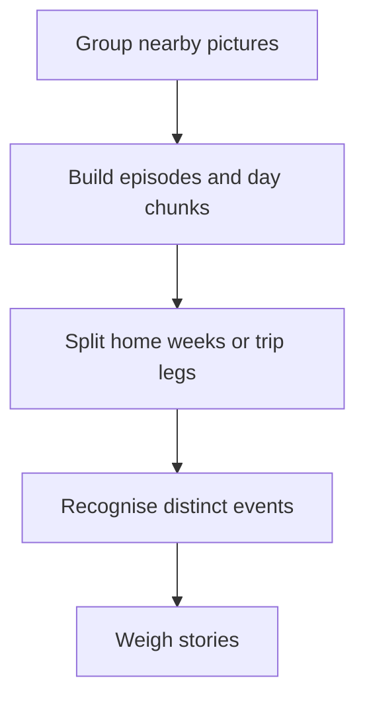
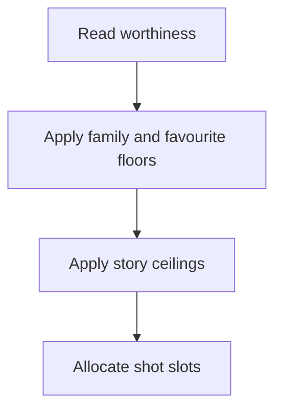

# Moments, episodes and stories

A Saturday at the dog park is one **moment** if you shot it in ten minutes, and an afternoon of
them (park, café, the walk home) is one **episode**. A week of ordinary evenings at home is one
**story**; so is a ski week away, however long it lasts. The editor weighs the stories against each
other and hands each one the number of shots its weight earns. A marathon you ran, with 400
pictures in a day, weighs more than a Tuesday with three. A quiet week at home with nothing starred, no video
and no close family in it gets nothing at all.

Everything on this page is the no-model path, which is the draft every film starts from.

## From pictures to stories

| Unit | Rule | Where |
|---|---|---|
| Moment | a picture joins the open moment when it is within 10 minutes and 2 km of that moment's last picture; with no GPS, time alone decides | `moment_grouping.py`: `MOMENT_WINDOW_MINUTES`, `MOMENT_RADIUS_METRES` |
| Episode | the same test at 90 minutes and 2 km; every moment sits in exactly one episode | `EPISODE_WINDOW_MINUTES`, `build_episode_groups` |
| Capture run | captures each within five minutes of the one before; it spaces shots and is the unit of the exposure rule | `MIN_GAP_IN_CAPTURE_GROUP_SECONDS` |
| Day chunk | same calendar day, or starting within 6 hours of the last picture (a late night stays one night); split only when more than 90 minutes pass **and** the city changes | `RuleStructureReader._day_chunks` |
| Story | a run of consecutive photographed days: at home, cut on the ISO week; away, kept whole unless it changes where it stays (below); a day back home ends it | `RuleStructureReader._runs` |
| Trip leg | days stay in one area while each day's median position is within 25 km of the area's; an area of 3 days or more is a leg, a shorter one joins a neighbour; a trip splits only when two legs are more than 50 km apart | `trip_legs.legs_of_days` |

"Away" is more than 10 km from `trips.homebase_latitude` / `homebase_longitude`. Without a home base
nothing is away, so a three-week holiday arrives as three weekly stories. Setting it is step one of
[Teach it your family](../../get-started/who-is-who.md).

**A trip that changes where it stays is two stories.** A week hiking village to village and then four
days in a city are two chapters. As one story, the hike's favourites took every slot and the city got
none. A road trip that never stays three days in one place is still one story, and so is a week on an
island with day trips. Each leg is weighed on its own, with its own name and the same rules for days
without a favourite. A trip film splits the same way.

**One place does not take a film.** Inside a story, each place may hold only the share of shots its
days (or its moments, on a one-day story) earn against the rest, on the same square-root curve a trip
allowance uses. A story that only ever visited one place is never bounded. A picture refused for its
place comes back when nothing else can fill the slot, and a starred one comes back before a shot
nothing vouches for keeps its slot.

**A one-off inside an ordinary day is its own story.** A week at home is one story, so an evening
across town photographed in two dense bursts deserves different coverage from the
morning's errands. An episode of a home story becomes its own **event** story when all of this
holds (`editorial_event_story.py`):

- it's dense on its own: its pictures reach the same day threshold the gate uses for a whole day
  (4x the median photographed day, or the 75th percentile if that's higher),
- it's at least 2 moments, so one burst of a cake, a pet or a sunset never counts,
- its activity label differs from every other episode of its day (or, alone on its day, from the
  episodes either side of it in the story),
- when both sides have GPS, it's at least 1 km from them.

Nothing here names a kind of event: a race, a concert, a graduation and a prize evening all look
the same to it. A story with three favourites or a big one already has the depth, so it isn't cut,
and a trip stays whole. The event is funded first among stories of its weight (like a trip) and
reserves 2 shots, the most a `minor` story takes.

A screen or document the next day can add a third shot, never make an event. When a picture no
camera made (a screenshot, a scan), taken within 18 hours after the event, has a result, finish,
time or rank word on it according to Immich's own OCR, the event reserves 3. The words are
generic ("result", "time", "rank", "record", "score", "certificate", "prize"...), and the read is
one Immich search per word, only for the events the draft found. The events and whether a
screen backed them up are listed under `events` in `derived-decisions/period-story.private.json`.

Known limit: a dinner out photographed like an occasion (40 pictures in 3 bursts across town) is
an event too. From counts, places and labels alone it looks exactly like one.

## How much a story weighs

Each happening is first read for whether it is worth remembering, from facts alone.

The mapping from the reading to a weight is `GATE_WEIGHT` in `editorial_story_replies.py`:
remarkable seeds `minor`, maybe seeds `glimpse`, background gets `none`. Then the floor and ceiling:

- **Three favourites** in a story raise it to `major`.
- **A big story** is raised to `major` too: one that is both dense (at least
  `advanced.editorial.people.big_story_density`, 2.0 by default, times the period's median
  photographed day, in pictures per day) **and** mostly close family (at least
  `big_story_family_share`, 0.3, of its pictures show a partner, child or parent). Density alone
  never does it: a race day full of strangers has the pictures and not the people.
- **Present** stories (remarkable, or holding a favourite, or close family) are floored at `minor`.
- **Strangers only**: when the film knows people at all, a story with nobody known in it, no
  favourite and nothing remarkable is capped at `glimpse`.
- **One moment** and nothing that makes it present: capped at `minor`.

"The 12 usual cities" is literal: the twelve cities most pictures of the window were taken in. A
happening whose main city is not one of them reads as remarkable even with no home base set.

## Weight to shots

The film's slot count is its target length divided by the average hold of its material (about 4 s
a shot), and each weight has a ceiling:

| Weight | Shots it may take out of `n` slots |
|---|---|
| `dominant` | ceil(n / 2) |
| `major` | ceil(n / 4) |
| `minor` | 2, or 1 in a film under 8 slots |
| `glimpse` | 1 |
| `none` | 0 |

Slots are handed out in order: one for each `major` story, then one `minor` per day, then `major`
stories up to their ceiling, the remaining `minor` stories, one `glimpse` per day, and whatever is
left deepens the heavier stories one moment at a time.

In a long film the `major` ceiling rarely binds. The budget runs out first, so every `major` story
ends up at the same depth: a two-evening story with a handful of stars gets as many shots as a
ten-day trip with a hundred.

**A recurring kind is one story's worth.** Three starred evenings of the same thing at the same
place in one month (three concerts at the same hall, three matches at the same club) count as one kind when all of this holds:

- the densest episode of each story carries the same activity label,
- that episode alone reaches the day threshold the gate already uses (4x the median photographed
  day, or the 75th percentile if that's higher), so a label on a few ordinary pictures links nothing,
- they happen at the same place: the GPS medians of those episodes are within 10 km, or they have
  the same place name when one of them has no GPS,
- they fall in the same part of the film (a month in a year film, the whole film otherwise).

Every story of the kind keeps its own shot. Only the heaviest one (most favourites, then most
moments) goes deeper, as deep as any other `major` story. A trip and a big family story never fold:
they carry their own weight, so a birth-sized day next to smaller days of the same label keeps
everything it had. The kinds found are listed under `same_kind` in
`derived-decisions/period-story.private.json` (`editorial_same_kind.py`).

**Every year gets a shot.** A person film longer than 18 months (548 days) is split into calendar
years, a person film over several date ranges into those ranges, and a custom film over several
ranges likewise. Before any story takes a second shot, each year (or range) that holds a funded
story gets one, from its first story in funding order. When no picture that story offered stands
on its own, the year's next story gets the shot, and so on down the year. A year where none stands
stays quiet, and `quiet_partitions` in `derived-decisions/story-selection.private.json` names the
year and the stories that were tried. The passes that cut for length or taste keep a year's only shot: the favourite
readmission, the timing trim, the filler drop, and the model polish's vote and standing gate (see
[Length, quiet weeks and filler](./length-and-filler.md)). The family-viewing gate still removes a
shot it holds back, whatever year it carries. The finished-cut check reports a year left without
one. A year-in-review film is one year, so this does not apply to it.

## When the model plans the whole film

On a model install, the model plans the whole film only when `advanced.editorial.thin_model_layer`
is `false` (Route C in [What a model adds](./what-a-model-adds.md)). Every other film, one over
several separate windows included (on this day across years, a birthday with flashbacks), starts
from the no-model draft on this page and gets the polish. Only Route C adds these:

- **Trips fold into one story per leg** (`editorial_story_trips`), each with a reserve of
  `round(slots / 2 * sqrt(leg days / film days))` shots, at least one.
- **Recurring activities become one thread** (`editorial_story_threads`): four Saturdays at the same
  climbing gym are one story, one per calendar year in a film longer than 18 months, so a year of
  progress still shows. The no-model draft has its own, narrower version: the recurring kind above.
- **`dominant`** is set by the model naming at most two central stories. The no-model draft never
  sets it, so its heaviest weight is `major`.
