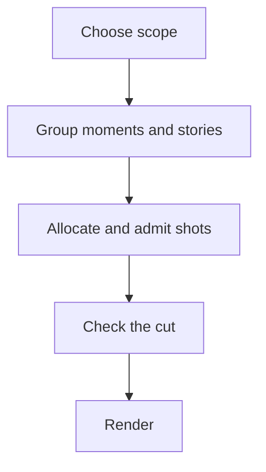
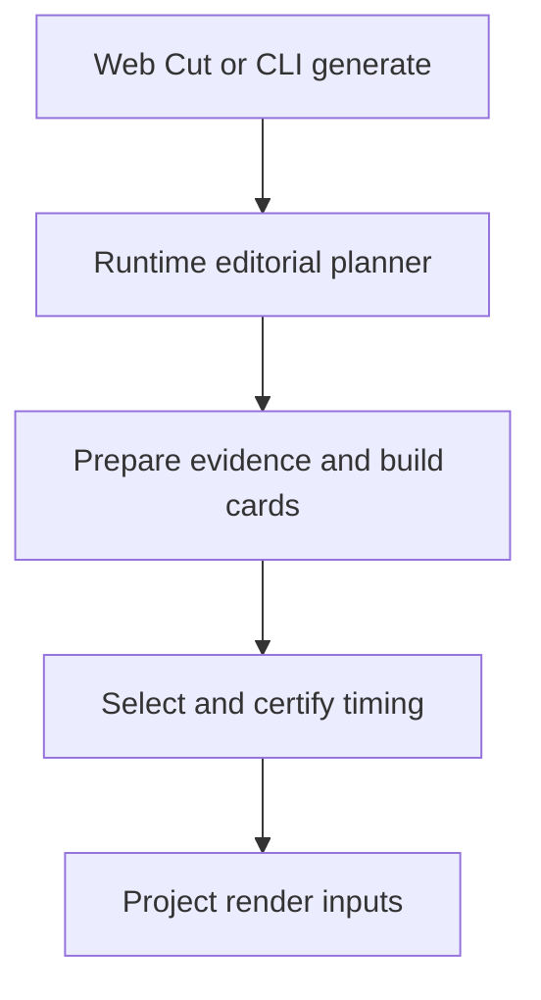

# From library to film

How a period of your library becomes a film: the short version and the rules that always hold
first, then the route through the code, for when you want to see every step. The pages after this
one take each stage in turn.

## The short version

You pick a period: a month, a year, a trip, a person. The editor reads what Immich already knows
about every picture in it (when, where, who, whether you starred it, whether it moves), groups the
pictures into moments and the moments into stories, decides which stories earn a place in a film
of that length, picks the best frame of each moment it funds, and checks the finished cut against
a list of promises before anything renders.

On Basic that is the whole editor: metadata, pixels and small CPU classifiers make the film.
A GPU adds a one-line description of every picture in the cut and a second family-viewing check. A
text model on top of that polishes the draft, swapping out the shots that add nothing
([What a model adds](./what-a-model-adds.md)). Facts already banked are reused, and the text model
only ever reads text and never decides what is shareable.

## The house rules

These hold on every tier.

- **Always chronological.** The film plays in the order things happened. The editor decides what
  goes in and how long it stays, never when.
- **Your star wins its moment.** A favourite beats every other frame of its moment and always stands
  on its own. It does not buy a place by itself: the family-viewing gate, the capture spacing and
  the duplicate review still apply. When they keep it out, nothing else from that moment takes
  its place: the moment is dropped and the slot goes to another one.
- **Stories are weighed, days aren't counted.** A week with nothing marked gets no shot; a stretch
  away from home or an unusually busy day does. See [Moments, episodes and stories](./moments-and-stories.md).
- **Videos are first class.** A video always plays, and a Live Photo plays as motion when its clip
  moves and shows its subject. See [Picking each shot](./picking-shots.md).
- **Close family gets a shot.** A partner, child or parent who is all over the period and in none of
  its shots gets a seat. See [Family, audience and duplicates](./family-audience-duplicates.md).
- **Short beats a guess.** When the material runs out, the film runs shorter than its target rather
  than pad with a frame nothing vouches for. See [Length, quiet weeks and filler](./length-and-filler.md).
- **Your tick outranks the editor.** A picture you tick in the pool goes in, one you untick never
  does, even over a family-viewing hold: you looked at it. On a new cut, a picture you pass with
  `--include` still goes through the gate. See [Edit the cut](../../how-it-chooses/overrule-it.md).
- **The finished cut is checked.** Once every pass has run, the cut is read against these promises.
  A broken one is a warning in the log and a row in the run's records.

## The route through the code

The web UI's **Cut** runs `immich-memories generate --no-render` on the server, so both take the same
route. The quoted stage names are what the web UI and the terminal print.

`_select` in `analysis/editorial_structure_planner.py` is where the film gets decided. Everything the
other pages of this section describe happens inside it.

## Preparation: what gets read, and when

Preparation banks versioned picture facts before selection, then reads missing captions and clip evidence for selected shots and candidates. [Pixel evidence and preparation](./pixel-evidence.md) lists the reach, admission rules and exact producers for each tier.

## What a run leaves behind

Every cut writes a durable attempt under `~/.immich-memories/cache/editorial-runs/`, with each pass's
decisions in `derived-decisions/*.private.json`. `immich-memories runs why <asset-id>` reads them for
one picture, `runs story` prints the storyboard, and `runs show` prints the run with its count of
broken promises. See [runs](../../make/cli/runs.md).
