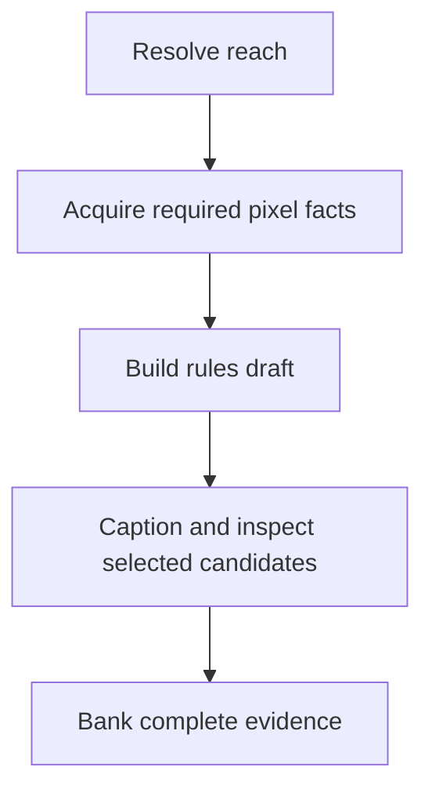

# Pixel evidence and preparation

This page lists what preparation reads, which pictures it covers, and when each producer runs.

## Scope and timing

A film acquires cheap facts for its **reach**: the pictures it could select (for a person film,
exactly the pictures Immich recognised that person on, strict per picture), the other stills of their Live Photo bursts, and every picture of the same
five-minute capture run, because the exposure rule reads the whole run. The rest of the window is
read as Immich metadata only, since moments and episodes are cut from all of it. A cut that selects
a picture it never prepared stops rather than ship it. Captions and clip checks wait until after
the rules draft, for selected shots and actual candidates. A reader may use the selected shot's
whole episode for context without captioning every neighbour. `immich-memories prepare` reads a
whole scope ahead of time when explicitly requested.

Admission refuses a few things before anything is read: a video over five minutes
(`advanced.analysis.max_source_video_seconds`, 300 s), the video half of a Live Photo (it plays
inside its still), anything tagged `immich-memories/generated` or listed in this install's upload receipts (a film this app made
is not footage), and pictures that look forwarded rather than shot on your camera. After the heads
run, screenshots and photos of screens go too: a phone-screen pixel size, the `screen` head, or the
document detector, enabled on GPU and Full, calling it a screenshot, a table or a QR code.

The eight heads are small classifiers over one pinned DINOv2 encoder: `location`, `people`,
`children`, `activity`, `venue`, `frame_kind`, `screen` and `uncovered_person`. The two detectors are
`nsfw_marqo` (exposure) and `doc_docling` (documents), enabled on GPU and Full only. Basic keeps
the eight heads, including screen, frame-kind and uncovered-person checks. Every fact is banked in the store
under its producer's version, so the next cut asks nothing twice.

Preparation follows the resolved product tier (`tier: auto` by default):

| Tier | What reads the pixels | When you get it |
|---|---|---|
| `basic` (legacy `nas` alias) | previews, pixel facts, face boxes, the eight heads | no usable local GPU or GPU inference service |
| `gpu` | Basic facts, Marqo and Docling, plus missing captions and clip evidence for selected shots and candidates; Laya reads their captions | GPU inference without a configured prose LLM |
| `full` | the same pixel producers as GPU; a prose LLM reads annotation text to refine selection | GPU inference and a configured prose LLM |

Basic needs `immich-memories models fetch` once. A configured LLM alone does not change selection
from Basic, but can still write titles and music mood. GPU and Full enable captions by default;
Basic can use a vision-capable LLM only with explicit caption-provider opt-in. Captions are an add-on:
[Add captions](../../better/captions.md).

[All selection internals](./overview.md).
