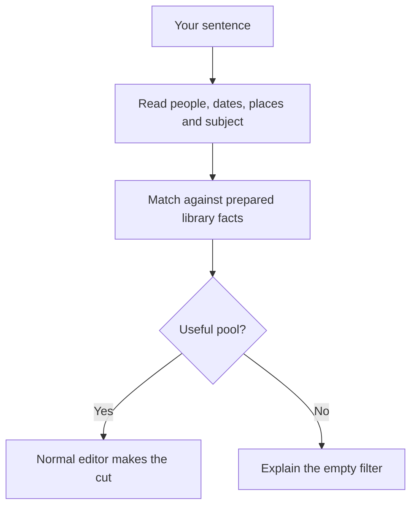

# Sentence parsing and pool rules

:::caution[Highly experimental]
The parser is developed against one real family library and synthetic households. Those examples do not establish its accuracy on another library. Inspect the translation and pool before trusting a film.
:::

You type what you want to see ("the cars I drove", "at the park with kids", "the first picture
of each person") and get a film of it. The part that reads the sentence is new. The part that
makes the film is the same editor as every other memory
([From library to film](../how-it-chooses/overview.md)).

```bash
immich-memories generate --ask "at the park with kids" --dry-run   # the translation, the pool and its rules
immich-memories generate --ask "at the park with kids"             # then the film
```

What it needs:

- **`tier: full`**: GPU preparation, captions and a configured text reader (`advanced.llm`). Every step is built for a small
  local model: it was tuned on Gemma 4 E4B. See [Add a reader](../better/reader.md).
- **A prepared library.** It reads the captions, faces and place names `immich-memories prepare`
  banked, plus the letters Immich's OCR found in your photos.
- **The WordNet dictionary** (11 MB), downloaded once by `immich-memories models fetch` and
  checked against a pinned digest. Nothing downloads it at run time.

Interpreting the sentence calls your configured reader and searches prepared library facts. Making the film can also use configured caption, inference, music and rendering services. [Privacy](../run/privacy.md) lists what each receives. The flags are on the
[generate page](../make/cli/generate.md#a-film-from-a-sentence). The web UI has the same thing as a box on
the **Memory** page, with a preview before any film: [The web UI](../make/free-text.md).

## How it works

The sentence becomes filters, the filters make a pool of pictures, and the editor chooses from the
pool the same way it chooses from a month or a trip. The model reads your words. Code links them
to what the library holds. No model looks at a picture to decide whether it belongs: the pool is
built from captions and facts the library already has.



1. **Reading.** The model splits the sentence into who, when, where and what. It can only pick
   phrases your sentence contains, and it does it three times in three orders. A word counts
   where two answers agree. A part you said nothing about sets no filter: say nothing about where
   and the film is from anywhere. Replies must match the requested field types before voting.
   Unreadable replies get one retry; fewer than two valid readings stops the request.
2. **Who.** Grammar and your people registry, no model:
   - "I", "me" and "my" are you, used for your age and your homes, never as a face in the photo
     (you are usually the one holding the phone: "the cars I drove" has no face in it).
   - The parser currently interprets "we" and "our" as you and the people whose registered role resolves to partner. It does not treat those words as the whole household; name the people explicitly when you mean a different group.
   - A name or a role from your people registry ("my son", a first name) means that face, as Immich
     recognised it.
   - A plural word for people ("friends", "kids") asks for company: a caption naming people, or
     the specific kind when the word is specific (children, teens, performers). A curated word
     list reads this, in any of the 14 supported locales, not a dictionary lookup: "humans"
     is an irregular plural that a dictionary lookup never reduces to its singular, so a list
     of the words themselves is the only thing that reads it reliably.
   - "No", "without" and each language's own negation word turn that company into an absence
     instead of a requirement: "landscapes, no humans" drops any picture with a face or a
     caption subject who is a person, "sans les enfants" drops children instead of requiring
     them. A negated name ("without Alex") drops that person's own pictures the same way. Each
     clause of the sentence is read for its own negation, so "with the kids, no rain" keeps
     the kids filter and a double negation ("not without the kids") cancels back to a
     requirement.
   - "Only" narrows company to the kind named and excludes everyone else of that company:
     "only the performers" keeps musicians, singers, dancers and the rest of that cast, and
     drops the audience.
3. **When.** Years you write are pattern work. An age ("in our 20s") is read by the model as
   numbers, and the calendar is arithmetic from the birth date in your people registry. If a phrase
   such as "foggy days" supplies no dates, its visible modifier still filters the captions.
4. **Where.** The model votes one place per phrase among the options code builds: anywhere, a
   home, near home, away on a trip. A phrase that only repeats the subject ("at the park") stays
   the subject, not a place. One particular place at home has to be proven by GPS.
5. **What.** The head noun of each phrase ("bread" in "bread making", "park" in "at the park with
   kids"). When that head only frames an occasion, the modifier carries the subject instead:
   "rainy weekends" offers "rainy" and WordNet's "rain"; "snowy days" offers "snowy" and "snow".
   Generic heads are WordNet time periods plus `day`, `walk`, `trip`, `moment` and `time`. Their plural
   forms follow the same rule. A picture phrase such as "rainy pictures" also keeps its modifier;
   measured qualities such as "best blurry pictures" still use the facts filter. "Best" does
   not become a subject just because the dictionary also lists it as a noun. Concrete heads such
   as "cat" in "black cat" keep their meaning. The trace names the modifier and the head it replaced.
   WordNet adds the other everyday names and the thing's own kinds and parts, and the
   model votes which one is the main subject. A thing has to be what the caption is about ("a
   loaf of bread on a rack" yes, "a toddler holding toast" no). A place, a scene or something
   people do counts anywhere in the caption, since captions put the people first ("kids playing
   in a park"). A word printed in the photos (a club's name on the jerseys, read by Immich's OCR)
   vouches for the whole episode it appears in. Only what follows "not", "no", "without" or
   "except" is left out.
6. **What the library measures.** Some words link straight to fields the library holds, no
   caption involved:
   - a country, region or city Immich names on your photos ("I love &lt;a country&gt;");
   - the kind of picture ("screenshots", "documents", "maps", "videos");
   - "blurry": below the editor's own sharpness line (the softest 10 % of your library);
   - how often a face appears ("people with more than 35 pictures");
   - "farthest from home": the trip whose middle photo is farthest from where you lived then;
   - "first" or "last" picture of each person. The first is when they show up for good, never
     before their birth date, so a scanned childhood photo or a wrong face match stays out.
7. **The film.** The pool goes whole to the editor, filmed like an album whose written subject is
   your sentence: stories, standing, the family-viewing check, duplicates and length all apply.
   Forwarded pictures are kept (a club's photos tend to arrive through a group chat). One occasion
   of one day ("the birth of my son") goes to the special-day film instead. What the sentence
   excluded travels with it as a hard rule of the editorial brief, so the run's report can name
   a shot that still showed it, not only filter the pool by it.

## Reading the trace

Every run prints how it read you before anything else runs, one line per decision. A real dry run:

```text
"At the park with kids"
READING  the model split your words 3 times; a word counts where 2 answers agree -> who: kids; where: the park; what: at the park | kids
WHO      your words "kids" -> children must be in the photos, no one in particular (a plural word for children; a caption naming children shows it)
WHEN     nothing said -> any time (no time words, years or people to date)
WHERE    your words "the park" -> anywhere (nothing beyond the subject's own nouns)
WHAT     your words "at the park | kids" -> subject words park (...)
POOL     library 76367 -> kind of picture 74466 -> subject 1197 -> company 457
VERDICT  possible: 457 pictures in the pool; ...
FILM     the engine films the pool as an album whose written subject is your words: 457 pictures (the pool is the film's whole reach)
```

`POOL` is the funnel: how many pictures were left after each filter. When a film is wrong, this
line usually says where. A subject count of 3 means the captioner never writes your word. A count
that barely moves means the filter did nothing.

`VERDICT` is one of three:

| Verdict | Meaning | What happens |
|---|---|---|
| possible | 12 pictures or more in the pool | the film is made |
| thin | fewer than 12 | a short film is made, and the run says why |
| not possible | the pool is empty | no film; the trace names the filter that emptied it |

A computed selection ("the first picture of each person") is never called thin, however short.
The run does not pad a request it cannot show with something else.

## Which rules would drop pictures

The pool is what your words mean. The editor then refuses some pool pictures on rules that protect
every film: a screenshot, a second file of a picture it already has, a picture held for review. A
dry run asks those rules about the pool before anything renders, and prints them as `RULES` right
after `POOL`:

```text
RULES    451 of 457 pictures pass the rules checked before cutting
         another file of the same picture: 3 (the full-size file of the same picture plays instead) id-6c1f0e2a9b4d7e31, id-...
         screens and documents: 1 (a screenshot, a screen or a document is never a source) id-...
         held for review: 2 (a detector or you marked it never_auto; only your clearance lifts it) id-...
         decided while cutting: who sees it (...); look-alikes (...); capture spacing (...)
         not applied to a film you asked for: provenance (...); standing (...)
```

These are the run's own checks, called on the same banked facts, so the preview and the film
agree. It reads the pool's pictures from Immich first, like the film run does: one search call
per 1,000 pictures between the pool's first and last date, never one call per picture. Each picture
counts once, under the first rule that drops it. The ids are hashed the way
[`report`](../make/cli/report.md) hashes them: the terminal never prints a real one.

What it checks, in the run's order:

| Rule | Drops |
|---|---|
| hidden in Immich, a film this app made, long video | archived, locked or deleted pictures, uploaded memories, recordings over the source cap |
| another file of the same picture | the smaller copy (a shared album's downscale, a chat's re-send) |
| screens and documents | screenshots, screens, documents, by the document head, the screen head, the caption or a phone's screen size |
| held for review | a `never_auto` flag on the picture or its Live Photo clip, until you clear it |
| close-up of a face part, medical care, sheet of identical portraits | pictures that need an explanation |
| video frames miss the subject | a video whose sampled frames mostly miss the subject, unless starred |

Three rules depend on the shots around a picture or on a model reading, so they are only known
while cutting and are named without a count: **who sees it** (the reader checks each chosen shot's
caption for your sharing level; a detector hold keeps a picture out of shareable films),
**look-alikes** (a shot repeating one already in the cut) and **capture spacing** (two shots of
one moment within five minutes). Two rules do not apply to a film you asked for, and the block
says so: **provenance** (forwarded and saved pictures stay) and **standing** (a pool picture stands
on your subject whatever its score).

A picture `prepare` has not read yet has nothing for the rules to read, so it is not counted as
passing: the first line then reads "17 of 18 prepared pictures pass ...; 12 not prepared yet". The
run reads those pictures before applying the rules. There is no switch to turn a rule
off. Held pictures come back one at a time, when you clear them on the pool page.

With `--dry-run` the command stops after the trace and the rule preview. Translating one sentence
took 7 to 46 seconds on a Mac with a local Gemma E4B; the model's answers are banked in the store,
so asking the same question twice does not ask the model twice.

## Where it is good, where it is less good

Requests work through the evidence the library actually contains. Captions supply named subjects and activities; Immich metadata supplies recognised people, dates and places; OCR supplies visible words. A concept that none of those sources names cannot be recovered by a clever sentence.

A request for one picture per person still goes through the film's length and selection rules. It is not a guarantee that every person survives the final cut.

## Limits

- **One library.** The parser is developed against one family's pictures and synthetic households.
  Your words, habits and cameras differ, so will the results.
- **Captions are the basis.** If the captioner does not name the requested concept, the subject filter may return a thin or empty pool.
- **Occasions without a date.** A wedding the captions never call a wedding can only be found by
  its date, and there is no place to tell it that date yet (birth dates in the people registry work).
- **Two senses.** "Races" found running races AND motor-racing track days. Say which one you mean.
- **WordNet is from 2006.** It has no "screenshot" or "app", and some first senses are odd
  ("dashboard" is a carriage's mud panel).
- **The model still judges some parts**: the main subject, the place vote, the kind of film. Three
  votes soften a bad answer; they do not remove it.
- **Company comes from captions only.** "With kids" needs a caption naming children; the ages of
  the faces are not used yet.
- **The editor still decides the film.** It gets the pool and your sentence, not your special
  cases: a list of one picture per person is cut to the film's length, and blurry pictures still
  lose to sharp ones.
- **English first.** Other languages go through the model and may lose meaning.

## When a result is bad

Mark it on the run, then paste the report into an issue:

```bash
immich-memories report <run-id> --wrong <asset-id> --wrong <asset-id> --missing "the red bike"
```

Each photo marked wrong gets the filter that let it into the pool and whether the editor picked
it. The missing words are checked against the run: did the reading keep them, were they offered
or picked as the subject, and does any caption in the pool say them.

In the web UI, open the film's run and use **Copy report**, or **Download report** for the ZIP
with the whole log. Same report, same redaction. A film made from the web UI is cut first, then
rendered as a run of its own: the report of either run carries your sentence.

The report carries the sentence, the trace, the translation as data (the same JSON `--ask-trace`
writes), the funnel, the rule preview, the editor's picks and the run's logs. Before anything is copied:

- IDs become hashes that only match inside that one report;
- the names of people the sentence linked become their roles ("the owner's son"), and a birth
  date the trace dated from becomes `[private]`;
- place names become "area A", and words read by OCR become "text-1", in your sentence too;
- captions stay out unless you pass `--include-flagged-captions`, and then only those of the
  photos you marked. Pictures never.

The rest of the report and its privacy rules: [report](../make/cli/report.md) and
[Privacy](../run/privacy.md#diagnostic-reports).
