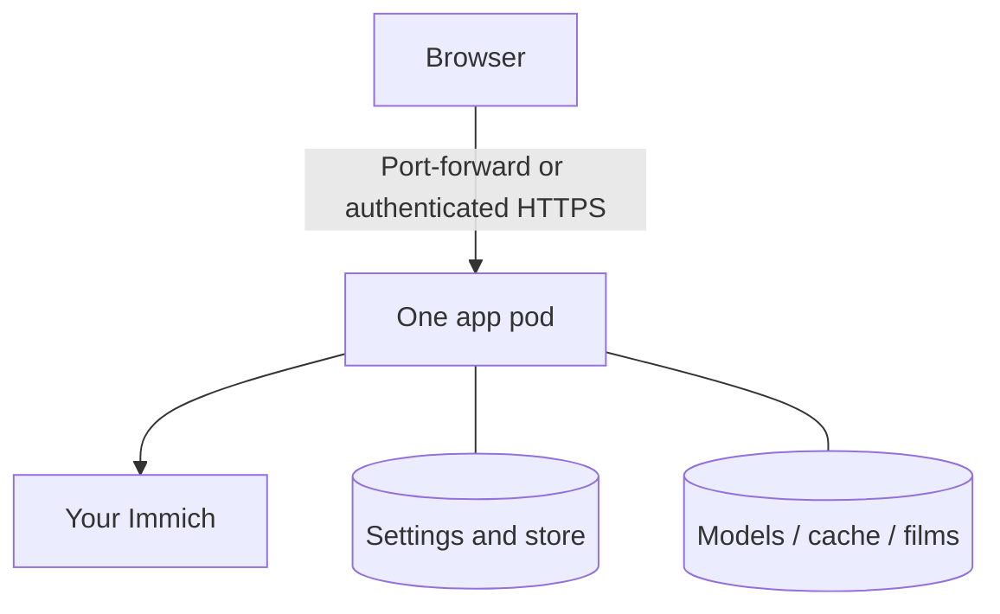

# Kubernetes

For an existing cluster with persistent storage. [Docker Compose](./docker.md) is the simpler
install. The Kustomize manifests live in `deploy/kubernetes/`; CI renders them but does not deploy
them to a live cluster. [Compatibility evidence](./reference/compatibility.md) lists tested setups.

## Prerequisites

- Immich reachable from the cluster, normally port 2283.
- A storage class for three `ReadWriteOnce` PVCs: data/cache 20Gi, output 50Gi, models 5Gi.
- For NVIDIA overlays: GPU Operator, `nvidia` RuntimeClass and labelled GPU nodes.

The default is one CPU-only app, with SQLite on the data PVC. Use local/block storage for SQLite,
not NFS/SMB. Keep `replicas: 1` even with PostgreSQL: the UI has in-process state.



## Quick start

Download/extract the deployment bundle from your chosen
[release](https://github.com/sam-dumont/immich-video-memory-generator/releases). Its image pins
match that release. If using a source checkout instead, check `base/kustomization.yaml`: committed
pins can trail releases. Image tags have no `v` prefix.

```bash
cd deploy/kubernetes
cp base/secret.yaml.example base/secret.yaml
# Edit IMMICH_URL and IMMICH_API_KEY in base/secret.yaml.
kubectl kustomize base
kubectl apply -k base
kubectl rollout status -n immich-memories deploy/immich-memories
```

For a source checkout, set the image before applying:

```bash
(cd base && kustomize edit set image ghcr.io/sam-dumont/immich-video-memory-generator=:X.Y.Z)
```

The init container fetches model files needed by its configuration. Before the first film,
check the running app's actual tier and requirements:

```bash
kubectl exec -n immich-memories deploy/immich-memories -- immich-memories models fetch
kubectl exec -n immich-memories deploy/immich-memories -- immich-memories preflight
kubectl port-forward -n immich-memories svc/immich-memories 8080:80
```

Open `http://localhost:8080`. Set home coordinates and timezone below, then make
[your first film](../get-started/first-film.mdx).

:::caution Keep it private until login works
Authentication is disabled by default. Do not expose the Service or add an Ingress before
[enabling authentication](./authentication.mdx). Keep one UI replica.
:::

## Home base, time zone and the first cut

Add these to the Deployment's `env` (or your overlay), so future applies keep them:

```yaml
- name: IMMICH_MEMORIES_TRIPS__HOMEBASE_LATITUDE
  value: "50.8503"
- name: IMMICH_MEMORIES_TRIPS__HOMEBASE_LONGITUDE
  value: "4.3517"
- name: TZ
  value: Europe/Brussels
```

Home coordinates enable trips and local public holidays. Then
[confirm your family once](../get-started/who-is-who.md).

## Getting the films

The web Render panel can upload to Immich. To default CLI/daily films to upload, set
`IMMICH_MEMORIES_UPLOAD__ENABLED=true` and optionally `IMMICH_MEMORIES_UPLOAD__ALBUM_NAME`.
The key needs [upload permissions](./docker.md#the-api-key).

For local films, copy from the output PVC:

```bash
kubectl get pods -n immich-memories
kubectl cp immich-memories/<pod>:/app/output ./output
```

Confirmed uploads remove their local film; local-only and failed deliveries keep theirs.

## Authentication and Ingress

Add Basic-auth credentials to the Secret, or configure [OIDC](./authentication.mdx#oidc--sso).
Then copy `base/ingress.yaml.example`, set its host/TLS settings and list it in your kustomization.
Use the [proxy trust/cookie checklist](./authentication.mdx#behind-a-reverse-proxy-with-tls).

## How the pod is wired

The app runs as UID/GID 1000 with `fsGroup: 1000`, dropped capabilities, RuntimeDefault seccomp
and a read-only root.

| Path | Storage |
|---|---|
| `/home/immich/.immich-memories` | Data/cache PVC: store, settings, session key, previews and clips |
| `/app/output` | Output PVC: local films |
| `/models` | Models PVC: encoder, WordNet and tier-dependent model files |
| `/tmp` | 4Gi emptyDir; allow more for 4K |

Base settings come from environment variables and the Secret. Settings saves go to the store;
[environment variables win](./config-file.md#where-a-setting-comes-from).

Keep `enableServiceLinks: false` on every custom pod spec. Service names can otherwise inject
`IMMICH_MEMORIES_*` variables that the app mistakes for configuration and fails to parse.

## NetworkPolicy

The base policy allows DNS and TCP ports 80, 443, 2283, 11434 and 8092. These are port rules,
not destination allow-lists. Add your actual service ports: oMLX commonly uses 8000,
PostgreSQL 5432, render services 8093, and your services may differ.
The CNI must enforce NetworkPolicy for these rules to matter.

## GPU

For **video encoding/title effects**, apply `overlays/gpu` instead of `base`. It reserves one
NVIDIA GPU for the app. It does not start inference or caption services.
Intel/AMD device plugins and `/dev/dri` mapping are not supplied by these manifests.

## Automatic product tiers {#set-the-preparation-tier}

For **GPU picture preparation**, deploy the model services and point the app at them:

```bash
kubectl apply -k overlays/inference-cuda
kubectl apply -k overlays/captioner-cuda
```

```yaml
- name: IMMICH_MEMORIES_INFERENCE__FACTS_BASE_URL
  value: http://inference:8092
- name: IMMICH_MEMORIES_EDITORIAL__PREPARATION__CAPTION_BASE_URL
  value: http://captioner:8092/v1
```

CPU service variants are `overlays/inference` and `overlays/captioner`.
The default `tier: auto` sees GPU inference separately from encoding.
Add a [reader](../better/reader.md) for Full. After changing tier/services, run `models fetch` in
the app again for required detectors/Laya, then `preflight`.
[Requirements](./requirements.md#which-tier-you-get) explains the resolver.

## Render worker as a sidecar

`overlays/render-sidecar` puts a worker in the same pod, on an NVIDIA node.
It receives the Immich API key over pod loopback `http://127.0.0.1:8093`.
Copy its `render-worker-secret.yaml.example` to `render-worker-secret.yaml`, generate a token
(`openssl rand -hex 32`), then apply the overlay.

Keep app and worker image tags equal. The worker binds loopback, so its probes must use `exec`,
not kubelet HTTP/TCP probes to the pod IP. [Render worker](../better/gpu-render.md) covers remote
workers and transport protection.

## The two model services

Inference and caption overlays can also run independently for another app deployment. Create the
namespace first if the base is not deployed. Reader/music servers are not provided by the base.
See [Inference](../better/inference.md), [Captions](../better/captions.md) and [Music](../better/music.md)
for model/service configuration.

## Database

For PostgreSQL, fill in `overlays/postgres/database-secret.yaml` from its example and apply that
overlay instead of base. It connects to an existing PostgreSQL; it does not deploy one.
[PostgreSQL modes](./reference/database.md) gives the database/role SQL.

Add PostgreSQL egress in your own overlay. For example, build on `../postgres` and add this
inline patch to `patches:`:

```yaml
- target:
    kind: NetworkPolicy
    name: immich-memories
  patch: |-
    - op: add
      path: /spec/egress/-
      value:
        ports:
          - port: 5432
            protocol: TCP
```

Use your server's port. Overlays based on `base` are alternatives: applying GPU after PostgreSQL
replaces the PostgreSQL patch. For both, compose one overlay based on PostgreSQL and copy in the
GPU deployment patch. Do not apply sibling app overlays one after another.

## Batch jobs

`base/job.yaml` is optional. Its CronJobs call `POST /api/trigger` on the running app; they do not
mount SQLite from a second pod. Set `IMMICH_MEMORIES_SERVER__TRIGGER_TOKEN` in the Secret.
Both schedules invoke the automatic decision, even the job named monthly: they do not force a
monthly film.

For a fixed recipe, prefer `kubectl exec ... -- immich-memories generate ...`.
The one-off generate Job mounts the PVCs directly; use it with the Deployment scaled to zero.
If using PostgreSQL, add its Secret to that Job too. Include `job.yaml` in Kustomize so its app
image follows the selected tag; a raw `apply -f` bypasses image transformations.

Or enable the app's [daily timer](../make/automate.md) and skip CronJobs entirely.

## Backups

```bash
kubectl exec -n immich-memories deploy/immich-memories -- immich-memories store backup
kubectl cp immich-memories/<pod>:/home/immich/.immich-memories/backups ./backups
```

Keep the manifest/encryption key. [Restore](./database.md#restore-in-a-container) needs the
Deployment stopped. Caches are disposable; the store is not.

## Probes

Liveness uses `/health/live`; readiness uses `/health/ready`, which returns 503 when Immich/config
is unavailable. `/health` always returns 200 and must not be used as a probe.
[Diagnostics](./maintenance/health-logs-cache.md#health-endpoints) gives response/access details.

## Logs

```bash
kubectl logs -n immich-memories deploy/immich-memories -c immich-memories -f
```

For init failures, use `-c fetch-models`. [Diagnostics](./maintenance/health-logs-cache.md#logging)
has per-run paths and logging variables.

## Upgrading and rollback

Back up, change pins in the base **and any add-on overlays**, render the same kustomization you
installed, then apply it. Run `models fetch` and `preflight` in the updated app.
The init guard checks presence only, so existing files do not prove new pins match.
[Rollback](./maintenance/upgrading.md#rollback) requires the old store backup when its schema changed.

## Another namespace

Set `namespace:` in each kustomization root you apply. Update command `-n` arguments and any
cross-namespace URLs too. Applying raw YAML bypasses the namespace transformation.

## Check it from outside the pod

Use the quick-start `kubectl exec ... preflight` command after service changes. The
[reference setup](./reference-setup.md) shows a complete multi-service topology.

## The models the first cut needs

Model requirements follow the selected tier. [Model files](./maintenance/health-logs-cache.md#model-files)
lists the fetch options. Run fetch from the app's configuration after adding GPU/Full services.

## Everything at once

[The advanced reference setup](./reference-setup.md) combines inference, captions, a render
sidecar, reader, music and OIDC. Build the basic install first.
