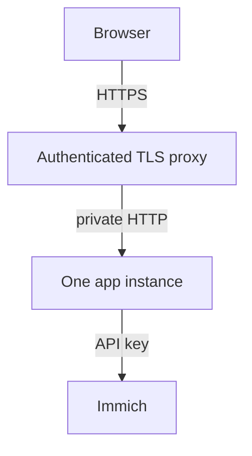

# Network and security

Keep the app private until authentication works. An Immich API key gives the app access to the
library; a proxy or render worker is part of that trust boundary.

## Listen on the right address

With auth off, Python binds to `127.0.0.1`. Enabling auth normally permits all interfaces.
Use `ui --host 127.0.0.1` to keep an authenticated app local.
In Docker, the image binds inside the container; the shipped mapping `127.0.0.1:8080:8080`
keeps it reachable only from the host. For LAN access, follow
[Docker's login and mapping steps](./docker.md#reaching-the-ui-from-another-machine).

An explicit `--host` or environment host override can expose an unauthenticated app.
A bare YAML `server.host: 0.0.0.0` alone does not opt into that exposure.

## HTTPS reverse proxy

This example uses nginx on the same host, proxying the shipped loopback mapping. Enable
[Basic auth or OIDC](./authentication.mdx) first. Configure the app:

```yaml
advanced:
  auth:
    public_url: https://memories.example.com
    trusted_proxies: [127.0.0.1]
  server:
    secure_cookies: true
```

The app must trust the **peer address it actually sees**. Docker's bridge may make that the host
bridge address instead of `127.0.0.1`; replace it with that exact address. For a proxy container,
use its fixed address and keep the app off published LAN ports.

```nginx
server {
    listen 443 ssl;
    server_name memories.example.com;
    ssl_certificate /etc/nginx/tls/fullchain.pem;
    ssl_certificate_key /etc/nginx/tls/privkey.pem;
    client_max_body_size 100m;
    location / {
        proxy_pass http://127.0.0.1:8080;
        proxy_http_version 1.1;
        proxy_set_header Host $host;
        proxy_set_header X-Forwarded-Proto $scheme;
        proxy_set_header X-Forwarded-For $remote_addr;
        proxy_read_timeout 300s;
        proxy_buffering off;
    }
}
```

This recipe overwrites forwarded headers with the immediate client's values. If another trusted
proxy sits in front, configure that chain explicitly. For header authentication, also discard
client-supplied identity headers and set them only from the proxy's verified session.



Register OIDC callback `https://memories.example.com/auth/callback` and logout
`https://memories.example.com/logout`. Allow only intended verified emails/domains.
`FORWARDED_ALLOW_IPS`, when set, overrides `auth.trusted_proxies`.
Enable secure cookies only once users reach HTTPS; plain HTTP LAN logins then fail.

## Ports and egress

| Connection | Default port | Needed when |
|---|---|---|
| Browser/proxy to app | 8080 | Always |
| App to Immich | 2283, or your HTTPS proxy | Always |
| App to PostgreSQL | 5432 | PostgreSQL store |
| App to inference/captions | 8092 | Configured model services |
| App to Ollama | 11434 | Reader endpoint uses it |
| App to another reader | Its configured port, often 8000/9999 | That reader |
| App to render worker | 8093 standalone; 8092 with `/render` in the unified worker | Remote rendering |
| DNS / HTTPS downloads | 53 / 443 | Name resolution / explicit setup downloads |

Other music/map/notification endpoints use their configured ports.
[Exact payloads and destinations](./reference/privacy-egress.md).
The Kubernetes base allows ports, not hosts. Custom reader/worker ports require a policy patch;
[PostgreSQL needs the 5432 patch](./reference/kubernetes.md#postgresql-network-policy).
Terraform does not create a NetworkPolicy.

## Secrets with different jobs

| Secret | Purpose |
|---|---|
| Immich API key | Reads the library and optional generated-film delivery |
| `IMMICH_MEMORIES_SECRET_KEY` | Decrypts credentials saved in Settings; preserve with backups |
| `IMMICH_MEMORIES_STORAGE_SECRET` | Signs browser sessions; rotating it signs users out |
| `server.trigger_token` | Authenticates automation triggers |
| `render.worker_token` | Authenticates the worker; worker also receives the Immich key |

Prefer HTTPS for services beyond loopback. Review access to deployment Secrets, Terraform state,
backup files and worker hosts as access to your library.
