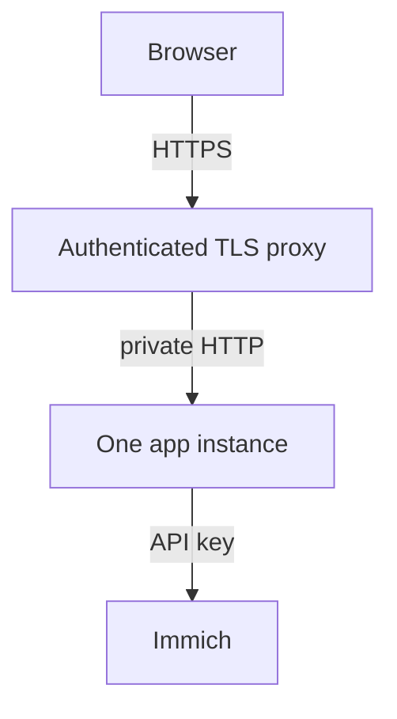

# Network and security

Keep the app private until authentication works. An Immich API key gives the app access to the
library; a proxy or render worker is part of that trust boundary.

## Listen on the right address

With auth off, Python binds to `127.0.0.1`. Enabling auth normally permits all interfaces.
Use `ui --host 127.0.0.1` to keep an authenticated app local.
In Docker, the image starts with `ui --host 0.0.0.0`. Only the shipped Compose mapping
`127.0.0.1:8080:8080` keeps it reachable from the host alone. `docker run -p 8080:8080`,
a NAS template or a Portainer stack with an all-interface mapping exposes the unauthenticated
app unless you enable auth. For LAN access, follow
[Docker's login and mapping steps](./docker.md#reaching-the-ui-from-another-machine).

An explicit `ui --host 0.0.0.0` or `IMMICH_MEMORIES_SERVER__HOST=0.0.0.0` can expose an
unauthenticated app. `advanced.server.allow_unauthenticated_lan: true` also permits a wildcard
bind without auth. Anyone reaching that port can use the app's Immich access.
A YAML `server.host: 0.0.0.0` is ignored because older versions wrote it automatically.
Enable auth for LAN access, or use one of the explicit overrides only on a restricted network.

## Allowed hosts

Every request names a host in its `Host` header. With auth off, the app answers only these:

- `localhost`, `127.0.0.1`, `[::1]` and `host.docker.internal`, on any port;
- `server.host`, when it is a name or a specific address (not `0.0.0.0` or `::`);
- the host of `auth.public_url`;
- every entry of `server.allowed_hosts`.

Any other host gets **421 Misdirected Request**. Without this, a web page on another site could
point its own name at your machine and read the app as if it were that site.

With auth on, any host is answered, so a NAS reached by its IP or hostname keeps working. Set
`server.allowed_hosts` to restrict it: then only the listed names, the localhost names and the
host of `auth.public_url` are answered.

`/health/live` and `/health/ready` answer whatever host they name, since Kubernetes probes use the
pod IP. They tell an anonymous caller nothing beyond up or down.

An unauthenticated LAN install (`allow_unauthenticated_lan: true`) must list the names it is
reached by:

```yaml
advanced:
  server:
    allow_unauthenticated_lan: true
    allowed_hosts: [nas.lan, 192.168.1.20]
```

Ports in `allowed_hosts` are ignored: `nas.lan` covers `nas.lan:8080`. The environment form is
`IMMICH_MEMORIES_SERVER__ALLOWED_HOSTS='["nas.lan"]'`. The first refusal for each host is logged
as a warning.

## Writes from other sites

A `POST`, `PUT`, `PATCH` or `DELETE` under `/api` or `/auth` that a browser sends from another
site is refused with **403**, with auth on or off. The browser's `Sec-Fetch-Site` header decides
when it is present; otherwise an `Origin` that differs from the request's host is refused.
Calls without either header (curl, CronJobs, the CLI) pass, so `POST /api/trigger` with its token
works as before.

Uploaded soundtracks are capped at 64 MiB each, refused before the body is read when the request
announces more. Together they may use `server.music_upload_quota_mb` (default 1024); past it the
oldest uploads are removed.

No page may show the app in a frame: every response carries `X-Frame-Options: DENY` and
`Content-Security-Policy: frame-ancestors 'none'`.

## HTTPS reverse proxy

This example uses nginx on the same host, proxying the shipped loopback mapping. Enable
[Basic auth or OIDC](./authentication.mdx) first. Configure the app:

```yaml
advanced:
  auth:
    public_url: https://memories.example.com
    trusted_proxies: [127.0.0.1]
  server:
    secure_cookies: true
```

The app must trust the **peer address it actually sees**. Docker's bridge may make that the host
bridge address instead of `127.0.0.1`; replace it with that exact address. For a proxy container,
use its fixed address and keep the app off published LAN ports.

On a Linux Docker host, inspect the app's container IP and observe a proxied connection:

```bash
docker inspect --format '{{json .NetworkSettings.Networks}}' "$(docker compose ps -q immich-memories)"
sudo tcpdump -nn -i any 'tcp dst port 8080'
```

Open the UI through the proxy while the capture runs. Find the packet whose destination is
the app's container IP; its source is the peer the app must trust. Stop the capture with Ctrl-C.
For example, `172.20.0.1 > 172.20.0.3.8080` means trust `172.20.0.1`, not the browser address
in `X-Forwarded-For`. With Docker Desktop, a proxy container on the app's private network with
a fixed IP avoids relying on the host-to-VM bridge address.

```nginx
server {
    listen 443 ssl;
    server_name memories.example.com;
    ssl_certificate /etc/nginx/tls/fullchain.pem;
    ssl_certificate_key /etc/nginx/tls/privkey.pem;
    client_max_body_size 100m;
    location / {
        proxy_pass http://127.0.0.1:8080;
        proxy_http_version 1.1;
        proxy_set_header Host $host;
        proxy_set_header X-Forwarded-Proto $scheme;
        proxy_set_header X-Forwarded-For $remote_addr;
        proxy_read_timeout 300s;
        proxy_buffering off;
    }
}
```

This recipe overwrites forwarded headers with the immediate client's values. If another trusted
proxy sits in front, configure that chain explicitly. For header authentication, also discard
client-supplied identity headers and set them only from the proxy's verified session.



Register OIDC callback `https://memories.example.com/auth/callback`. Allow only intended verified
emails/domains. App logout redirects to the IdP's end-session endpoint when available, without
a `post_logout_redirect_uri`.
`FORWARDED_ALLOW_IPS`, when set, overrides `auth.trusted_proxies`. With auth on, the app refuses
to start when it is `*` (it would let every client choose its own address); list your proxy's
address instead. With `provider: header` remove the variable entirely, even if empty, and
configure `auth.trusted_proxies`. Only uvicorn reads
`X-Forwarded-For`, and only from those proxies: the sign-in limiter counts failures on the address
uvicorn resolved, never on a header the client sent.
Enable secure cookies only once users reach HTTPS; plain HTTP LAN logins then fail.

## Ports and egress

| Connection | Default port | Needed when |
|---|---|---|
| Browser/proxy to app | 8080 | Always |
| App to Immich | 2283, or your HTTPS proxy | Always |
| App to PostgreSQL | 5432 | PostgreSQL store |
| App to inference/captions | 8092 | Configured model services |
| App to Ollama | 11434 | Reader endpoint uses it |
| App to another reader | Its configured port, often 8000/9999 | That reader |
| App to render worker | 8093 standalone; 8092 with `/render` in the unified worker | Remote rendering |
| DNS / HTTPS downloads | 53 / 443 | Name resolution / explicit setup downloads |

Other music/map/notification endpoints use their configured ports.
[Exact payloads and destinations](./reference/privacy-egress.md).
The Kubernetes base allows ports, not hosts. Custom reader/worker ports require a policy patch;
[PostgreSQL needs the 5432 patch](./reference/kubernetes.md#postgresql-network-policy).
Terraform does not create a NetworkPolicy.

## Secrets with different jobs

| Secret | Purpose |
|---|---|
| Immich API key | Reads the library and optional generated-film delivery |
| `IMMICH_MEMORIES_SECRET_KEY` | Decrypts credentials saved in Settings; preserve with backups |
| `IMMICH_MEMORIES_STORAGE_SECRET` | Signs browser sessions; rotating it signs users out |
| `server.trigger_token` | Authenticates automation triggers |
| `render.worker_token` | Authenticates the worker; worker also receives the Immich key |

Prefer HTTPS for services beyond loopback. Review access to deployment Secrets, Terraform state,
backup files and worker hosts as access to your library.


## Configured service addresses

Reader, caption, inference, geocoding, music and render-worker endpoints must use HTTP or HTTPS.
Notification URLs use Apprise's supported schemes. Loading configuration or saving Settings
rejects literal link-local addresses (`169.254.0.0/16`, `fe80::/10`, including mapped IPv4).
Ordinary private LAN addresses remain supported.

An operator who needs a link-local service can set `IMMICH_MEMORIES_ALLOW_LINK_LOCAL_URLS=true`
in the app's process environment and restart it. Settings cannot change this override. This is
a guard against accidental configuration: it does not resolve DNS names or inspect redirects.

The [project threat model](https://github.com/sam-dumont/immich-video-memory-generator/blob/main/docs/security/threat-model.md)
lists the trust boundaries and accepted deployment limits.
