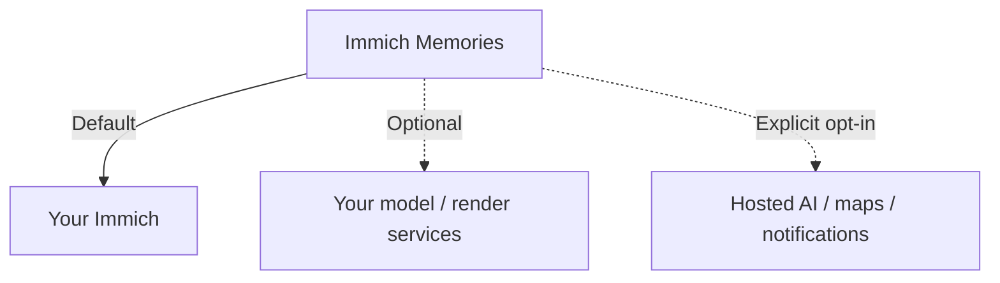

# Privacy

A default Basic film talks only to your Immich server. Hugging Face Hub telemetry is disabled
before imports in the app and inference service; there are no app analytics or update checks.
Fetch model files during setup. Explicit download switches and some optional music backends
can also fetch weights on first use, including during a run.

Optional features can contact other services. You choose which ones, and whether they run on
your own hardware or outside your network.



## Before adding a service

| Feature | What it receives |
|---|---|
| Text reader | Candidate annotations, dates, places, people/relationship and album names, plus your memory brief |
| Caption server | Small picture tiles and video-frame strips |
| LLM captions | Pictures, only with explicit `caption_provider: llm` |
| Inference service | Previews and sampled frames for classification; generated WAV music for stem separation |
| Render worker | Cut/timing metadata, primary and selected partner API keys, names, titles, home coordinates and network settings |
| Geocoding/maps | Rounded coordinates or map tile requests |
| Generated music | Mood/genre/tempo text; stem separation can send audio |
| Notifications | Run outcome/details, optionally a thumbnail |
| OIDC | The usual login flow to your provider |

The reader is disabled by default. Enable it with `llm.enabled: true`, blank `base_url` and `openai-compatible` or `ollama` for an owned local reader;
a remote URL or hosted provider preset sends text to that endpoint. Configuring a reader does
not enable image captions. Check the [full request inventory](reference/privacy-egress.md) for exact
hosts, switches and defaults. `preflight` names enabled geocoding/map destinations; that list
does not cover every outside endpoint. Its service checks also send authenticated probes.

## What Immich sees

The app reads metadata, previews and source media. It never changes your originals.
With upload off (the default), it does not write to the library.
With delivery enabled:

1. Upload the finished film as a new asset.
2. Tag it `immich-memories/generated`, so it is not selected as source footage later.
3. Add it to the configured album (create the album if needed).
4. Move a recognised previous render of the same recipe to trash, if the API key permits it.

`immich-memories config test` only checks authentication/API compatibility.

## Geocoding and maps

Both are off by default:

```yaml
network:
  geocoding: false
  geocoding_url: ""
  map_tiles: false
```

Geocoding gets city, village and trip names and names in the film's language. It sends
coordinates rounded to two decimals (about a kilometre) to Nominatim, once per place. That can
include home. Answers stay in the store. Set `geocoding_url` for your own Nominatim.

After upgrading past the fix that dropped the English fallback, each already-geocoded place is
looked up once more: the cache key changed, so a stored English answer is never reused, and
English is no longer requested at all. A place with no name in the film's language keeps its own
local name instead.

Map tiles come from ArcGIS World Imagery for trip maps and location-card backgrounds. Requests
reveal the area, including home base. With tiles off, ordinary title/location cards still work.
[Maps and titles](../make/titles-maps-music.md) explains the result.

## Fonts

Docker includes script fonts. Python installs include the core fonts; other alphabets use one
explicit download:

```bash
immich-memories titles fonts --install
```

Font files are pinned and digest-checked. A render never fetches a font. Detector downloads are
off unless allowed; the Compose inference profile allows them and the captioner profile fetches
its weights at startup. ACE-Step and local Demucs can fetch their own weights on first use.
Those downloads contain no library data. Local ACE-Step uses app-pinned immutable Hugging Face
snapshots and refuses incomplete downloads; [checkpoint revisions](./reference/privacy-egress.md#ace-step-checkpoint-revisions)
list the pins. API mode uses the remote music server's checkpoints.

## Thumbnails in the web UI

Your browser asks this app for pictures/video, behind the same login. The app fetches or serves
cached media from Immich. The API key stays on the server.

## Privacy mode

For sharing a demonstration without showing the actual film:

```bash
immich-memories generate --privacy-mode --year 2024
```

The encoded film blurs pictures, scrambles speech, substitutes names and moves places to a fake
city. **This changes the film, not network requests.** Trip geocoding can happen before names
are substituted. The output filename can still contain real information: rename it before sharing.

For a screen share, enable `server.enable_demo_mode` and turn on the UI's **Demo mode** eye button.
Each browser has its own choice. This only blurs what the UI displays.

## Diagnostic reports

`immich-memories report` creates a local report, with configured credentials, known personal
names/places, coordinates, addresses, URLs and absolute paths removed. Asset IDs become report-local
hashes. It contains no pictures and sends nothing automatically.
Read it before sharing; automatic redaction is not a substitute for checking the file.

## Documents never ship

A photographed ID card, passport, bank card, letter or form with readable personal text is
held back on every tier, on purpose; see [picking a shot](../how-it-chooses/picking-shots.md)
for how it's caught.

## Everything that can leave, and when

The [network request inventory](reference/privacy-egress.md) keeps the complete egress table and
image-provider details together for operators.

## The one picture seat

The ordinary reader receives text. Picture tiles go to the caption server, or to the configured
LLM only after an explicit image-caption opt-in. See the [inventory](reference/privacy-egress.md#the-one-picture-seat).

## Files on disk, and cancellation

[Technical privacy details](reference/privacy-egress.md#files-on-disk-and-cancellation) cover local file
permissions and cancellation. Keep the [store backed up](./database.md).

## Fetch once, then block outbound

The [offline Basic recipe](./offline.md) seeds a model volume before restricting the app to
Immich. It includes Docker's same-host internal bridge and a destination-scoped Kubernetes
policy, with their routing limits.

## Before using the Basic offline recipe

Basic omits the extra GPU/Full detectors and Laya sharing pre-screen. Choosing **Family**
instead of **Just us** does not add that missing coverage. Review the film before sharing;
[the audience guide](../how-it-chooses/family-audience-duplicates.md) explains the limits.

For an additional text service, see [Basic with a local text model](./local-models.md).
