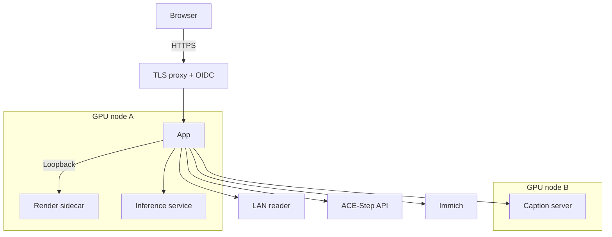
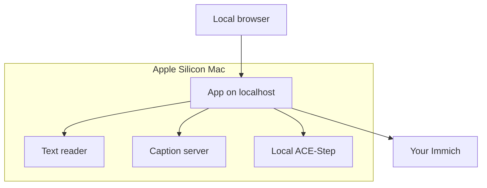

# Advanced reference setup

Two examples for an operator who wants the optional services: a two-GPU Kubernetes cluster,
and a Mac running everything locally. You do not need either to make a film.
Start with [what each add-on buys](../get-started/what-a-gpu-or-a-model-adds.md).

The hostnames, IPs and node names below are placeholders.

## The two profiles

| Profile | Best fit |
|---|---|
| Always-on cluster | Daily films, GPU services and authenticated remote access |
| Local Mac | Interactive editing, local model servers and local generated music |

## The always-on server (Kubernetes)

This profile uses the shipped `overlays/maximalist`: app + render sidecar, CUDA inference and
CUDA captions. You supply the reader, ACE-Step API and TLS/identity provider.



Read the [Kubernetes base setup](./kubernetes.md) first. Prepare secrets and edit the example
configuration:

```bash
cd deploy/kubernetes
cp base/secret.yaml.example base/secret.yaml
cp overlays/render-sidecar/render-worker-secret.yaml.example overlays/render-sidecar/render-worker-secret.yaml
cp overlays/maximalist/maximalist-secret.yaml.example overlays/maximalist/maximalist-secret.yaml
```

Fill in the Immich key, shared worker token, OIDC/reader/music secrets and
`overlays/maximalist/config-map.yaml`. Set all image pins to the same chosen release.
Render the result before applying:

```bash
kubectl kustomize overlays/maximalist
kubectl apply -k overlays/maximalist
```

### The cluster's config.yaml, annotated

The shipped ConfigMap contains the complete example. These are the connections you must change:

```yaml
tier: full
advanced:
  auth:
    enabled: true
    provider: oidc
    public_url: "https://memories.example.com"
    issuer_url: "${OIDC_ISSUER_URL}"
    client_id: "${OIDC_CLIENT_ID}"
    client_secret: "${OIDC_CLIENT_SECRET}"
    allowed_emails: [you@example.com]
    trusted_proxies: ["10.42.0.2"] # replace with your immediate proxy address
  server:
    secure_cookies: true
  inference:
    facts_base_url: "http://inference:8092"
  editorial:
    preparation:
      caption_base_url: "http://captioner:8092/v1"
  llm:
    provider: openai-compatible
    base_url: "http://192.168.1.50:9999/v1"
    model: "your-model-name"
    api_key: "${LLM_API_KEY}"
  ace_step:
    enabled: true
    mode: api
    api_url: "http://acestep-api:8001"
    api_key: "${ACE_STEP_API_KEY}"
```

Replace the example trusted proxy address with your proxy's actual peer address. The model name must match the
reader's served model. Keep Basic/OIDC access configured before exposing the app.
[Authentication](./authentication.mdx) has callback and forwarded-header requirements.

Geocoding/maps in the shipped example are opt-in outside calls; leave them off unless you want
that result. Size the caches below the data PVC's capacity.

### Check the tier it really runs

The overlay sets `IMMICH_MEMORIES_TIER=full`; an environment variable beats the file.
After adding services:

```bash
kubectl exec -n immich-memories deploy/immich-memories -c immich-memories -- immich-memories models fetch
kubectl exec -n immich-memories deploy/immich-memories -c immich-memories -- immich-memories preflight
kubectl exec -n immich-memories deploy/immich-memories -c immich-memories -- immich-memories config show tier
```

Full needs a configured reader, captions and Laya. With `auto`, missing GPU inference means NAS:
selection stays rules-based, although a configured reader can still supply titles/music mood.

### The two GPU nodes

The reference deployment used a T1000 (Turing, 8 GB) for inference/rendering, and a GTX 1070
(Pascal, 8 GB) for captions. llama.cpp captions can use Pascal; newer PyTorch CUDA wheels may not.
These are tested examples, not required cards.

Pin inference/caption deployments to their intended nodes with your own overlay patches:

```yaml
apiVersion: apps/v1
kind: Deployment
metadata:
  name: immich-memories-inference
spec:
  template:
    spec:
      nodeSelector:
        kubernetes.io/hostname: gpu-node-a
```

Add the corresponding patch for `immich-memories-captioner` on `gpu-node-b`.
If sharing GPUs with other workloads, configure time slicing/resource scheduling in your GPU
Operator setup; the app does not do that for you.

### Music stems

ACE-Step supplies music; Demucs can split it through the inference service. The CUDA inference
image includes its weights. CPU/local fallbacks may download weights on first use: keep their
cache persistent. [Generated music](../better/music.md) covers memory, precision and verification.

### Gotchas, with the exact strings to search for

| Symptom | Check |
|---|---|
| OIDC `Invalid callback origin` | `public_url`, proxy trust and forwarded HTTPS scheme |
| A service port parsed as `tcp://...` | `enableServiceLinks: false` on custom pods |
| Loopback worker never Ready | `exec` probes, not HTTP/TCP probes to pod IP |
| PVC stuck Pending | Storage class/provisioner, capacity and binding mode |
| Full requested, NAS selected under auto | Actual environment source and GPU inference endpoint |
| Large responses stall, small ones work | CNI/tunnel MTU on multi-site clusters |

See [Kubernetes](./kubernetes.md) for network policy, storage, probes and overlay composition.

### Preparation cost and reuse

Keep the store when replacing containers. Compatible prepared facts survive tier and machine
changes. Measure one month before preparing a whole library.
[Measured](../better/measured.md#nas-preparation) separates preparation, captions and rendering.

## The laptop / workstation (the Mac)

Everything runs on one Apple Silicon Mac: the app, an OpenAI-compatible reader, a SmolVLM
caption server and optional local ACE-Step. Full still needs the reader/caption services running.



For this checkout setup, use Python 3.12 for local ACE-Step and Node 22 for the web client:

```bash
git clone https://github.com/sam-dumont/immich-video-memory-generator.git
cd immich-video-memory-generator
uv sync --extra all-mac --extra auth
make web-client
make install-acestep
```

Start your [reader](../better/reader.md) and [caption server](../better/captions.md), then configure
the endpoints below. [Local music setup](../better/music.md) explains the ACE-Step installation
and validation command.

### The Mac's config.yaml, annotated

Add this to your existing Immich/home configuration:

```yaml
tier: full
advanced:
  editorial:
    preparation:
      caption_base_url: "http://localhost:8092/v1"
  llm:
    provider: openai-compatible
    base_url: "http://localhost:9999/v1"
    model: "your-model-name"
  ace_step:
    enabled: true
    mode: lib
    model_variant: "acestep-v15-xl-turbo"
    lm_model_size: "4B"
    use_lm: true
```

XL/4B is the reference choice, not a low-memory default. Use the music guide to choose what fits.
For local-only access, pin the host even if you later enable authentication:

```bash
uv run immich-memories models fetch
uv run immich-memories preflight
uv run immich-memories ui --host 127.0.0.1
```

## Feature → where it runs → config keys → hardware

[The configuration guide](./config-file.md#what-each-top-level-section-is-for) maps tasks to keys.
Inference, video encoding and music are separate GPU workloads; adding one does not configure
the others.

## Terraform

`deploy/terraform/examples/maximalist` is the module form of the cluster example. Optional
captioner/sidecar variables create those components; inference remains a separate Kustomize
service. Reader and ACE-Step are external endpoints.
[Terraform](./terraform.md) covers module ownership, secrets and applying changes.
