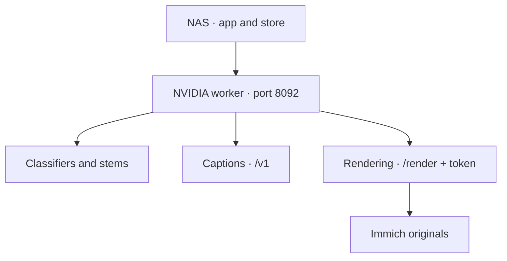

# One GPU service

Keep the app on the NAS and move classifiers, captions, Demucs stems and rendering to one NVIDIA
container. The text reader and ACE-Step music generation are separate choices. Laya runs in the app.

## One GPU service {#one-gpu-service}

Use the CUDA inference image matching the app version, the NVIDIA Container Toolkit and a
private address reachable from the app. From a checkout of that release:

```bash
export GPU_WORKER_IMAGE=ghcr.io/sam-dumont/immich-video-memory-generator/inference:YOUR_APP_TAG-cuda
export IMMICH_URL=https://photos.example.com
export RENDER_WORKER_TOKEN=$(openssl rand -hex 32)
export GPU_WORKER_BIND_ADDRESS=192.168.1.50
docker compose -f services/inference/compose.gpu-worker.yaml up -d
```

Save the token in your secret manager and use the same value in the app. The recipe defaults to
loopback binding if you omit `GPU_WORKER_BIND_ADDRESS`. It mounts separate model-cache and
render-scratch volumes and reserves one NVIDIA GPU. It does not set a RAM limit.

Configure the app:

```yaml
advanced:
  inference:
    facts_base_url: http://192.168.1.50:8092
    fallback_to_local: false
  editorial:
    preparation:
      caption_base_url: http://192.168.1.50:8092/v1
render:
  worker_base_url: http://192.168.1.50:8092/render
  worker_token: ${RENDER_WORKER_TOKEN}
  allow_insecure_http: true
  fallback_to_local: false
```

`allow_insecure_http` is an explicit opt-in for this trusted LAN: render requests include the
Immich API key. Use HTTPS through a proxy otherwise, and omit that opt-in. Only `/render` checks
the bearer token; `/facts`, `/audio/stems` and `/v1` have no built-in authentication. Do not expose
this listener to the internet.



Check from the app's environment:

```bash
immich-memories preflight -v
```

The Compose health check verifies the inference listener and authenticated render health. It
does not certify caption responses or every model's provider; preflight supplies those checks.

## Memory and scheduling

Work changes phase between classifiers, captions, audio and rendering. The worker unloads
classifier weights and stops its owned caption subprocess when switching away from them.
Demucs releases after separation. Captions restart on demand.

Rendering waits up to 60 seconds for active model work to finish. Conflicting requests return
`503` with `Retry-After: 1`; classifier queue overflow separately returns `429`. Native work keeps
its GPU ownership even when its client cancels. `/queue` reports classifiers, not a combined
queue for all phases.

One container saves duplicate services and image layers. It still needs enough host RAM and
VRAM for the largest active phase, scratch space for originals and output, and headroom for other
GPU users. The bundled caption command sets an 8192-token context; it does not explicitly bound
llama.cpp's RAM prompt cache or processing slots. Separate-reader or music services can still
compete for the card. Measure your workload before raising concurrency.

## Other deployments

The shipped Kubernetes inference and caption overlays and render sidecar deploy **separate**
services; there is no unified-worker overlay. Use the [Kubernetes reference](./reference/kubernetes.md)
for those manifests. The [multi-service cluster example](./reference/cluster-example.md) is for
operators deliberately distributing work across nodes.

For Apple Silicon, use the [Mac example](./reference/mac-example.md). The CUDA worker cannot use
Metal. Service API details and offline model provisioning are in the
[inference reference](../reference/inference-service.md).
