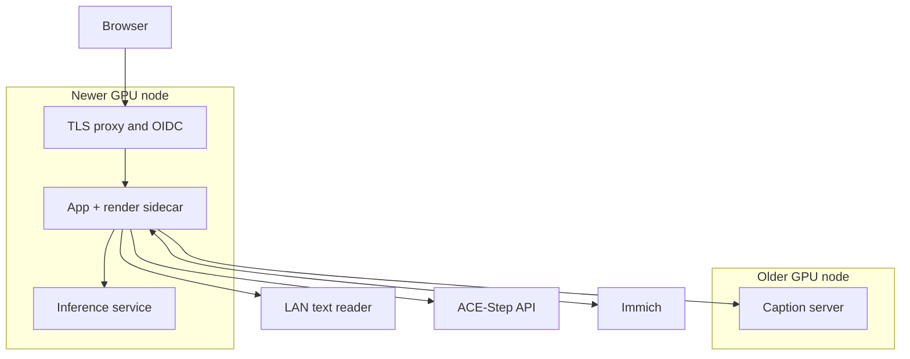

# Multi-service cluster example

A worked example with two GPU nodes, an external text reader, ACE-Step API, Immich and an identity
provider. This is an advanced deployment, not the minimum install. Set up the
[base app](../kubernetes.md) first.



The text reader and ACE-Step endpoint are existing services: the overlay does not deploy them.
Inspect image pins, Secrets, node selectors and NetworkPolicy before applying.

## The always-on server (Kubernetes)

```bash
cd deploy/kubernetes
cp base/secret.yaml.example base/secret.yaml
cp overlays/render-sidecar/render-worker-secret.yaml.example overlays/render-sidecar/render-worker-secret.yaml
cp overlays/maximalist/maximalist-secret.yaml.example overlays/maximalist/maximalist-secret.yaml
vim base/secret.yaml overlays/render-sidecar/render-worker-secret.yaml \
    overlays/maximalist/maximalist-secret.yaml overlays/maximalist/config-map.yaml
kubectl apply -k overlays/maximalist
```

`overlays/maximalist/kustomization.yaml` composes `overlays/render-sidecar` (which itself pulls in
`base`), `overlays/captioner-cuda` and `overlays/inference-cuda`, rather than duplicating any of
them. It keeps the base's 20Gi
cache PVC, so it applies over an existing install. On top: a second init container that installs `config.yaml`,
`IMMICH_MEMORIES_TIER=full` on the app container (the base sets `auto`, and an env var beats
`config.yaml`), and a NetworkPolicy that lets the app reach the LLM and ACE-Step ports. Read
[Kubernetes](.././kubernetes.md) first for the base layout this builds on.

### Check the tier it really runs

The tier in the file and the tier the pod runs can differ: the environment wins over
`config.yaml`, and the base Deployment sets `IMMICH_MEMORIES_TIER=auto`. Ask the app, before and
after any change:

```bash
kubectl -n immich-memories exec deploy/immich-memories -c immich-memories -- \
  immich-memories config show | grep '│ tier'
```

The row names the tier and where it came from. `full` from `env` is this setup. `nas` from `env`
means the pod has been cutting on the plain NAS tier, the caption server and selection reader are not used; a configured reader can still write titles and choose music; the log line above the table says why (`Automatic selection tier: nas. ...`).

### The cluster's config.yaml, annotated

The full file `overlays/maximalist/config-map.yaml` ships, redacted of anything that is a
credential (those come from `maximalist-secret.yaml` and expand with `${VAR}`):

```yaml
tier: full

network:
  geocoding: true    # nominatim.openstreetmap.org: place names, trip names
  map_tiles: true    # server.arcgisonline.com: the trip fly-over, location cards

cache:
  video_cache_max_size_gb: 5        # well inside the base's 20Gi cache PVC; a bigger
  thumbnail_cache_max_size_mb: 3000 # library raises both, and the PVC first

advanced:
  auth:
    enabled: true
    provider: oidc                         # Auth0, behind Traefik terminating TLS
    public_url: "https://memories.example.com"
    trusted_proxies:
      - "10.42.0.0/16"   # the cluster's pod CIDR, v4
      - "fd42::/48"      # and v6
    issuer_url: "${OIDC_ISSUER_URL}"
    client_id: "${OIDC_CLIENT_ID}"
    client_secret: "${OIDC_CLIENT_SECRET}"
    allowed_emails:
      - "you@example.com"

  server:
    secure_cookies: true

  editorial:
    preparation:
      caption_base_url: "http://captioner:8092/v1"   # gpu-node-b, server-cuda

  inference:
    facts_base_url: "http://inference:8092"   # gpu-node-a, ONNX Runtime on CUDA

  llm:
    provider: "openai-compatible"
    base_url: "http://192.168.1.50:9999/v1"   # oMLX on the Mac, LAN
    model: "gemma-4-e4b-it-6bit"
    api_key: "${LLM_API_KEY}"

  ace_step:
    enabled: true
    mode: api
    api_url: "http://acestep-api:8001"   # an ACE-Step 1.5 API server, not in the overlay
    api_key: "${ACE_STEP_API_KEY}"

  automation:
    enabled: true
    daily_at: "09:00"
```

### Music stems

ACE-Step generates the full track in its separate deployment. Demucs in the inference service
splits it into drums, bass, other and vocals for separate ducking under the clips. The existing
`advanced.inference.facts_base_url` also selects `/audio/stems`. This setup needs ACE-Step and
Demucs; a MusicGen server is optional and is not deployed by this repository.

The inference CUDA image includes the 80 MB `htdemucs` weights under `/opt/immich-models/torch`.
The CPU inference image downloads them on first separation into `/cache/torch`; keep `/cache`
on the model-cache PVC. Jobs run one at a time and their temporary audio files are removed after
the response is sent. ACE-Step keeps its own image, models and Terraform deployment.
On NVIDIA cards without BF16 support, its Oobleck VAE needs FP32 through CPU offload/reload:
FP16 can produce NaNs and silent tracks. The [ACE-Step image patch](https://github.com/sam-dumont/ace-step-1.5#vae-precision-on-older-nvidia-cards)
sets that precision in the VAE selector. Deploy the rebuilt image digest; this upstream selector
does not read `ACESTEP_DTYPE`.

If the service fails, `advanced.inference.fallback_to_local` (default `true`) allows local Demucs.
The app and render-worker image includes it on CPU; the Mac uses Metal. Local separation caches
weights under `~/.cache/torch/hub/checkpoints`. Set `TORCH_HOME` to a persistent cache directory
to reuse them after a container restart. With no inference URL, local separation remains the default.
An explicitly enabled MusicGen server retains priority for stems for existing installations.

The app image takes both Torch and TorchAudio from the CPU wheel index. The inference images
pin matching CPU or CUDA 12.8 wheels. Every image checks the real Demucs model-loader import at
build time, catching missing native libraries before release.

### Preparation cost and reuse

Picture facts are banked in the app's persistent store. A later cut reuses matching asset and
producer versions, whether the original preparation ran on the Mac, the NAS CPU or the inference
GPU. Keep that store when replacing an app container. The
[measured preparation comparison](../../better/measured.md#nas-preparation) separates CPU cost,
GPU offload, warm reuse and captioning; those timings do not include rendering. Start by measuring
one small month before preparing a larger library window.

### The two GPU nodes

`gpu-node-a` has the newer card, here an NVIDIA T1000 (Turing, 8 GB), time-sliced with Immich's
own machine-learning pod. It carries the app pod with the render worker as a loopback sidecar
(NVENC h264/hevc, exec probes, below) and the inference service, which reads every picture once:
the encoder, the context heads and the two detectors, on ONNX Runtime's CUDA provider.
`gpu-node-b` has an older GTX 1070 (Pascal, 8 GB) and carries only the caption server: llama.cpp's
CUDA build runs on Pascal, and the caption server is the one GPU workload that doesn't compete
with the app for the busier card.

`overlays/inference-cuda` and `overlays/captioner-cuda` select any node with
`nvidia.com/gpu.present`, so on a two-card cluster pin each to its node. The inference service
belongs on the newer card; this setup was not tested with it on Pascal:

```yaml
# a patch in overlays/maximalist, listed under patches:
apiVersion: apps/v1
kind: Deployment
metadata:
  name: immich-memories-inference
  namespace: immich-memories
spec:
  template:
    spec:
      nodeSelector:
        kubernetes.io/hostname: gpu-node-a   # your newer card's node
```

### Gotchas, with the exact strings to search for

**OIDC, unpinned `public_url`.** Without `auth.public_url` the `redirect_uri` sent to the IdP is
built from the in-cluster request and comes out `http://`, which every IdP refuses before the app
ever sees the callback.

**OIDC, untrusted proxy.** With `public_url` set but no `auth.trusted_proxies`,
`X-Forwarded-Proto` from Traefik is not trusted, so the callback still looks like plain HTTP and
comes back:

```text
400 {"detail":"Invalid callback origin"}
```

`trusted_proxies` is the pod CIDR your CNI hands out, IPv4 and IPv6.

**`enableServiceLinks` left on.** Kubernetes injects a set of env vars for every Service in the
namespace by default, and this app's own `IMMICH_MEMORIES_*` prefix collides with its own Service
names. A Service named `immich-memories-render-worker` injects
`IMMICH_MEMORIES_RENDER_WORKER_PORT=tcp://10.x.x.x:8093`, which the worker's settings then read as
its own `port` field and crash on (pydantic's validation error):

```text
port
  Input should be a valid integer, unable to parse string as an integer [type=int_parsing, input_value='tcp://…:8093', input_type=str]
```

Every manifest here sets `enableServiceLinks: false` for exactly this reason (#1608); copy it onto
any pod spec you write yourself.

**A `tcpSocket`/`httpGet` probe on a loopback-only worker.** The kubelet dials the pod IP for both
of those, never `127.0.0.1`: a process inside the container makes no difference. The render
worker binds loopback only, so either probe kind fails forever and the pod never goes Ready. The
sidecar's `startupProbe`/`readinessProbe` run `exec` instead, inside the worker's own network
namespace, where loopback is reachable.

**A PVC that never binds.** A storage class provisioning only static, pre-created PVs (no dynamic
provisioner, `volumeBindingMode: Immediate`) leaves a fresh PVC `Pending` forever if no PV happens
to match it. The caption weights are the case that bites here: they are pinned artifacts, cheap to
refetch, so on a storage class that works this way, patch the caption server's `models` volume to
an `emptyDir` in place of the `immich-memories-caption-models` claim `overlays/captioner` ships.
The cache, output and models PVCs the app itself needs still want real storage.

**`tier: full` in the file, `nas` in the pod.** The base Deployment's `IMMICH_MEMORIES_TIER=auto`
beats `config.yaml`, and `auto` stays on the plain NAS tier until it finds GPU picture reading.
Nothing fails: films still render, from the rules alone, and the caption server and the reader
simply never get a request. Search the log for `Automatic selection tier: nas`, and check with
`config show` as above. The overlay sets the tier in the environment for this reason.

**Which card gets what.** llama.cpp's CUDA build runs on Pascal (`sm_61`); PyTorch's cu128 wheels
no longer do. Put the caption server on the older card, and the inference service and the render
worker on the newer one.

**MTU on a multi-site cluster.** A cluster spanning two sites over VXLAN loses bytes to the tunnel
header; Cilium's default MTU assumes a 1500-byte path that isn't there. Symptoms are intermittent:
large responses (a picture upload, a chat completion from the LAN LLM) stall or hang while small
ones work. Set the CNI's MTU to match the tunnel's real ceiling, e.g. 1370 for a ~1420-byte path,
rather than discovering it one timeout at a time.
