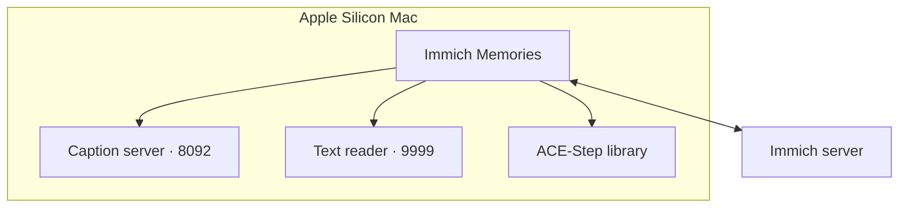

# All-features Mac example

This profile uses a source checkout for local ACE-Step, plus an external local caption server
and reader endpoint. An owned reader with blank `base_url` is another option; see
[reader setup](../../better/reader.md). If you only want the app, use the [Python install](../uv-pip.md).



## The laptop / workstation (the Mac)

Nothing above needs a second machine or a cluster; this profile runs the same app, the same
config keys, entirely on one Mac, with two local servers instead of a cluster. `lib` mode is not in
`uv tool install` or the `all-mac` extra: ACE-Step runs from a `.venv-acestep` beside a checkout
([Install locally on a Mac](../../reference/local-audio.md#local-runtime-and-repairs)). OIDC needs `authlib`,
which `all-mac` and `make dev-mac` leave out; `make dev` installs every extra and builds the web
client (it needs Node 22):

```bash
git clone https://github.com/sam-dumont/immich-video-memory-generator.git
cd immich-video-memory-generator
make dev
uv sync --extra all-mac --extra auth
make install-acestep
uv run immich-memories ui --host 127.0.0.1
```

### The Mac's config.yaml, annotated

Every key below is valid on current `main`; nothing here is exotic or Tier-2-only by accident.

```yaml
tier: full

network:
  geocoding: true
  map_tiles: true

cache:
  video_cache_max_size_gb: 10
  thumbnail_cache_max_size_mb: 10000

advanced:
  auth:
    enabled: true
    provider: oidc          # the same IdP as the cluster profile
    issuer_url: "${OIDC_ISSUER_URL}"
    client_id: "${OIDC_CLIENT_ID}"
    client_secret: "${OIDC_CLIENT_SECRET}"
    public_url: "http://localhost:8080"
    allowed_emails: [me@example.com]

  editorial:
    preparation:
      # mlxcel, serving the same SmolVLM2 alias as the llama.cpp recipe
      caption_base_url: "http://localhost:8092/v1"

  llm:
    provider: "openai-compatible"
    base_url: "http://localhost:9999/v1"   # oMLX, also the cluster's reader over the LAN
    model: "gemma-4-e4b-it-6bit"

  ace_step:
    enabled: true
    mode: lib                        # a local library, not an API server
    model_variant: "acestep-v15-xl-turbo"   # the XL variant
    lm_model_size: "4B"
    use_lm: true
```

`mode: lib` needs Python 3.12 specifically ([ACE-Step config reference](../../reference/config-reference.md));
`mode: api` (the cluster profile's choice) has no such constraint, which is why the two profiles
differ here. Use the explicit localhost bind above. Enabling OIDC otherwise broadens the bind address.
Register `http://localhost:8080/auth/callback` and `http://localhost:8080/logout` with your provider,
and allow only the intended verified email. For remote access, use
[the HTTPS proxy recipe](../network-security.md).
