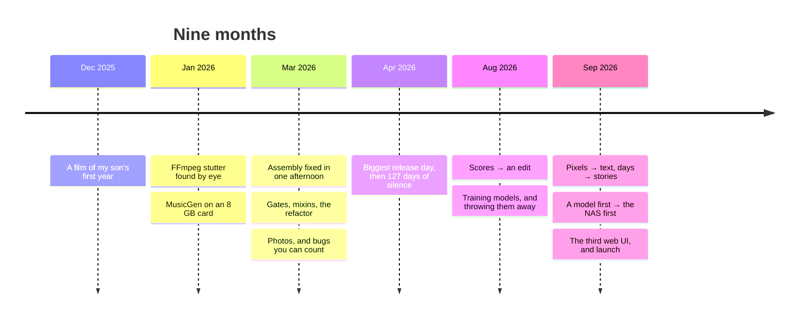

# How this was built

> "what was supposed to be a weekend project became a 9 month constant refactor but I’m getting where
> I want"

That's me, on 2026-09-28, the day this went out. Cutting 30 pictures out of 400 into a film sounds
like a weekend of Python around FFmpeg and a model. It took nine months, three web UIs, four
assembly engines, four music backends, a pile of trained models that mostly got thrown away, and two
AIs writing the code. There's a reason nobody offers this for a self-hosted library: a year holds
tens of thousands of pictures, choosing them is editing (not ranking), it has to run on the box that
already runs Immich, and nothing is allowed to leave it.

This page is the short version, in order. Every quote is mine unless it says otherwise, copied from
the project's own logs.

## December 2025: a film of my son's first year

It started in French, in a chat with Claude, three days before the new year: "je voudrais créer une
vidéo souvenir des VIDÉOS de mon fils". Videos only, reusable every year. By the end of that chat
there was a plan (Streamlit for a UI, MoviePy for the cut, face recognition for the people), and on
December 29 the first day of code produced 22 commits: the pipeline, four hardware encoders,
Kubernetes and Terraform, and music ducking. It looked almost done. It wasn't.

## January to March: FFmpeg

The films stuttered: a clip would jump back a few frames at every transition. On January 12 I found
the cause by comparing frames by hand, "OKAY I FOUND SOMETHING, look at this clio: image 1 = last
frame of the trimmed clip, image 2 first frame of transition". The same source frame, encoded by two
different FFmpeg processes, comes out different. Knowing that took a day; fixing it took until
March 5.

In between, a debug log grew to 27 GB ("I AM GOING MAD, my laptop is FULL FULL FULL FULL I CANNOT FIND
WHY THE DRIVE IS FILLING UP !!!") and nothing got committed for 56 days. When I came back, the
assembly went through its last versions in one afternoon: the concat demuxer garbled the video, MPEG-TS
dropped two frames at every join, the concat filter kept the stutter, and one long crossfade chain
over twelve 4K clips was perfect until "the RAM EATS EVERYTHING, SWAP, FILLS THE DISK". Crossfading
in chunks of four clips peaked at 2.2 GB. "OH YES IT'S PER-FECT". Three weeks later that engine was
replaced too, by a streaming one built to stay around 550 MB at 4K: "WHAT WE SHOULD HAVE IS MAX 2GB
(go for 4GB) for FFMPEG, which means STREAMING".

## The music, round one

Music had one rule from day one: "So it has to be very cheap like less than a dollar". No commercial
API came close, so it became MusicGen on the 8 GB card in my cluster, as its own service, at 2 to 4
minutes per 30 seconds of music. The songs were fine and the joins were not: "the transition between
scenes can be 'felt' (beat unaligned etc)".

ACE-Step replaced it in March, and sounded like a keyboard demo: "why ALWAYS futurebass ?", then "still
very MIDI. I thought we fixed this by using the 1.7b model". To get the better model to load, the
server had to be told the 8 GB card had 20 GB. What finally fixed the sound was the prompt, not the
model: with a generic prompt, "oh wow the AUDIO SUCKS !"; with the key, the tempo and the instruments
spelled out, "OH WOW THIS IS AMAZING :-o THE SOUND IS INSANE".

It came back in August, at 108 GB of memory for one song ("but wait 108 GB OF RAM ????", fixed to
1.2 GB idle), and again in a listening test: "it feels like a compressed old school video game music,
too "plastic"", and "black metal is VERY BAD". Today the default is a set of hand-picked bundled
tracks, and generated music is an add-on.

## The gates, and what they bred

On March 7, getting ready for the first public release, I found mypy errors parked behind
`continue-on-error`: "NO NO THE APPROACH IS TO FIX ALL ! I am releasing this for the first time it
needs to be clean". The next day the gates went in: security scanners, complexity limits, dead-code
detection, and a 500-line cap per file.

The cap worked the way caps work: every time a file got too long, the answer was another mixin. A
week later a skeptic review graded the code B-, with 23 mixins, 11 of them on the video assembler. The
refactor that followed touched 267 files, took the mixins to zero and moved the cap to 800 lines. The
gates are still what keeps two AIs writing code from making a mess, and they are why this codebase
still reads like one.

## Photos, and bugs you can count

On March 14 I gave in: "I know I'm getting into slurm coding mode but _WE SHOULD_ support plain
photos. I KNOW I KNOW I KNOW I'M FEATURE CREEPING". Photos needed Ken Burns moves (I pasted the
Wikipedia article in), HDR that didn't come out red, and a pool where photos and videos compete. A
2023 film had no pictures before May until they shared one pool.

A few of the bugs from those weeks, because the numbers say more than a description:

- Immich's width and height were never read, so **0 of 1,100** pictures survived the resolution
  filter. After the fix, 985.
- The scoring weights added up to **1.15**, and the language model was *lowering* scores: a clip it
  never looked at scored 0.98, a favourite it did look at 0.47.
- A title's "black" background came out **green**, because in YUV, black with U and V at zero is
  green. "NOOO STILL GREEN !!!!!", then "NO GREEN. PER-FECT !".
- A full-year film had **zero clips**: a transition allowance of 12 × 2 s × 1.3 = 31.2 s came out of a
  26 s budget.
- Audio drifted out of sync from five causes at once: duplicated crossfade audio, a rounding of
  0.017 s per clip (**1.19 s** over 70 clips), loudness normalisation eating 35 ms a clip, a double AAC
  encode, and a 64 KB pipe that deadlocked the encoder. It took a week: "I was working on a very difficult PR and
  it's now done".

## Three web UIs

The first UI was Streamlit, and it died of silent crash loops in February. NiceGUI replaced it and
brought its own problems ("since we moved from streamlit to nicegui it's issues after issues after
issues..."), and was reskinned twice on Immich's own design. It lasted until the week before launch:
"the more time passes the less I like it it’s clunky and a bit old school" (that one I wrote to
Codex). The third, the SvelteKit client you use now, replaced it in
one pull request, merged whole, the day this went out.

## April: a finish line, then nothing

April 8 was the biggest release day of the first era: nine pull requests, five patch releases, 26
issues opened and closed in one sitting, 3,902 tests. Two days later came the last commit. Then
nothing for 127 days.

Not quite nothing: the nightly scheduler kept running. When I came back in August it had tried 96
times, failed 79, and reported 12 fake successes that handed back the previous run's file. "oh wow I
did not even see that it was generating all this !!!"

## August: from scores to an edit

The relaunch opened with a speech detector (picked by a research survey) that heard nothing in a
toddler shouting, because a phone's noise suppression leaves almost no energy below 300 Hz: "no no I
think you're using it wrong or missing something. this is not possible to have a specialized model be
SO BAD." Then CI collapsed: "EVERY CICD job fails because one job getting error 137". Two memory leaks
stacked on each other, 22 GB down to 868 MB once found.

The selection at that point was a scorer: every picture got a number, and the film took the best
numbers. Nobody had set a temperature on the model calls, so a whole sheet could be culled by a dice
roll. Asked whether it would show a picture to someone else, the model kept 36 of 36, a washing
machine included. After 51 releases in three days of tuning, the scorer dropped a photo of a positive
pregnancy test, in a film about my son's first year, because it scored 0.455 against a 0.53 bar. "pic
7 is one of the most important one ever : positive pregnancy test". The ruling that followed threw
scoring out:

> "ANY PICTURE IN THIS SHOULD BE ABLE, IN ITSELF, TO BE ON THE MEMORY."

I studied photography, and that is how a photographer edits: cull, group, pick, sequence. Selection
became an edit ([#764](https://github.com/sam-dumont/immich-video-memory-generator/issues/764)).

## Training models, and throwing them away

The plan was a large vision model doing everything. It could classify a picture but not rank pictures
against each other (0 of 12 when asked which picture was the peak), and comparing a year's pictures in pairs
cost about 8 hours. So I tried to train smaller ones:

- Flipping one worked example in a prompt took a 2B model from 0 of 119 correct verdicts to 107 of
  107. It wasn't reading the picture; it was copying the example.
- A distilled 0.5B describer looked great until it turned out human captions had leaked into its
  validation set.
- Small classification heads on a frozen picture encoder trained cleanly and then failed their own
  bar: 96.76% at 70.88% coverage, against 97% at 85%.
- The last one, Laya, took about 34 hours, 18 GPU hours and 27,318 calls to a 30B model to label its
  data. A free rule over facts already stored beat it: 0.821 against its 0.745. "analyze this disaster
  and understand what can be salvaged".

What survived is small: one frozen encoder with a few heads on the CPU, a caption model, and Laya as an
off-by-default pre-screen. And one rule for all of it: "we can't say 'you need to train your own model
for hours' it has to be an option for enthusiasts".

## September: pixels to text, days to stories

On September 2 a cut built only from text already banked about each picture reached 22 of 30 graded
days, against 18 for the version that looked at the pixels again, at half the cost. Pictures are now
looked at once, cheaply, and everything after that reads text.

On September 8 three rules I had already ruled on broke again in one night, and a month I had graded
"perfect" came back as one picture per day: "Respectfully what the fuck . This was litigated weeks
ago". The fix was to stop coding, write the pipeline out in plain words, and move the weight from
days to stories that span days: a holiday, a festival, a week away. Graded films went from 23 good and
8 bad to 27 good and 1 bad, and the old clip scorer was deleted: 47,528 lines in one pull request.

The bugs got stranger as the data got real:

- Geotagging old photos put 46 of them in the wrong village because of a name printed on a
  cheesemaker's apron, pinned a mountain to Manhattan, and placed 1,616 forwarded WhatsApp pictures
  where I was standing. 1,667 writes were rolled back. "GOD FUCKING DAMMIT".
- A medical-content rule refused 1,445 pictures because the pipeline's own tag for Live Photos says a
  still "stitches" to a clip. It surfaced because a relative who is in a lot of my pictures had
  vanished from a film.
- The Immich client had only ever seen 500 of 2,601 people.
- A hardware check initialised the GPU encoder and the real render never did, and the image shipped
  no GPU drivers at all. Films went from about 280 MB a minute to 12 once both were fixed.

## Not overfitting to my own library

The hardest discipline was not making the product work for me only. The rulings kept coming:

- "No no no you're overfitting. You should not say explicit number of moments"
- "Be careful not to overfit! It needs to work for any library and content"
- Codex, caught choosing the pictures itself instead of the product doing it: "IF I DID NOT CAUGHT YOU I
  WOULD HAVE THOUGHT THE PRODUCT WORKS"
- "we’re entering over fitting territory on my own library. A person without kids but dog owner or
  horse rider"
- And for the free-text memories, fresh prompts every round with the expected result written down
  first, until: "we stop overfitting now", and a few days later, "the design is finally behaving like
  it should".

## A model first, then the NAS

Running on my Mac was easy. A launch audit in September found that a stranger following the docs
could not finish a first cut: "running on docker compose / nas (what 99% of people will do) is
currently not ready for prime time". That turned into `models fetch`, an inference service modelled
on Immich's own machine-learning container, and a matrix of real installs.

Then on [#1033](https://github.com/sam-dumont/immich-video-memory-generator/issues/1033) someone
rendered a 75-minute film on a two-core Synology with no model at all. A wrong check marked it failed
after 25 hours (the file was fine), and they still wrote it was "genuinely impressive how well it
handles transitions between clips" and "feels smooth and well-paced even with zero LLM involvement,
purely metadata-driven."

Four days later a 10-minute year written by the model failed after 31 minutes and 270 calls, with no
film, while the rules alone cut complete 10-minute years in 14 to 82 seconds. "Okay good honestly this
is the best case : degraded mode is good enough and only improved by the models." The plain NAS became
the product and the model a polish on its draft: "just remove the 30B. The gain is so low that it makes
no sense to recommend that." The verdict on the NAS-only films a few days later: "the results on nas
only is excellent considering it does not look at the pictures".

## See what sticks, then cut

Every stretch of adding ended with deleting:

- the old clip scorer, 47,528 lines;
- a picture reader that took 1.15 s a picture (4 hours for a year of photos), removed less than a day
  after it shipped: "Failed experiment we kill it";
- the model's picture reads at film time, 10,142 lines: pictures are read once, when they come in;
- the large model's judgment of what a picture carries, replaced by a points table over facts already
  stored, with zero model calls;
- a sensitivity classifier, killed 73 minutes after it was commissioned;
- four CLI commands, and two web UIs;
- every opt-in switch for a better path: "NO GATE THIS IS HOW WE LOSE STUFF".

## Two AIs and a set of rulings

Claude and Codex wrote most of the code, on purpose: the experiment is how far AI can take a codebase
this size while it stays clean. I set the direction, tested the films on my own library, and wrote
down rulings: a favourite wins its moment, always chronological, stories are weighed and days aren't
counted, no feature switches. The agents forget between sessions; the rulings don't.

It was messy. The August relaunch started in Codex. When one ran out of credits the other took over
("Boom hit the weekly limit time to take over"), and each caught the other's mistakes. Codex did the
long real runs patiently and shipped a release nobody had asked for. Claude was better at measuring and
reviewing than building, and once started re-deriving rules the code already held: "YOU ARE IGNORING
ALL THE REFINEMENTS I MADE FOR MONTHS". One agent got taken off a job with "Okay stop you’re running in
circles". The credits went the way you'd expect.

On launch day, 2026-09-28, about ten Claude sessions and a coordinator merged more than 40 pull
requests into `main`: the store (SQLite or PostgreSQL), the new web UI, and these docs among them. The
gates in the `Makefile` are what kept that from falling apart;
[DISCLAIMER.md](https://github.com/sam-dumont/immich-video-memory-generator/blob/main/DISCLAIMER.md)
says who does what, and where the approach fell short.
