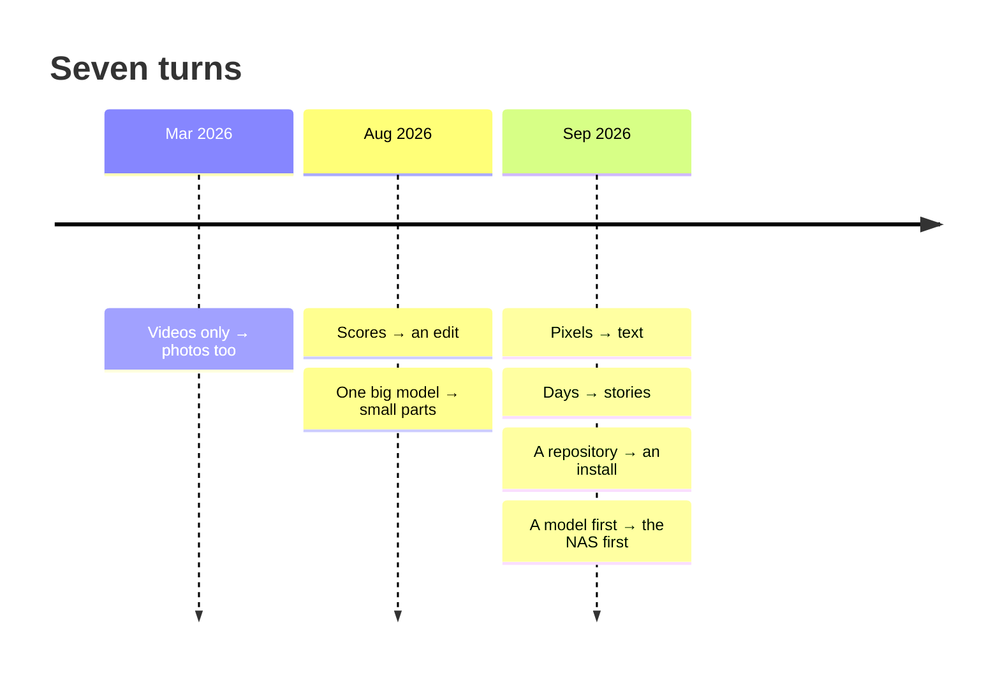

# How this was built

> "what was supposed to be a weekend project became a 9 month constant refactor but I’m getting where
> I want"

That's me, on 2026-09-28, the day this went out. It started in December 2025 as a recap of my son's
first year. I had hundreds of clips in Immich and a timeline in Premiere I never finished. Picking 30
pictures out of 400 and cutting them into a film sounded like a weekend of Python around FFmpeg and a
model. It isn't, and that is also why nobody offers it: a library holds tens of thousands of pictures,
choosing is editing (not ranking), the whole thing has to run on the box that already runs Immich, and
nothing is allowed to leave it.

Some of what "a weekend" turned into:

- Assembling clips into one video took nine attempts over about two months (frame gaps, garbled
  streams, a crossfade chain that ate the RAM and then the disk). The fix was rendering in chunks of
  four clips.
- A speech detector a research survey picked fell apart on a toddler's voice: almost no energy below
  300 Hz. My message that morning: "no no I think you're using it wrong or missing something. this is
  not possible to have a specialized model be SO BAD."
- A NAS CPU has no AVX, so the models run 20 to 50 times slower there than on a laptop.
- Continuous integration died with exit 137 for days and got written off as flaky. It was two memory
  leaks stacked on each other: 22 GB down to 868 MB once found.

The product got its shape from seven turns. Each one started from something that broke.

## Videos only, then photos too

**March 2026.** The first version cut videos only. My library said otherwise: most of a year is
stills. "I KNOW I KNOW I KNOW I'M FEATURE CREEPING BUT WE SHOULD HAVE MEMORIES INCLUDING THE PHOTOS".
Photos and videos moved into one pool, and the months a year-film covers went from 6 of 12 to 12 of 12.

## Scores, then an edit

**August 2026.** The selection was a scorer: every picture got a number, and the film took the best
numbers. After 51 releases in three days of tuning it, the scorer dropped a photo of a positive
pregnancy test, in a film about my son's first year, because it scored 0.455 against a 0.53 bar. "pic
7 is one of the most important one ever : positive pregnancy test". The next ruling threw scoring out:

> "ANY PICTURE IN THIS SHOULD BE ABLE, IN ITSELF, TO BE ON THE MEMORY."

I studied photography, and that is how a photographer edits: cull, group, pick, sequence. Selection
became an edit ([#764](https://github.com/sam-dumont/immich-video-memory-generator/issues/764)).

## One big model, then small parts

**Late August.** The plan was a large vision model doing everything. Probing it showed it could
classify a picture but could not rank pictures against each other (0 of 12 on "which of these is the
peak"), and comparing a year's pictures in pairs cost about 8 hours. So a model became the last resort:
its answers now calibrate cheap rules, and a frozen picture encoder with small heads on the CPU does
what it did per picture.

## Pixels, then text

**2026-09-02.** A cut built only from text already banked about each picture (dates, places, people, a
line of description) reached 22 of 30 graded days, against 18 for the version that looked at the
pixels again, at half the cost. Pictures are now looked at once, cheaply, and everything after that
reads text.

## Days, then stories

**2026-09-08.** Three rules I had already ruled on broke again in one night, and a month I had graded
"perfect" came back as one picture per day. "Respectfully what the fuck . This was litigated weeks ago".
The fix was to stop coding, write the pipeline out in plain words, and move the weight from days to
stories that span days: a holiday, a festival, a week away. The graded films went from 23 good and 8
bad to 27 good and 1 bad. Three days later the old clip scorer was deleted: 47,528 lines in one pull
request.

## A repository, then an install

**Mid-September.** Running on my Mac was easy. A launch audit found that a stranger following the docs
could not finish a first cut, because the model files it needed existed nowhere a user could reach.
"running on docker compose / nas (what 99% of people will do) is currently not ready for prime time".
That turned into `models fetch`, a caption and inference service modelled on Immich's own
machine-learning container, and a matrix of real installs.

## A model first, then the NAS

**2026-09-17 to 24.** On [#1033](https://github.com/sam-dumont/immich-video-memory-generator/issues/1033)
someone rendered a 75-minute film on a two-core Synology with no model at all. The render was marked
failed after 25 hours by a check that was wrong (the file was fine), and they still wrote it was
"genuinely impressive how well it handles transitions between clips" and "feels smooth and well-paced
even with zero LLM involvement, purely metadata-driven."

Four days later a 10-minute year written by the model failed after 31 minutes and 270 calls, with no
film, while the rules alone cut complete 10-minute years in 14 to 82 seconds. "Okay good honestly this
is the best case : degraded mode is good enough and only improved by the models." The plain NAS became
the product, and the model became a polish on its draft: "just remove the 30B. The gain is so low that
it makes no sense to recommend that." The prose model is now Gemma 4 E4B, the same small model that
failed on malformed JSON three weeks earlier.

## See what sticks, then cut

Every turn came after a stretch of adding things, and ended with deleting them:

- the old clip scorer, 47,528 lines;
- a picture reader that took 1.15 s a picture (4 hours for a year of photos), removed less than a day
  after it shipped: "Failed experiment we kill it";
- the model's picture reads at film time, 10,142 lines: pictures are read once, when they come in;
- the large model's judgment of what a picture carries, replaced by a points table over facts already
  stored, with zero model calls;
- four CLI commands and the NiceGUI web UI, replaced by the Svelte client;
- every opt-in switch for a better path: "NO GATE THIS IS HOW WE LOSE STUFF".

## Two AIs and a set of rulings

Claude and Codex wrote most of the code, on purpose: the experiment is how far AI can take a codebase
this size while it stays clean. I set the direction, tested the films on my own library, and wrote
down rulings (a favourite wins its moment, always chronological, stories are weighed and days aren't
counted, no feature switches). The agents forget between sessions; the rulings don't.

It was messy. When one ran out of credits the other took over, and each caught the other's mistakes.
Codex did long real runs patiently and found a four-generation diagnosis in 17 minutes; it also
shipped a release before the UX work it was meant to wait for. Claude was better at measuring and
reviewing than at building, and once started re-deriving rules the code already held: "YOU ARE
IGNORING ALL THE REFINEMENTS I MADE FOR MONTHS". Between April and August nothing happened at all, for
127 days.

On launch day, 2026-09-28, about ten Claude sessions and a coordinator merged more than 40 pull requests into
`main`: the store (SQLite or PostgreSQL), the new web UI, and these docs among them. The gates in the
`Makefile` are what kept that from falling apart;
[DISCLAIMER.md](https://github.com/sam-dumont/immich-video-memory-generator/blob/main/DISCLAIMER.md)
says who does what, and where the approach fell short.
