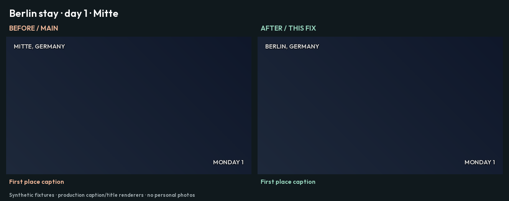
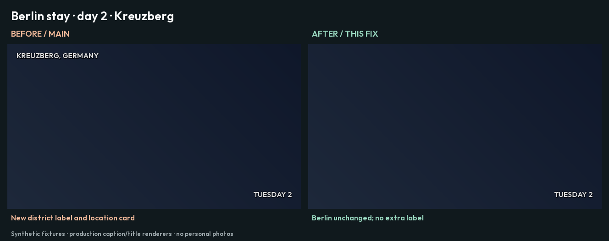
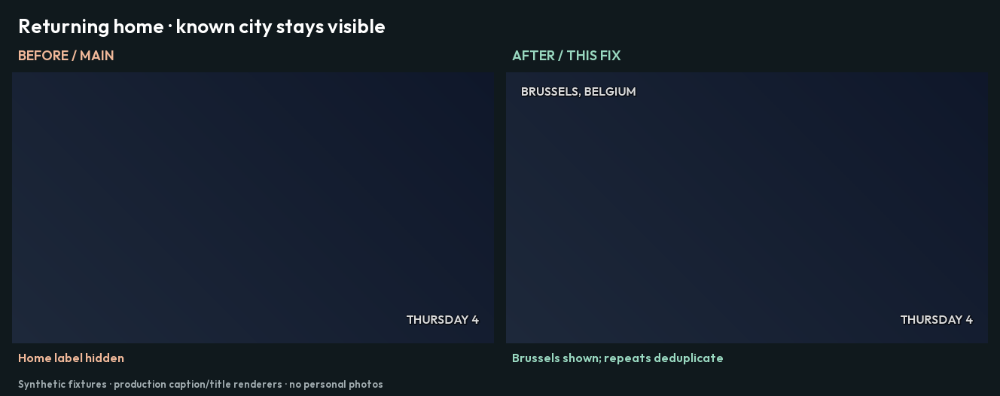
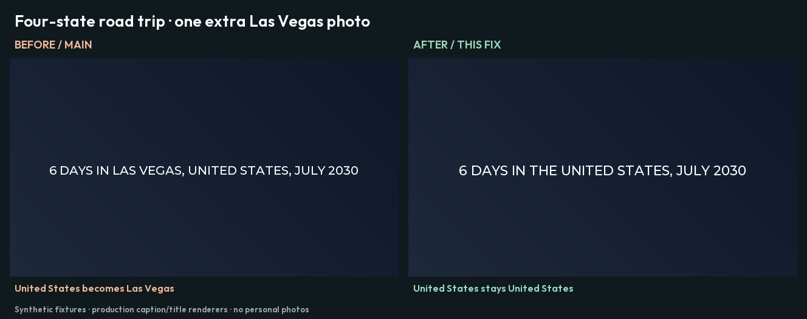

# Place names at the trip's scale

Before: `b371427b6` on main. After: the fix for #1651.
The same synthetic inputs run through both revisions. Captions are rendered by FFmpeg using
the production caption filters; titles use the production Pillow renderer and bundled fonts.
The backdrops are plain title backgrounds. No personal photos, library reads or online lookups.

[Play the animated comparison](demo.webp) · [Inspect the measured labels](behavior.json)

## A Berlin stay

The fixture geocoder supplies both the district and its parent city. The old resolver picks
Mitte, then Kreuzberg, then Charlottenburg. Each change can add another location card.
The fix says Berlin once and keeps it through the stay.




## Returning home

The synthetic home is a public landmark in Brussels. The old rule hides its label.
The fix displays Brussels and deduplicates later identical captions, like any other city.



## One more photo should not rename a road trip

The fixture visits Nevada, Utah, Arizona and California. With 10 photos in Las Vegas and
10 elsewhere, both revisions name the country. Add one Las Vegas photo: main switches to
Las Vegas, while the fix keeps United States. A majority town can still name a local stay
under 25 km across.



## Reproduce

After `make dev`, run from the repository root. The base snapshot only needs `src/` and the
generated version file; the current virtual environment provides dependencies for both runs.

```sh
DEMO_BASE=$(mktemp -d)
DEMO_OUTPUT=$(mktemp -d)
git archive b371427b6 src | tar -x -C "$DEMO_BASE"
cp src/immich_memories/_version.py "$DEMO_BASE/src/immich_memories/_version.py"
PYTHONPATH="$DEMO_BASE/src" .venv/bin/python scripts/preview_place_scale.py --capture "$DEMO_OUTPUT/before"
PYTHONPATH=src .venv/bin/python scripts/preview_place_scale.py --capture "$DEMO_OUTPUT/after"
PYTHONPATH=src .venv/bin/python scripts/preview_place_scale.py \
  --compare "$DEMO_OUTPUT/before" "$DEMO_OUTPUT/after" --output "$DEMO_OUTPUT/comparison"
```

The address fixture replaces only the external geocoder boundary. The resolver, caption
deduplication, location-card decisions and trip naming are the actual application functions.
Geocoding remains opt-in in the product; offline runs keep Immich's recorded place names.
