# Free-text memories: semantic translation onto the existing engine

Status: probe, not merged. Tracking issue #1436. Code on `exp/caption-threads`
(`experiments/caption-threads/`, entry point `translate.py`), two small probe hooks in `cli/`.
This page is the plan for building it properly; the probe is evidence, not the implementation.

## What the owner wants

Two things, full model tier only:

1. **Type a sentence, get a film.** "Pictures of our cat along the years, 2014-2024, black cat",
   "the cars I drove", "best holiday landscapes along the years", "our cycling club's rides",
   "the evolution of our house since we bought it", "<child>'s firsts of anything new". The
   prompt is light and open; the system works out the rest. The feature is expensive (LLM
   checks and judgments) and that is accepted: it is the killer feature.
2. **Discovery.** Threads nobody asked for (a hobby over ten years, a pet, travel), where a
   good surprise beats safety and a mildly interesting result is an acceptable risk.

## Rulings (owner, 2026-09-26/27)

- **Semantic translation, not an LLM movie maker.** The sentence becomes something the code can
  query; the LLM refines and judges; then the *regular* selection runs through that lens (a
  thesis). The free-text interface commands the existing engine, it never bypasses it.
- **Reuse, don't rebuild.** Trips, home, familiar places, the people graph, episodes, stories,
  threads, standing, the thesis-fit vote, sharing all exist. The semantic model *is* the existing
  `generate` surface.
- **Captions are the basis. CLIP is banned** (a ranked list of probabilities never guarantees the
  subject is in the picture). **OCR is allowed**: the letters are really in the photo.
- **Visual questions are allowed in this feature only.** The judge may show a picture to the model
  and ask ("is this the same house as the reference?", "is this the same kit as the reference?").
  Everywhere else pictures are still read once, at ingest.
- **Forwarded pictures are kept** in requested films (a club's photos arrive through a group
  chat): the existing `--accept-any-provenance`.
- **Requested films may pass ordinary-film rules, never silently** (see *Rule report and bypass*).
- **Test with light prompts exactly as a user writes them.** Adding facts only the owner knows is
  cheating. Owner facts are scoring checks, never prompt input.
- English first; other languages are translated to English by the model and may degrade.

### Rulings (owner, 2026-09-28)

- **One small model for every step.** Gemma 4 E4B translates, checks captions, asks the photo
  questions and writes the thesis. A step that struggles gets a different task shape (options,
  lists, one question per call), never a bigger model.
- **Gemma pilots it in production.** It receives the prompt as typed and nobody reviews the
  translation, so every semantic decision is Gemma's; code only builds the options from the
  library and applies the answers. The owner's prompts test the mechanism, never tune it.
- **The flow is short:** prompt → filters → pool → thesis → the regular engine. No second
  selector in front of the engine; the per-caption check is the filter that says "shows what was
  asked", not a ranking.
- **Bad results must be easy to report** with the same builder and privacy rules as #1428
  (see *Reports for bad results*).

## What the research says

- [Snowflake semantic views](https://docs.snowflake.com/en/user-guide/views-semantic/overview) /
  [Cortex Analyst](https://docs.snowflake.com/en/user-guide/snowflake-cortex/cortex-analyst): the
  LLM translates against a curated model (dimensions, synonyms, real sample values, verified
  queries), never raw tables. Accuracy moves from the model's guess to a definition.
- [NatSQL / SemQL](https://aclanthology.org/2021.findings-emnlp.174/): a small intermediate
  representation shrinks the space a model can get wrong.
- [LangChain query construction](https://blog.langchain.com/query-construction/): split a request
  into structured filters plus a semantic subject.
- [Microsoft ISE, query decomposition for media search](https://devblogs.microsoft.com/ise/from_noisy_queries_to_precise_frames/):
  filters + cleaned sub-query took Recall@5 from 27% to 49%; regex matched or beat the LLM on the
  structured parts.
- [Schema/value linking (CHESS, RSL-SQL)](https://arxiv.org/pdf/2411.00073): map literals to the
  values actually stored.
- [Palimpzest](https://www.vldb.org/cidrdb/papers/2025/p12-liu.pdf),
  [LOTUS](https://www.vldb.org/pvldb/vol18/p4171-patel.pdf): cheap operators first, LLM filters
  last and as cascades; up to 1000x cheaper with accuracy guarantees.
- [Google Ask Photos](https://blog.google/products-and-platforms/products/photos/ask-photos-google-io-2024/):
  understanding the request is separate from answering it.

## Tooling decision

- **No agent framework** (LangChain/LangGraph): the flow is a fixed pipeline and the product
  already owns the LLM wire, JSON repair, answer banking, block votes and the no-outside-calls
  rules. Borrow the patterns, not the stack.
- **Schema-constrained output** (`response_format: json_schema`) through the existing wire. The
  local oMLX server *enforces* it (verified: "reply hello" still returns the schema; a
  forbidden enum value is coerced). Measured limits with a 4B model: generation **stalls** when the
  model wants to stop before a required key; **optional** keys are skipped; **required** keys are
  filled with invented content; free lists repeat. So: small schemas, every key required, lists
  capped, and never a free-text field last.
- **DSPy later, offline**, to tune prompts against the scored evaluation set; not a runtime
  dependency. Revisit orchestration only if the feature becomes a conversation.

## Architecture

```mermaid
flowchart LR
  S[Prompt as typed] --> F[Filters: people, when, where, text in photo, shape]
  F --> C[Candidates from the lexicon and the filtered photos' captions]
  C --> W[What the photos show: Gemma picks words, then the main subject]
  W --> K[Printed spec]
  K --> P[Pool: filters, caption words, OCR events]
  P --> J[Gemma caption check against the spec]
  J --> V[Photo question on unsure and caption-less pictures, sampled yeses]
  V --> T[Thesis]
  T --> G[Engine: the pool as an album, the thesis as the written subject]
```

### The spec: code builds the options, Gemma picks

A 4B model writes open text badly (hollow sentences, one-word lists, invented dates, prompt
examples copied back) and picks well among options. Every field is therefore one small enforced
question over choices the code builds from the owner's library, and the spec is printed before
anything runs on it.

| field | options built by code | Gemma decides |
|---|---|---|
| people | people file, with roles relative to the owner ("the owner themself") | who the request is about |
| when | birth dates, move-in dates, years in the request; for one moment, spans (a day, a week, a month, three months) | the range; a moment's span is a choice, never a written date |
| where | anywhere / at home at the time / near home / one particular home (homes list, or inferred per year from photo days; Immich's area name shown) / away on trips | asked three times in three option orders, majority wins, widest place on a split |
| text in photo | the request's own words | which would be printed on things (read by Immich OCR) |
| shape | one moment / along the years / how it changed / first times / a collection | one |
| what the photos show | seeds from the request; the lexicon (main sense, kinds and parts, parts inherited from what a thing is, everyday sense only); grounded proposals; words over-represented in the filtered photos | the words that belong, then the main subject; parts and kinds of the main subject follow by logic |
| alongside | words the owner's captions use next to the main subject | which belong, given the shape (how a house changing shows up: tiles, flooring, exposed) |
| not this | phrases around the subject in captions; what follows a negation in the request | what does not belong |

Measured limits that shaped it: no example words in any prompt (Gemma quotes them back as the
answer); names are never subject words (faces own identity); the house is a 150 m radius (the
owner's library: 19.3k photos within 50 m, then the street), not the 10 km trip radius.

### Judging

- Caption check: E4B yes / no / unsure per caption against the spec (main subject, what else it
  may show, what does not belong), twenty-four captions per call, budget spread over the pool's
  time scale.
- Photo question: built by code from the main subject; asked of unsure and caption-less pictures
  and of a random sample of caption yeses. The sample's agreement decides whether the remaining
  yeses are trusted or looked at too.
- No "same one as the reference" check: it dropped good pictures and never helped.
- Firsts: the first occurrence of every noun in the person's own face-tagged photos, compared ten
  at a time (at most three kept per ten) until about sixty remain. Asked to keep every meaningful
  one, E4B kept 774 of 1,835.

### What the engine does with a pool (why the pool must already mean the ask)

- The draft is the rules reader's: dates, favourites, people, spread; no captions, no thesis.
- The model pass reads only the episodes the draft chose.
- The thesis replaces the base brief in the model's prompts and feeds the thesis-fit vote, which
  is reject-only over shots already in the film; nothing refills what it removes.
- Handoff is therefore a precise pool as an **album** (`--from-album`): the pool is the whole
  material, the album length curve applies. A custom date range clamps to 30 s past about 40
  months (`duration_from_date_range`), so a multi-year request must not go through it.

### Rule report and bypass

A requested film can be gutted by rules that protect ordinary films: forwarded copies,
identifying records (a licence plate may read as one), standing (a car alone), the family-viewing
gate ("the birth of my son", "breastfeeding <child> across the years").

1. Before render, preview the existing gates on the pool from banked verdicts; report per rule how
   many pictures would drop, example captions, and why that conflicts with the request.
2. Smallest fix first: the right audience before any bypass (an intimate request becomes a
   `just-us` film); then named bypasses (`--bypass standing,identifying_record`) with reasons.
   Provenance: `--accept-any-provenance`.
3. Config `free_text.rule_bypass: never | ask | auto`, default `ask`.
4. Detector holds and `never_auto` are never bypassed automatically; only the owner clears a hold,
   per picture, as today.
5. For a subject film, a picture whose caption matches the requested subject stands (as a caption
   naming an animal already does).

### Reports for bad results

Built on #1428 (`immich-memories report`, the web UI's Copy report): same allowlist-then-redact
builder, same hashed IDs, same issue templates. A free-text run adds one section, because it fails
in its own places (the translation, the pool, or the engine's picks from a good pool):

- The request as typed, redacted: people-file names become roles ("the owner's son"), home and
  area names become "home 1" / "area A", printed words read by OCR become "text-1".
- The spec field by field, with the votes (where) and which source offered each word.
- The funnel: in scope → pool → captions read → yes / unsure / no → photos looked at → kept →
  engine picks and film length; the sample agreement; Gemma calls, failures and seconds per stage.
- The user's verdict, which is what makes it a report of a bad result: photos marked wrong in the
  result view travel as hashed IDs with the stage that admitted each one and the answer that kept
  it (caption verdict or photo answer, with Gemma's one-line reason); a "what is missing" line is
  checked against the spec and the funnel (was the word offered, picked, in the pool, read?).
- Captions are off by default (they describe private scenes); an opt-in adds the captions of the
  flagged photos only, shown before copying. Pictures never.
- Acceptance: a fixture free-text run whose prompt, people, homes and places carry known names
  produces a report with none of them, the typed request included.

### Reuse map

| need | existing code |
|---|---|
| trips / holidays | `trip_detection.detect_trips`, `editorial_story_trips`, `trip_discovery` |
| home, and home over time | `editorial_home_radius.home_of/near_home_of`, `familiar_places.PlaceHistory` |
| people, roles, birth dates, co-occurrence | `people/graph.py`, `people/companion.py`, `people.yaml` |
| events | moments, episodes (90 min), stories |
| a recurring activity | `editorial_story_threads` |
| "best" | standing, favourites, carriers, look-alike review |
| selecting through a lens | story thesis, thesis-fit vote, `EditorialRunContext.base_brief` (dormant hook) |
| forwarded pictures | `--accept-any-provenance` |
| audience | sharing levels (`just-us`, `family`, `shareable`) |
| products and parameters | memory types, `--person`, dates, `--sharing`, duration |

## Evaluation set

- The owner's private set (outside git, scored against owner facts): six hard prompts (a pet over
  eleven years; the cars I drove, including one-offs such as a track day and a rental on a trip;
  holiday landscapes; a cycling club's rides via OCR and forwarded chat photos; a house's evolution
  since purchase; a child's firsts) and **two controls** where ordinary-film rules would drop what
  is asked for: "the birth of my son", "breastfeeding <child> across the years". The controls pass
  only if the pictures are reached with the right audience and every bypass is reported.
- The test households' sentence set (23 sentences) for regressions.
- Every change is judged on the whole set, never on the one sentence being fixed.

## Probe results (aggregates only)

- Discovery on eight synthetic test households: per-thread yes/no kept 40 of 40 threads;
  comparison in heats plus arithmetic gates found 15 of 18 described threads on the four
  households never looked at; 2-12 minutes and 60-140 E4B calls per library.
- Free text on test households: 20 of 23 sentences produce a sensible pool.
- Owner set (2026-09-27): pet over eleven years **works** (63 pictures, every year); holiday
  landscapes **work** (131, every year, trip-scoped); cycling club **found** (198 OCR hits, 397
  forwarded pictures pulled from their episodes) but lost to a wrong reference picture, fixed and
  re-running; firsts **find real firsts but admit noise**, moved to comparative picking; the
  house **fails** (searches "house"; the same-house reference drops interiors and works); the cars
  **fail** (any car; nothing tests driving).
- The local E4B answers image questions at ~5.6 s and ~320 tokens per picture.
- 2026-09-28, the spec translation on 18 sentences (8 owner, 10 from test households): places,
  people, dates and text in photo right on all but a few; firsts compared down to 45 meaningful
  first words; exclusions only from what follows a negation. End to end, the pet request: 14,031
  photos in scope (home at the time), 2,168 captions read, 171 photos looked at, sample agreement
  0.96, 785 in the pool, the engine's 300 s film picks 45.

## Open designs

- **The house:** now the address (150 m) since the move-in, the house and its parts as the main
  subject, and the words the owner's captions use around it; whether works and renovation reach
  the film is being measured.
- **The cars:** cars as the main subject (owner ruling: "cars is fine"); no photo shows whose car.
- **Curated-pool handoff:** the album route (`--from-album`), never `--include` (which bypasses
  sharing checks).
- **#1404** resolves an Apple Silicon install whose models run in separate servers (oMLX, mlxcel)
  to the NAS tier: it only checks for `mlx` inside the app's own environment.

## Build plan (proper, from main)

1. Semantic model object: the library's real values (years, homes per period, people and roles,
   caption vocabulary, OCR availability), built without an LLM.
2. Translator: the spec, every field one enforced E4B choice over code-built options; printed to
   the user before anything runs.
3. Compiler: spec -> existing functions -> pool; OCR anchor episodes (forwarded included); firsts.
4. Judge: caption check against the spec, photo question with a sampled agreement check,
   comparative picking for firsts; budgets spread over the pool's time scale.
5. Rule report and bypass (audience first, named bypasses, `rule_bypass` config, holds never
   automatic).
6. Handoff: the pool as an album with the thesis as the written subject,
   `--accept-any-provenance`.
7. Reports for bad results: the free-text section of #1428's report.
8. Evaluation: the private owner set with its two controls plus the household sentences; every
   change on the whole set.
9. UI: sentence box, the printed spec, the rule report, the pool, then the film; mark wrong photos
   and say what is missing, then Copy report.
