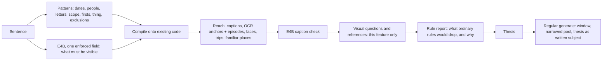

# Free-text memories: semantic translation onto the existing engine

Status: probe, not merged. Tracking issue #1436. Code on `exp/caption-threads`
(`experiments/caption-threads/`, entry point `translate.py`), two small probe hooks in `cli/`.
This page is the plan for building it properly; the probe is evidence, not the implementation.

## What the owner wants

Two things, full model tier only:

1. **Type a sentence, get a film.** "Pictures of our cat along the years, 2014-2024, black cat",
   "the cars I drove", "best holiday landscapes along the years", "our cycling club's rides",
   "the evolution of our house since we bought it", "<child>'s firsts of anything new". The
   prompt is light and open; the system works out the rest. The feature is expensive (LLM
   checks and judgments) and that is accepted: it is the killer feature.
2. **Discovery.** Threads nobody asked for (a hobby over ten years, a pet, travel), where a
   good surprise beats safety and a mildly interesting result is an acceptable risk.

## Rulings (owner, 2026-09-26/27)

- **Semantic translation, not an LLM movie maker.** The sentence becomes something the code can
  query; the LLM refines and judges; then the *regular* selection runs through that lens (a
  thesis). The free-text interface commands the existing engine, it never bypasses it.
- **Reuse, don't rebuild.** Trips, home, familiar places, the people graph, episodes, stories,
  threads, standing, the thesis-fit vote, sharing all exist. The semantic model *is* the existing
  `generate` surface.
- **Captions are the basis. CLIP is banned** (a ranked list of probabilities never guarantees the
  subject is in the picture). **OCR is allowed**: the letters are really in the photo.
- **Visual questions are allowed in this feature only.** The judge may show a picture to the model
  and ask ("is this the same house as the reference?", "is this the same kit as the reference?").
  Everywhere else pictures are still read once, at ingest.
- **Forwarded pictures are kept** in requested films (a club's photos arrive through a group
  chat): the existing `--accept-any-provenance`.
- **Requested films may pass ordinary-film rules, never silently** (see *Rule report and bypass*).
- **Test with light prompts exactly as a user writes them.** Adding facts only the owner knows is
  cheating. Owner facts are scoring checks, never prompt input.
- English first; other languages are translated to English by the model and may degrade.

## What the research says

- [Snowflake semantic views](https://docs.snowflake.com/en/user-guide/views-semantic/overview) /
  [Cortex Analyst](https://docs.snowflake.com/en/user-guide/snowflake-cortex/cortex-analyst): the
  LLM translates against a curated model (dimensions, synonyms, real sample values, verified
  queries), never raw tables. Accuracy moves from the model's guess to a definition.
- [NatSQL / SemQL](https://aclanthology.org/2021.findings-emnlp.174/): a small intermediate
  representation shrinks the space a model can get wrong.
- [LangChain query construction](https://blog.langchain.com/query-construction/): split a request
  into structured filters plus a semantic subject.
- [Microsoft ISE, query decomposition for media search](https://devblogs.microsoft.com/ise/from_noisy_queries_to_precise_frames/):
  filters + cleaned sub-query took Recall@5 from 27% to 49%; regex matched or beat the LLM on the
  structured parts.
- [Schema/value linking (CHESS, RSL-SQL)](https://arxiv.org/pdf/2411.00073): map literals to the
  values actually stored.
- [Palimpzest](https://www.vldb.org/cidrdb/papers/2025/p12-liu.pdf),
  [LOTUS](https://www.vldb.org/pvldb/vol18/p4171-patel.pdf): cheap operators first, LLM filters
  last and as cascades; up to 1000x cheaper with accuracy guarantees.
- [Google Ask Photos](https://blog.google/products-and-platforms/products/photos/ask-photos-google-io-2024/):
  understanding the request is separate from answering it.

## Tooling decision

- **No agent framework** (LangChain/LangGraph): the flow is a fixed pipeline and the product
  already owns the LLM wire, JSON repair, answer banking, block votes and the no-outside-calls
  rules. Borrow the patterns, not the stack.
- **Schema-constrained output** (`response_format: json_schema`) through the existing wire. The
  local oMLX server *enforces* it (verified: "reply hello" still returns the schema; a
  forbidden enum value is coerced). Measured limits with a 4B model: generation **stalls** when the
  model wants to stop before a required key; **optional** keys are skipped; **required** keys are
  filled with invented content; free lists repeat. So: small schemas, every key required, lists
  capped, and never a free-text field last.
- **DSPy later, offline**, to tune prompts against the scored evaluation set; not a runtime
  dependency. Revisit orchestration only if the feature becomes a conversation.

## Architecture

### The plan: patterns for structure, the model for the fuzzy part

A 4B model filling a 12-field plan dropped stated words ("black"), skipped or invented fields and
stalled. The plan is now mostly deterministic:

| field | from | compiled onto |
|---|---|---|
| window (since/until) | regex; a year named as an event is not an end date | `generate --start/--end` |
| people | value-linked: people-file names matched in the sentence | Immich faces via `people.yaml` ids |
| read_text | words in no dictionary, not a place ("in X") or an exclusion; OCR then decides | Immich OCR search; each hit's 90-minute episode fetched from Immich (forwarded batches included) |
| scope | only when stated (holiday/trip, home/house) | `detect_trips`, `home_of`/`near_home_of`, `PlaceHistory.is_familiar` |
| firsts | the word "first(s)" | first appearance of recurring nouns/verbs in a person's pictures |
| same_thing | "our/my + noun" | reference picture for the visual check |
| exclusions | "not / no / without / except ..." | judge prompt |
| **subject** | **E4B, one enforced field**, qualifiers inline ("black cat") | caption bank + companion words by lift over the request's rarest words |
| qualifiers | extracted by code from the subject, kept only if stated and used in captions | joined to the subject |
| visual questions | built from the subject ("Does the photo show a black cat?") | visual check |

### Judging

- Caption check: E4B membership against the full sentence, budget spread per year, strongest
  matches first. Captions cannot show names, breeds or ownership; the judge does not withhold for
  those (the visual check handles what captions cannot).
- Visual check: questions about a real photograph (not a painting, poster or screen); letters are
  OCR's job, never a visual question. A reference picture is an OCR anchor that visibly shows the
  subject, or for one thing followed over time the earliest picture that passes. Only an explicit
  "different" drops a picture. Budget spread across years; answers cached.
- Choosing among candidates (firsts, discovery threads) is **comparative**: a 4B model says yes to
  almost everything it sees alone; asked to pick at most N of a batch, it discriminates.

### Rule report and bypass

A requested film can be gutted by rules that protect ordinary films: forwarded copies,
identifying records (a licence plate may read as one), standing (a car alone), the family-viewing
gate ("the birth of my son", "breastfeeding <child> across the years").

1. Before render, preview the existing gates on the pool from banked verdicts; report per rule how
   many pictures would drop, example captions, and why that conflicts with the request.
2. Smallest fix first: the right audience before any bypass (an intimate request becomes a
   `just-us` film); then named bypasses (`--bypass standing,identifying_record`) with reasons.
   Provenance: `--accept-any-provenance`.
3. Config `free_text.rule_bypass: never | ask | auto`, default `ask`.
4. Detector holds and `never_auto` are never bypassed automatically; only the owner clears a hold,
   per picture, as today.
5. For a subject film, a picture whose caption matches the requested subject stands (as a caption
   naming an animal already does).

### Reuse map

| need | existing code |
|---|---|
| trips / holidays | `trip_detection.detect_trips`, `editorial_story_trips`, `trip_discovery` |
| home, and home over time | `editorial_home_radius.home_of/near_home_of`, `familiar_places.PlaceHistory` |
| people, roles, birth dates, co-occurrence | `people/graph.py`, `people/companion.py`, `people.yaml` |
| events | moments, episodes (90 min), stories |
| a recurring activity | `editorial_story_threads` |
| "best" | standing, favourites, carriers, look-alike review |
| selecting through a lens | story thesis, thesis-fit vote, `EditorialRunContext.base_brief` (dormant hook) |
| forwarded pictures | `--accept-any-provenance` |
| audience | sharing levels (`just-us`, `family`, `shareable`) |
| products and parameters | memory types, `--person`, dates, `--sharing`, duration |

## Evaluation set

- The owner's private set (outside git, scored against owner facts): six hard prompts (a pet over
  eleven years; the cars I drove, including one-offs such as a track day and a rental on a trip;
  holiday landscapes; a cycling club's rides via OCR and forwarded chat photos; a house's evolution
  since purchase; a child's firsts) and **two controls** where ordinary-film rules would drop what
  is asked for: "the birth of my son", "breastfeeding <child> across the years". The controls pass
  only if the pictures are reached with the right audience and every bypass is reported.
- The test households' sentence set (23 sentences) for regressions.
- Every change is judged on the whole set, never on the one sentence being fixed.

## Probe results (aggregates only)

- Discovery on eight synthetic test households: per-thread yes/no kept 40 of 40 threads;
  comparison in heats plus arithmetic gates found 15 of 18 described threads on the four
  households never looked at; 2-12 minutes and 60-140 E4B calls per library.
- Free text on test households: 20 of 23 sentences produce a sensible pool.
- Owner set (2026-09-27): pet over eleven years **works** (63 pictures, every year); holiday
  landscapes **work** (131, every year, trip-scoped); cycling club **found** (198 OCR hits, 397
  forwarded pictures pulled from their episodes) but lost to a wrong reference picture, fixed and
  re-running; firsts **find real firsts but admit noise**, moved to comparative picking; the
  house **fails** (searches "house"; the same-house reference drops interiors and works); the cars
  **fail** (any car; nothing tests driving).
- The local E4B answers image questions at ~5.6 s and ~320 tokens per picture.

## Open designs

- **The house (backward thesis):** start from pictures at home since the date, find what changes
  there (renovation bursts, a facade under scaffolding), make those the subject; the same-house
  reference applies to exteriors only.
- **The cars (chapters):** one chapter per car (recurring described car, or an episode: a track
  day, a rental on a trip), each with its own reference; evidence of driving (driver's seat, at
  the wheel, a circuit), not ownership; home per period from familiar places.
- **Curated-pool handoff:** a thread pool handed to the regular editor must not be re-judged as a
  period (9 pictures cut to 1), and must not use `--include` (which bypasses sharing checks).
- **#1404** resolves an Apple Silicon install whose models run in separate servers (oMLX, mlxcel)
  to the NAS tier: it only checks for `mlx` inside the app's own environment.

## Build plan (proper, from main)

1. Semantic model object: the library's real values (years, places, familiar places per period,
   people and roles, caption vocabulary, OCR availability), built without an LLM.
2. Translator: patterns for structure, one enforced E4B field for the subject; the plan shown to
   the user.
3. Compiler: plan -> existing functions -> reach; OCR anchor episodes (forwarded included); firsts;
   chapters; backward thesis for scopes like a home.
4. Judge cascade: caption check, visual questions with references, comparative picking, budgets
   spread by year.
5. Rule report and bypass (audience first, named bypasses, `rule_bypass` config, holds never
   automatic).
6. Handoff: `generate` with a curated pool, `--accept-any-provenance`, the thesis as the written
   subject.
7. Evaluation: the private owner set with its two controls plus the household sentences; every
   change on the whole set.
8. UI: sentence box, the plan and its interpretation, the rule report, the pool, then the film.
