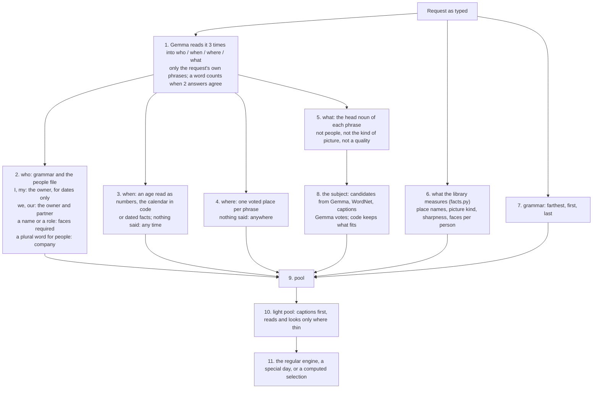

# Free-text memories: semantic translation onto the existing engine

Status: probe, not merged. Tracking issue #1436. Code on `exp/caption-threads`
(`experiments/caption-threads/`, entry point `translate.py`), two small probe hooks in `cli/`.
This page is the plan for building it properly; the probe is evidence, not the implementation.

> **Highly experimental.** Tuned and tried on a single real library (the owner's, 76k pictures)
> plus a few synthetic test households. Two held-out rounds of prompts the owner wrote cold were
> used to fix it, so they no longer count as tests. Expect wrong translations on a new library.

## What the owner wants

Two things, full model tier only:

1. **Type a sentence, get a film.** "Pictures of our cat along the years, 2014-2024, black cat",
   "the cars I drove", "best holiday landscapes along the years", "our cycling club's rides",
   "the evolution of our house since we bought it", "<child>'s firsts of anything new". The
   prompt is light and open; the system works out the rest. The feature is expensive (LLM
   checks and judgments) and that is accepted: it is the killer feature.
2. **Discovery.** Threads nobody asked for (a hobby over ten years, a pet, travel), where a
   good surprise beats safety and a mildly interesting result is an acceptable risk.

## Rulings (owner, 2026-09-26/27)

- **Semantic translation, not an LLM movie maker.** The sentence becomes something the code can
  query; the LLM refines and judges; then the *regular* selection runs through that lens (a
  thesis). The free-text interface commands the existing engine, it never bypasses it.
- **Reuse, don't rebuild.** Trips, home, familiar places, the people graph, episodes, stories,
  threads, standing, the thesis-fit vote, sharing all exist. The semantic model *is* the existing
  `generate` surface.
- **Captions are the basis. CLIP is banned** (a ranked list of probabilities never guarantees the
  subject is in the picture). **OCR is allowed**: the letters are really in the photo.
- **Visual questions are allowed in this feature only.** The judge may show a picture to the model
  and ask ("is this the same house as the reference?", "is this the same kit as the reference?").
  Everywhere else pictures are still read once, at ingest.
- **Forwarded pictures are kept** in requested films (a club's photos arrive through a group
  chat): the existing `--accept-any-provenance`.
- **Requested films may pass ordinary-film rules, never silently** (see *Rule report and bypass*).
- **Test with light prompts exactly as a user writes them.** Adding facts only the owner knows is
  cheating. Owner facts are scoring checks, never prompt input.
- English first; other languages are translated to English by the model and may degrade.

### Rulings (owner, 2026-09-28)

- **One small model for every step.** Gemma 4 E4B translates, checks captions, asks the photo
  questions and writes the thesis. A step that struggles gets a different task shape (options,
  lists, one question per call), never a bigger model.
- **Gemma pilots it in production.** It receives the prompt as typed and nobody reviews the
  translation, so every semantic decision is Gemma's; code only builds the options from the
  library and applies the answers. The owner's prompts test the mechanism, never tune it.
- **The flow is short:** prompt → filters → pool → thesis → the regular engine. No second
  selector in front of the engine; the per-caption check is the filter that says "shows what was
  asked", not a ranking.
- **Bad results must be easy to report** with the same builder and privacy rules as #1428
  (see *Reports for bad results*).

## What the research says

- [Snowflake semantic views](https://docs.snowflake.com/en/user-guide/views-semantic/overview) /
  [Cortex Analyst](https://docs.snowflake.com/en/user-guide/snowflake-cortex/cortex-analyst): the
  LLM translates against a curated model (dimensions, synonyms, real sample values, verified
  queries), never raw tables. Accuracy moves from the model's guess to a definition.
- [NatSQL / SemQL](https://aclanthology.org/2021.findings-emnlp.174/): a small intermediate
  representation shrinks the space a model can get wrong.
- [LangChain query construction](https://blog.langchain.com/query-construction/): split a request
  into structured filters plus a semantic subject.
- [Microsoft ISE, query decomposition for media search](https://devblogs.microsoft.com/ise/from_noisy_queries_to_precise_frames/):
  filters + cleaned sub-query took Recall@5 from 27% to 49%; regex matched or beat the LLM on the
  structured parts.
- [Schema/value linking (CHESS, RSL-SQL)](https://arxiv.org/pdf/2411.00073): map literals to the
  values actually stored.
- [Palimpzest](https://www.vldb.org/cidrdb/papers/2025/p12-liu.pdf),
  [LOTUS](https://www.vldb.org/pvldb/vol18/p4171-patel.pdf): cheap operators first, LLM filters
  last and as cascades; up to 1000x cheaper with accuracy guarantees.
- [Google Ask Photos](https://blog.google/products-and-platforms/products/photos/ask-photos-google-io-2024/):
  understanding the request is separate from answering it.

## Tooling decision

- **No agent framework** (LangChain/LangGraph): the flow is a fixed pipeline and the product
  already owns the LLM wire, JSON repair, answer banking, block votes and the no-outside-calls
  rules. Borrow the patterns, not the stack.
- **Schema-constrained output** (`response_format: json_schema`) through the existing wire. The
  local oMLX server *enforces* it (verified: "reply hello" still returns the schema; a
  forbidden enum value is coerced). Measured limits with a 4B model: generation **stalls** when the
  model wants to stop before a required key; **optional** keys are skipped; **required** keys are
  filled with invented content; free lists repeat. So: small schemas, every key required, lists
  capped, and never a free-text field last.
- **DSPy later, offline**, to tune prompts against the scored evaluation set; not a runtime
  dependency. Revisit orchestration only if the feature becomes a conversation.

## How it works

The first version asked Gemma open questions ("where?", "what else does not belong?"). A 4B model
answers something rather than nothing, so it invented constraints: exclusions of the subject
itself, "away from home" for a hike, GPS proof for a brunch. A held-out round scored about 1 in 7.
The rebuild splits the work: **Gemma reads, code links, and a part the request does not state
sets no filter.**



1. **Reading.** Gemma splits the request into who, when, where and what, using only phrases the
   request contains (an enum of its own words), three times in three field orders. A word counts
   for a part when two answers agree; a phrase can answer two parts ("holiday landscapes" says
   where and what). A cut-off answer is asked again, never counted as empty.
2. **Who.** Grammar, not a model: "I", "me", "my" are the owner, used for their age and homes but
   never as a face requirement (the owner usually holds the camera: "the cars I drove" has no
   face in it). "We", "our" are the owner and their partner. A name or a role in the people file
   ("my son", a first name, "wife" matched to "partner" through WordNet) requires that person's face in
   the photo's episode. A plural word for people ("friends", "kids") asks for company: a caption
   naming people, or naming children when WordNet says the word is young.
3. **When.** Years written in the request are pattern work. An age ("in our 20s") is read by
   Gemma as numbers and whose age; the calendar is code (it wrote two years for a decade). Dated
   facts (a birth, a move-in) are given to Gemma; nothing to date, no question asked. One
   occasion of one day is filmed as that special day, catalogued or not ("the birth of my son").
   An undated one ("our wedding") is the day whose photos of it show the people on the photo
   itself; none such, and the answer is "not possible", with what was found.
4. **Where.** One place per phrase, voted over the homes and scopes code builds (anywhere, a home,
   near home, away on trips); several phrases are their union ("at home or outside": anywhere). A
   phrase filters by its words beyond the subject's own nouns ("beaches and pools" is no place).
5. **What.** The head noun of each phrase ("pictures of our cat": cat), one per coordinated part;
   an activity (an -ing verb) adds its nouns from WordNet ("partying": party; "cycling":
   cyclist); "bread making" photographs bread; a trailing time phrase is time. People words,
   words for the picture itself and quality words are never the subject.
6. **What the library measures.** `facts.py` names fields the library already holds and links
   request words to them by code: Immich's place names (country, region, city; a name that is also
   an English word, such as the town of Best, only when capitalised mid-sentence), the kind of
   picture preparation labels (screenshots, documents, maps, videos), the engine's own sharpness
   line (blurry: below the library's 10th percentile), and how often each person's face appears
   ("over 35 pictures").
7. **Computed selections.** "Farthest from home": the trip whose middle photo is farthest from the
   home of its time. "First/last picture of" a set of people: each person's earliest or latest
   photo with their face.
8. **The subject.** Candidates come from Gemma's list, WordNet (the thing's own parts and kinds;
   an inherited part says so: a wheel is "part of any wheeled vehicle"), and words the owner's
   captions use next to it. Gemma votes the main subject. Code then drops people words (faces
   prove people; the doer of an asked activity stays: hiker for hiking), keeps a stated quality
   only when Gemma says it narrows which ones belong ("black cat" does, "live concert" does not),
   and never keeps a word the request excludes.
9. **Pool, light pool, engine.** Unchanged from the probe below: captions whose subject is the
   subject are free; thin periods get caption reads and photo questions; the pool goes to the
   regular engine with the thesis as the written subject.

Every decision writes one line of reasoning. The owner reads the translation as that trace:

```
"At the park with kids"
READING  Gemma split your words 3 times -> who: kids; where: the park; what: the park | kids
WHO      "kids" -> children must be in the photos, no one in particular
WHEN     nothing said -> any time
WHERE    your words "the park"; nothing beyond the subject's own nouns -> anywhere
WHAT     your words "the park | kids" -> subject words park
         Gemma picked the main subject: kids (3/3)
         nothing left of Gemma's pick -> your own subject words: park
```

### Judging

- Caption check: E4B yes / no / unsure per caption against the spec (main subject, what else it
  may show, what does not belong), twenty-four captions per call, budget spread over the pool's
  time scale.
- Photo question: built by code from the main subject; asked of unsure and caption-less pictures
  and of a random sample of caption yeses. The sample's agreement decides whether the remaining
  yeses are trusted or looked at too.
- One particular animal or thing ("our cat"): reference photos at home; one check per day away
  from home; a picture is dropped only on an explicit "different" (the check cannot tell solid
  black cats apart: accepted as not possible).
- Firsts: the first occurrence of every noun in the person's own face-tagged photos, compared ten
  at a time (at most three kept per ten) until about sixty remain. Asked to keep every meaningful
  one, E4B kept 774 of 1,835.

### What the engine does with a pool (why the pool must already mean the ask)

- The draft is the rules reader's: dates, favourites, people, spread; no captions, no thesis.
- The model pass reads only the episodes the draft chose.
- The thesis replaces the base brief in the model's prompts and feeds the thesis-fit vote, which
  is reject-only over shots already in the film; nothing refills what it removes.
- Handoff is a precise pool as an **album** (`--from-album`): the pool is the whole
  material, the album length curve applies. A custom date range clamps to 30 s past about 40
  months (`duration_from_date_range`), so a multi-year request must not go through it.

### Rule report and bypass

A requested film can be gutted by rules that protect ordinary films: forwarded copies,
identifying records (a licence plate may read as one), standing (a car alone), the family-viewing
gate ("the birth of my son", "breastfeeding <child> across the years").

1. Before render, preview the existing gates on the pool from banked verdicts; report per rule how
   many pictures would drop, example captions, and why that conflicts with the request.
2. Smallest fix first: the right audience before any bypass (an intimate request becomes a
   `just-us` film); then named bypasses (`--bypass standing,identifying_record`) with reasons.
   Provenance: `--accept-any-provenance`.
3. Config `free_text.rule_bypass: never | ask | auto`, default `ask`.
4. Detector holds and `never_auto` are never bypassed automatically; only the owner clears a hold,
   per picture, as today.
5. For a subject film, a picture whose caption matches the requested subject stands (as a caption
   naming an animal already does).

### Reports for bad results

Built on #1428 (`immich-memories report`, the web UI's Copy report): same allowlist-then-redact
builder, same hashed IDs, same issue templates. A free-text run adds one section, because it fails
in its own places (the translation, the pool, or the engine's picks from a good pool):

- The request as typed, redacted: people-file names become roles ("the owner's son"), home and
  area names become "home 1" / "area A", printed words read by OCR become "text-1".
- The spec field by field, with the votes (where) and which source offered each word.
- The funnel: in scope → pool → captions read → yes / unsure / no → photos looked at → kept →
  engine picks and film length; the sample agreement; Gemma calls, failures and seconds per stage.
- The user's verdict, which is what makes it a report of a bad result: photos marked wrong in the
  result view travel as hashed IDs with the stage that admitted each one and the answer that kept
  it (caption verdict or photo answer, with Gemma's one-line reason); a "what is missing" line is
  checked against the spec and the funnel (was the word offered, picked, in the pool, read?).
- Captions are off by default (they describe private scenes); an opt-in adds the captions of the
  flagged photos only, shown before copying. Pictures never.
- Acceptance: a fixture free-text run whose prompt, people, homes and places carry known names
  produces a report with none of them, the typed request included.

### Reuse map

| need | existing code |
|---|---|
| trips / holidays | `trip_detection.detect_trips`, `editorial_story_trips`, `trip_discovery` |
| home, and home over time | `editorial_home_radius.home_of/near_home_of`, `familiar_places.PlaceHistory` |
| people, roles, birth dates, co-occurrence | `people/graph.py`, `people/companion.py`, `people.yaml` |
| events | moments, episodes (90 min), stories |
| a recurring activity | `editorial_story_threads` |
| "best" | standing, favourites, carriers, look-alike review |
| selecting through a lens | story thesis, thesis-fit vote, `EditorialRunContext.base_brief` (dormant hook) |
| forwarded pictures | `--accept-any-provenance` |
| audience | sharing levels (`just-us`, `family`, `shareable`) |
| products and parameters | memory types, `--person`, dates, `--sharing`, duration |

## Evaluation set

- The owner's private set (outside git, scored against owner facts): six hard prompts (a pet over
  eleven years; the cars I drove, including one-offs such as a track day and a rental on a trip;
  holiday landscapes; a cycling club's rides via OCR and forwarded chat photos; a house's evolution
  since purchase; a child's firsts) and **two controls** where ordinary-film rules would drop what
  is asked for: "the birth of my son", "breastfeeding <child> across the years". The controls pass
  only if the pictures are reached with the right audience and every bypass is reported.
- The test households' sentence set (23 sentences) for regressions.
- Every change is judged on the whole set, never on the one sentence being fixed.

## Probe results (aggregates only)

- Discovery on eight synthetic test households: per-thread yes/no kept 40 of 40 threads;
  comparison in heats plus arithmetic gates found 15 of 18 described threads on the four
  households never looked at; 2-12 minutes and 60-140 E4B calls per library.
- Free text on test households: 20 of 23 sentences produce a sensible pool.
- Owner set (2026-09-27): pet over eleven years **works** (63 pictures, every year); holiday
  landscapes **work** (131, every year, trip-scoped); cycling club **found** (198 OCR hits, 397
  forwarded pictures pulled from their episodes) but lost to a wrong reference picture, fixed and
  re-running; firsts **find real firsts but admit noise**, moved to comparative picking; the
  house **fails** (searches "house"; the same-house reference drops interiors and works); the cars
  **fail** (any car; nothing tests driving).
- The local E4B answers image questions at ~5.6 s and ~320 tokens per picture.
- 2026-09-28, the spec translation on 18 sentences (8 owner, 10 from test households): places,
  people, dates and text in photo right on all but a few; firsts compared down to 45 meaningful
  first words; exclusions only from what follows a negation. End to end, the pet request: 14,031
  photos in scope (home at the time), 2,168 captions read, 171 photos looked at, sample agreement
  0.96, 785 in the pool, the engine's 300 s film picks 45.

## Prompts tried: what works, what is less good

Kept up to date after every run (the exact prompts and results are in the owner's private log).
"Translation" is the filters; "film" is what the regular engine picked from the pool.

| prompt (redacted) | translation | film | why |
|---|---|---|---|
| a pet along the years, with its colour | right | good, every year | one particular animal: sameness check away from home; two solid black cats cannot be told apart |
| holiday landscapes along the years | right | good | "holiday" in the phrase gives away from home |
| a house's evolution since we bought it | right | pending | works photos are lifeless: needs pool pictures to stand |
| the cars I drove | right | good | own cars, rentals, track days; a few background cars |
| a club's rides (name on the jerseys) | right | good, thin | OCR finds the club |
| the birth of a child | right | good | one day, filmed as the special day |
| breastfeeding a child across the years | right | thin | captions rarely say it |
| a child's firsts | right | good, some noise | first occurrences over dated captions |
| me and friends partying in our 20s | right | good | ages read as numbers, the calendar in code |
| me hiking along the years | right | not filmed yet | |
| the farthest I have been from home | right | not filmed yet | computed: the farthest trip from the home of its time |
| brunches at home or outside | right | thin | "brunch" is almost never in a caption |
| beaches and pools | right | not filmed yet | |
| a lifetime of live concerts | right, shape off | not filmed yet | "live" dropped (every concert is live) |
| our wedding | right | not possible | an unconventional wedding has no wedding captions; needs a dated fact |
| I love a country, show me the proof | right | good | Immich's place names |
| bread making along the years | right | pending | 108 real bread pictures; needs pool pictures to stand |
| races I have taken part in | right | good | also motor-racing track days: "race" has two senses |
| at the park with kids | right | good | a scene: the word anywhere in the caption, children required |
| closed eyes along the years | right | good | a body state: anywhere in the caption |
| sport app screenshots | right | not possible | the kind of picture is found; captions rarely say "sport" |
| first picture of each recurring person | right | loved | the onset (entered the library for good), never before their birth |
| last picture of each recurring person | right | good | where everyone is now |
| best blurry pictures | right | good | the engine's own sharpness line; leans to the year a baby was born (motion blur) |

What this says so far: things the captions name (cars, bread, a pet) and scenes with people in
them (parks, races, parties) work; so do filters the library measures (places, faces over time,
sharpness, picture kind). Concepts the captioner does not write (brunch, an unusual wedding) come
out thin or not possible, and a list-shaped request ("one picture per person") still loses a few
entries to the film's length.

## Limitations

- **One library.** Every rule was found on the owner's library and a few synthetic households.
  Held-out rounds on the owner's library went from about 1 in 7 translations right (round 1,
  before the rebuild) and 2 in 9 (round 2, before its fixes) to all 24 prompts translating as
  expected, but those rounds were then used to fix it.
- **Captions are the basis.** A concept the captioner does not write is thin or not possible:
  "brunch" appears in 3 captions of 76k, "breastfeeding" in 5, and an unconventional wedding in
  none (a hall, a balcony, a dinner with friends). Dated facts the owner can add (a wedding
  day, like birth dates) are the fix for occasions; they do not exist yet.
- **WordNet is from 2006.** No "screenshot", no "app"; some first senses are not everyday ("party"
  is political, "dashboard" is a carriage's mud panel). The rules lean on it for heads, parts,
  kinds, people words and derived nouns.
- **Gemma still judges some parts.** The film's shape ("a lifetime of concerts" came back as "how
  something changed"), the kind of subject and the main-subject vote can be wrong; three votes
  soften it, they do not remove it.
- **Company is read from captions only.** "With kids" needs a caption naming children; faces with
  known birth dates are not used yet.
- **The engine still decides the film.** It is told the pool and the thesis, not the request's
  special cases: blurry pictures carry a SOFT warning, screenshots are not photographs, and a
  one-per-person list is cut to the film's length. Those three need an explicit instruction to
  the engine.
- **English first.** Other languages are translated by Gemma first and may lose meaning.
- **Speed.** A translation is a few dozen Gemma calls (seconds each, cached); a thin request adds
  caption reads and photo questions, minutes on a Mac.

- 2026-09-28, held-out rounds (translation only). Round 1, six owner prompts plus "our wedding":
  about 1 in 7 right before the rebuild; after it, all right except brunch (translation right,
  captions too thin) and the wedding ("not possible": the captioned church wedding is someone
  else's). Round 2, nine owner prompts: 2 right before, 9 after the library facts
  (`facts.py`) and the fixes they showed. The 8 dev prompts kept their translations throughout.
  First film from round 1, "me and friends partying in our 20s": 59 pictures over 2007-2017.

## Open designs

- **The house:** now the address (150 m) since the move-in, the house and its parts as the main
  subject, and the words the owner's captions use around it; whether works and renovation reach
  the film is being measured.
- **The cars:** cars as the main subject (owner ruling: "cars is fine"); no photo shows whose car.
- **Curated-pool handoff:** the album route (`--from-album`), never `--include` (which bypasses
  sharing checks).
- **#1404** resolves an Apple Silicon install whose models run in separate servers (oMLX, mlxcel)
  to the NAS tier: it only checks for `mlx` inside the app's own environment.

## Build plan (one branch, one PR, owner 2026-09-28)

Built from main on `feat/free-text-memories`, one draft PR against #1436, merged only when every
item below is done (the same rule as the Svelte rewrite). The probe on `exp/caption-threads` is the
reference, not the code: every piece is rebuilt as product code with tests and every gate green.

1. **Library view** (`free_text/library.py`): captions, faces per episode, Immich place names,
   picture kind and sharpness, read from the store and Immich; no probe corpus, no legacy bank.
2. **What the library measures** (`free_text/facts.py`): the catalogue (places, picture kinds,
   the engine's sharpness line, faces per person) and the computed selections (farthest trip,
   first at the onset and never before birth, last, the day an undated occasion's photos show
   its people).
3. **Reading and linking** (`free_text/reading.py`, `free_text/linking.py`): who/when/where/what
   spans from the request's own words through the existing LLM wire (voted, enum of its words);
   grammar for I/we, the people file, ages as numbers with the calendar in code, homes, dated
   facts; one voted place per phrase.
4. **The subject** (`free_text/subject.py`): head nouns, activity nouns, WordNet kinds and parts
   (own parts only), Gemma's main-subject vote, the people / medium / quality rules. WordNet is
   fetched by `immich-memories models fetch` like every other model file, never at run time.
5. **The pool** (`free_text/pool.py`): the filters, caption grammar (things must be the caption's
   subject, scenes count anywhere, medium words read through), OCR anchors, company. No picture is
   read or looked at by a model here.
6. **Handoff**: in-process, the pool as the film's whole reach with the request as the written
   subject and `pool_is_subject` (its own PR to main); one-day occasions go to the special-day
   product.
7. **Trace**: `explain` printed before anything runs and saved with the run.
8. **CLI**: `immich-memories generate --ask "<sentence>"`; with `--dry-run` it prints the
   translation and the pool counts only.
9. **Reports**: the free-text section of `immich-memories report` (#1428, builder from #1464):
   trace, funnel, picks, marked pictures; names, places, printed words and captions redacted.
10. **Docs**: the user page "A film from a sentence" (experimental, sams-voice), this design doc,
    ARCHITECTURE.md, the config and CLI references.
11. **Evaluation**: the dev and held-out prompts as recorded fixtures (banked Gemma answers), so the
    translation is tested without a model; the private prompt log stays outside git.
12. **UI**: the sentence box lands with the Svelte rewrite (#1398), not in the NiceGUI pages.

## Documentation (owner 2026-09-28)

The user-facing page opens by saying the feature is highly experimental: tuned and tried on a
single real library plus a few synthetic tests. That line stays until held-out rounds pass on other
libraries.
