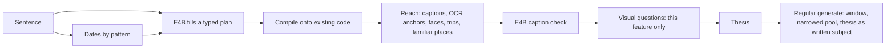

# Free-text memories: semantic translation onto the existing engine

Status: probe, not merged. Code on `exp/caption-threads` (`experiments/caption-threads/`), two
small probe hooks in `cli/`. This page is the plan for building it properly; the probe is
evidence, not the implementation.

## What the owner wants

Two things, full model tier only:

1. **Type a sentence, get a film.** "Pictures of our cat along the years, 2014-2024, black cat",
   "the cars I drove", "best holiday landscapes along the years", "our cycling club's rides",
   "the evolution of our house since we bought it", "<child>'s firsts of anything new". The
   prompt is light and open; the system works out the rest. The feature is expensive (LLM
   checks and judgments) and that is accepted: it is the killer feature.
2. **Discovery.** Threads nobody asked for (a hobby over ten years, a pet, travel), where a
   good surprise beats safety and a mildly interesting result is an acceptable risk.

## Rulings (owner, 2026-09-26/27)

- **Semantic translation, not an LLM movie maker.** The sentence becomes something the code can
  query; the LLM refines and judges; then the *regular* selection runs through that lens (a
  thesis). The free-text interface commands the existing engine, it never bypasses it.
- **Reuse, don't rebuild.** Trips, home, familiar places, the people graph, episodes, stories,
  threads, standing, the thesis-fit vote, sharing all exist. The semantic model *is* the existing
  `generate` surface.
- **Captions are the basis. CLIP is banned** (a ranked list of probabilities never guarantees the
  subject is in the picture). **OCR is allowed**: the letters are really in the photo.
- **Visual questions are allowed in this feature only.** The judge may show a picture to the model
  and ask ("is this the same house as the reference?", "is this the kit with the club's name?").
  Everywhere else pictures are still read once, at ingest.
- **Test with light prompts exactly as a user writes them.** Adding facts only the owner knows is
  cheating. Owner facts are scoring checks, never prompt input.
- English first; other languages are translated to English by the model and may degrade.

## What the research says

- [Snowflake semantic views](https://docs.snowflake.com/en/user-guide/views-semantic/overview) /
  [Cortex Analyst](https://docs.snowflake.com/en/user-guide/snowflake-cortex/cortex-analyst): the
  LLM translates against a curated model (dimensions, synonyms, real sample values, verified
  queries), never raw tables. Accuracy moves from the model's guess to a definition.
- [NatSQL / SemQL](https://aclanthology.org/2021.findings-emnlp.174/): a small intermediate
  representation shrinks the space a model can get wrong. For a 4B model, fill a typed plan.
- [LangChain query construction](https://blog.langchain.com/query-construction/): split a request
  into structured filters plus a semantic subject.
- [Microsoft ISE, query decomposition for media search](https://devblogs.microsoft.com/ise/from_noisy_queries_to_precise_frames/):
  filters + cleaned sub-query took Recall@5 from 27% to 49%; regex matched or beat the LLM on the
  structured parts.
- [Schema/value linking (CHESS, RSL-SQL)](https://arxiv.org/pdf/2411.00073): map literals to the
  values actually stored.
- [Palimpzest](https://www.vldb.org/cidrdb/papers/2025/p12-liu.pdf),
  [LOTUS](https://www.vldb.org/pvldb/vol18/p4171-patel.pdf): cheap operators first, LLM filters
  last and as cascades; up to 1000x cheaper with accuracy guarantees.
- [Google Ask Photos](https://blog.google/products-and-platforms/products/photos/ask-photos-google-io-2024/):
  understanding the request is separate from answering it.

## Architecture

### The plan (the intermediate representation)

One E4B call, JSON, every value chosen from real library values where it can be:

| field | meaning | compiled onto |
|---|---|---|
| window (since/until) | years, parsed by regex, never by the model | `generate --start/--end` |
| scope | any / home / trips | `detect_trips`, `home_of`/`near_home_of`, `PlaceHistory.is_familiar` (home changes over time) |
| people | names from the people file | Immich faces via `people.yaml` ids |
| subject | what must be visible, in the library's caption words | caption bank; companion words by lift over the request's rarest words |
| read_text | letters written in the photo | Immich OCR search, anchor expanded to its episode |
| same_thing / chapters | one thing followed over time, or several (each car) | reference pictures for the visual check |
| firsts | first appearances | first occurrence of each caption word in a person's pictures |
| exclusions, unverifiable | what to leave out; what no picture can prove | judge prompt; shown to the user |
| visual_questions | yes/no questions from the sentence only | visual check |

### Reuse map

| need | existing code |
|---|---|
| trips / holidays | `trip_detection.detect_trips`, `editorial_story_trips`, `trip_discovery` |
| home, and home over time | `editorial_home_radius.home_of/near_home_of`, `familiar_places.PlaceHistory` |
| people, roles, birth dates, co-occurrence | `people/graph.py`, `people/companion.py`, `people.yaml` |
| events | moments, episodes (90 min), stories |
| a recurring activity | `editorial_story_threads` |
| "best" | standing, favourites, carriers, look-alike review |
| selecting through a lens | story thesis, thesis-fit vote, `EditorialRunContext.base_brief` (dormant hook) |
| products and parameters | memory types, `--person`, dates, `--sharing`, duration |

New pieces only: the translator, a caption-based subject reach, OCR anchoring, the visual check,
firsts, chapters.

## Probe results (aggregates only)

- Discovery on eight synthetic test households: per-thread yes/no with a 4B model kept 40 of 40
  threads; comparison in heats (pick <=2 of 8, five rounds, keep >=3 wins) plus arithmetic gates
  found 15 of 18 described threads on the four households never looked at. Discovery 2-12 minutes
  per library, 60-140 E4B calls, down from ~45 minutes and ~185 calls.
- Free text on test households: 20 of 23 sentences produce a sensible pool; hard cases (a breed, a
  desert, a first birthday) fail on captions alone.
- The owner's library: a black-cat request returns a pet thread across every year of an 11-year
  window. A house request with the owner's own words fails (searches the word "house"); with the
  scope resolved to home and its caption vocabulary it finds three renovation bursts. The house
  evolution needs visual same-house checks.
- The local E4B answers image questions correctly at ~5.6 s and ~320 tokens per picture.

## Known failures to design for

- Plans drop explicit words ("black"), file stated dates as unverifiable, and do not map "our" to
  home. Dates and words the sentence states must be carried deterministically.
- "The cars I drove" needs chapters (several things, each with its own reference) and evidence of
  driving (driver's seat, at the wheel, a circuit, a rental on a trip), not ownership. Home before a
  move is a different place: use familiar places per period, not one home point.
- A caption judge loosened to accept what captions cannot show (breed, ownership) also admits
  false positives; the visual check is the answer, not a looser judge.
- A thread pool handed to the album editor gets re-judged as a period (9 pictures cut to 1); the
  pool needs a curated-pool mode, not `--include` (which bypasses sharing checks).
- #1404 resolves an Apple Silicon install whose models run in separate servers (oMLX, mlxcel) to the
  NAS tier, because it only checks for `mlx` inside the app's own environment.

## Build plan (proper, from main)

1. Semantic model object: the library's real values (years, places, familiar places per period,
   people and roles, caption vocabulary, OCR availability) built without an LLM.
2. Translator: regex dates + one E4B plan call against that model; the plan shown to the user.
3. Compiler: plan -> existing functions -> reach; OCR anchor episodes; firsts; chapters.
4. Judge cascade: caption check, then visual questions with references, budgets spread by year.
5. Handoff: `generate` with a narrowed pool and the thesis as the written subject; a curated-pool
   mode instead of `--include`.
6. Evaluation set: the owner's hard prompts (private, scored against owner facts) plus the test
   households' sentence set; every change judged on the whole set.
7. UI: sentence box, the plan and its interpretation, the pool, then the film.
